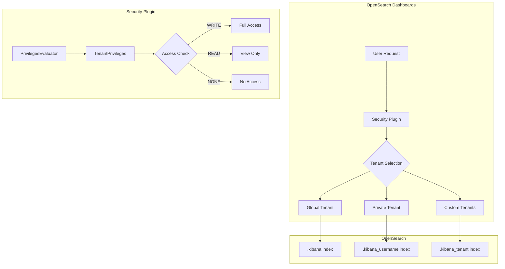
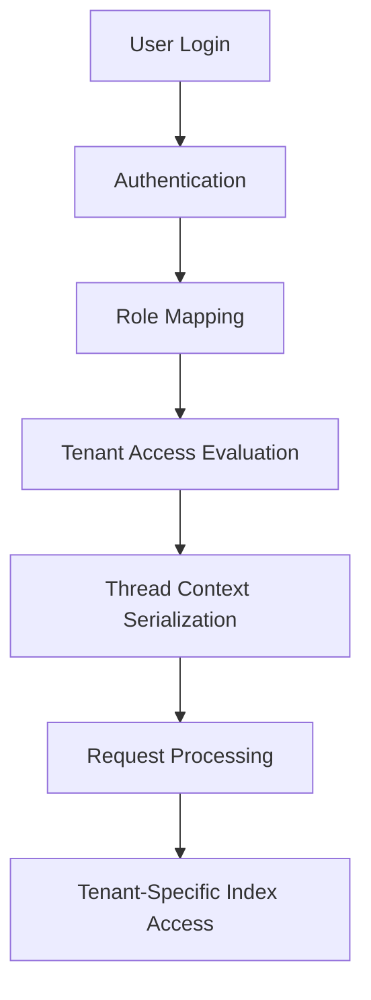

# Multi-Tenancy

## Summary

Multi-tenancy in OpenSearch Dashboards provides isolated workspaces called tenants for saving index patterns, visualizations, dashboards, and other saved objects. Users can have different levels of access (read, write, or none) to different tenants, enabling secure sharing of dashboards and visualizations across teams while maintaining data isolation.

## Details

### Architecture



### Data Flow



### Components

| Component | Description |
|-----------|-------------|
| Global Tenant | Shared tenant accessible to all users with appropriate permissions |
| Private Tenant | User-specific tenant that cannot be shared |
| Custom Tenants | Administrator-defined tenants for team collaboration |
| TenantPrivileges | Evaluates user access levels to tenants |
| PrivilegesEvaluator | Serializes user info including tenant access to thread context |

### Tenant Types

| Tenant Type | Index Pattern | Sharing | Use Case |
|-------------|---------------|---------|----------|
| Global | `.kibana` | All users | Organization-wide dashboards |
| Private | `.kibana_<hash>_<username>` | Single user | Personal exploration |
| Custom | `.kibana_<hash>_<tenant_name>` | Role-based | Team collaboration |

### Configuration

Configuration in `config/opensearch-security/config.yml`:

| Setting | Description | Default |
|---------|-------------|---------|
| `multitenancy_enabled` | Enable/disable multi-tenancy | `true` |
| `private_tenant_enabled` | Enable/disable private tenants | `true` |
| `default_tenant` | Default tenant on login | `global tenant` |
| `server_username` | Dashboards server user | `kibanaserver` |
| `index` | Base Dashboards index | `.kibana` |

Configuration in `opensearch_dashboards.yml`:

| Setting | Description | Default |
|---------|-------------|---------|
| `opensearch_security.multitenancy.enabled` | Enable multi-tenancy in Dashboards | `true` |
| `opensearch_security.multitenancy.tenants.enable_global` | Enable global tenant | `true` |
| `opensearch_security.multitenancy.tenants.enable_private` | Enable private tenants | `true` |
| `opensearch_security.multitenancy.tenants.preferred` | Tenant ordering preference | `["Private", "Global"]` |
| `opensearch_security.multitenancy.enable_filter` | Enable tenant search filter | `false` |

### Access Levels

| Level | Description | Capabilities |
|-------|-------------|--------------|
| WRITE | Full access | Create, modify, delete saved objects |
| READ | Read-only | View saved objects only |
| NONE | No access | Cannot access tenant |

### Thread Context Serialization

User information including tenant access is serialized to thread context for downstream components:

```
username|backend_roles|mapped_roles|requested_tenant|access_level
```

Example:
```
admin|admin_role|all_access|global_tenant|WRITE
```

### Usage Example

Defining tenant permissions in `roles.yml`:

```yaml
analyst_role:
  tenant_permissions:
    - tenant_patterns:
        - "analytics"
      allowed_actions:
        - "kibana_all_write"
    - tenant_patterns:
        - "executive"
      allowed_actions:
        - "kibana_all_read"
```

Creating a tenant via REST API:

```bash
PUT _plugins/_security/api/tenants/analytics
{
  "description": "Analytics team tenant"
}
```

## Limitations

- Global tenant does not synchronize with private tenants
- Tenant names are scrubbed of special characters in index names
- Workspaces feature conflicts with multi-tenancy (must disable one)
- Changes to tenant permissions during long-running requests may not be reflected

## Change History

- **v3.2.0** (2025-07-30): Added tenancy access level (READ/WRITE/NONE) to serialized user info in thread context
- **v3.0.0**: Removed tenant panels when multitenancy is disabled
- **v2.17.0**: Fixed tenancy app registration when disabled in configuration

## References

### Documentation
- [OpenSearch Dashboards multi-tenancy](https://docs.opensearch.org/3.0/security/multi-tenancy/tenant-index/): Multi-tenancy overview
- [Multi-tenancy configuration](https://docs.opensearch.org/3.0/security/multi-tenancy/multi-tenancy-config/): Configuration guide
- [Dynamic configuration in OpenSearch Dashboards](https://docs.opensearch.org/3.0/security/multi-tenancy/dynamic-config/): Dynamic configuration
- [PR #5519](https://github.com/opensearch-project/security/pull/5519): Tenancy access info implementation

### Pull Requests
| Version | PR | Description | Related Issue |
|---------|-----|-------------|---------------|
| v3.2.0 | [#5519](https://github.com/opensearch-project/security/pull/5519) | Add tenancy access info to serialized user in threadcontext |   |
| v3.0.0 | [#2218](https://github.com/opensearch-project/security/pull/2218) | Remove tenant panels when multitenancy disabled | [#2194](https://github.com/opensearch-project/security/issues/2194) |
| v2.17.0 | [#2057](https://github.com/opensearch-project/security-dashboards-plugin/pull/2057) | Do not register tenancy app if disabled in yml | [#2056](https://github.com/opensearch-project/security-dashboards-plugin/issues/2056) |
