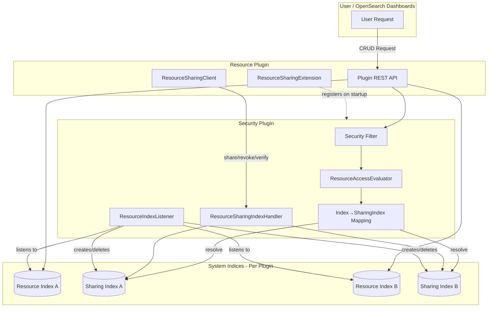
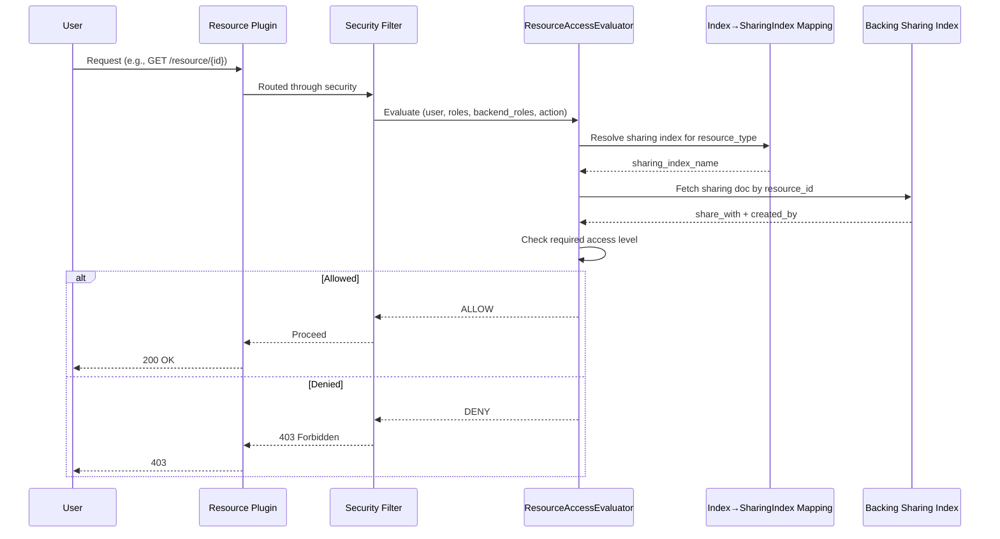

# Resource Access Control Framework

## Summary

The Resource Access Control Framework provides centralized, fine-grained access management for plugin-defined resources in OpenSearch. It enables document-level authorization for higher-level objects such as ML models, anomaly detectors, and reports, allowing resource owners to share their resources with specific users, roles, or backend roles while maintaining security and auditability.

This framework replaces the legacy backend-role-based access model (`filter_by_backend_role`) with an owner-controlled sharing model, providing more granular control over who can access specific resources.

## Details

### Architecture



### Data Flow



### Components

| Component | Description |
|-----------|-------------|
| `opensearch-security-spi` | Service Provider Interface package for plugins to implement resource sharing |
| `ResourceSharingExtension` | Interface that plugins implement to declare themselves as resource plugins |
| `ResourceProvider` | Record containing resource class name and index name |
| `ResourceSharingClient` | Client interface for plugins to perform access control operations |
| `ResourceAccessEvaluator` | Evaluates access permissions automatically via Security Filter |
| `ResourceSharingIndexHandler` | Manages CRUD operations on per-resource sharing indices |
| `ResourceIndexListener` | IndexingOperationListener that maintains sharing metadata on resource changes |
| `ResourcePluginInfo` | Tracks registered resource sharing extensions |

### Configuration

| Setting | Description | Default |
|---------|-------------|---------|
| `plugins.security.experimental.resource_sharing.enabled` | Enable/disable resource sharing feature | `false` |
| `plugins.security.system_indices.enabled` | Enable system index protection (required) | `true` |

### Data Model

Each resource index has a backing sharing index with naming convention: `{resourceIndex}-sharing`

**Sharing Document Structure:**

```json
{
  "resource_id": "resource-123",
  "created_by": {
    "user": "owner_username"
  },
  "share_with": {
    "READ_ONLY": {
      "users": ["user1", "user2"],
      "roles": ["viewer_role"],
      "backend_roles": ["data_analyst"]
    },
    "READ_WRITE": {
      "users": ["admin_user"],
      "roles": ["editor_role"],
      "backend_roles": ["content_manager"]
    }
  }
}
```

### Access Scopes

| Scope | Description | Example |
|-------|-------------|---------|
| Private | No `share_with` entry - only owner and super-admins can access | `"share_with": {}` |
| Restricted | Specific users/roles/backend_roles listed | `"share_with": {"READ_ONLY": {"users": ["alice"]}}` |
| Public | Wildcard `*` grants access to all | `"share_with": {"READ_ONLY": {"users": ["*"]}}` |

### Java APIs

| Method | Signature | Description |
|--------|-----------|-------------|
| `verifyResourceAccess` | `void verifyResourceAccess(String resourceId, String resourceIndex, ActionListener<Boolean> listener)` | Check if current user has access |
| `share` | `void share(String resourceId, String resourceIndex, Recipients recipients, ActionListener<ResourceSharing> listener)` | Grant access to specified entities |
| `revoke` | `void revoke(String resourceId, String resourceIndex, Recipients entitiesToRevoke, ActionListener<ResourceSharing> listener)` | Remove access from specified entities |
| `getAccessibleResourceIds` | `void getAccessibleResourceIds(String resourceIndex, ActionListener<Set<String>> listener)` | Get all accessible resource IDs |

### Usage Example

**1. Implement ResourceSharingExtension:**

```java
public class SampleResourceExtension implements ResourceSharingExtension {
    @Override
    public Set<ResourceProvider> getResourceProviders() {
        return Set.of(new ResourceProvider(
            SampleResource.class.getCanonicalName(), 
            RESOURCE_INDEX_NAME
        ));
    }

    @Override
    public void assignResourceSharingClient(ResourceSharingClient client) {
        ResourceSharingClientAccessor.getInstance()
            .setResourceSharingClient(client);
    }
}
```

**2. Register via SPI:**

Create file: `src/main/resources/META-INF/services/org.opensearch.security.spi.ResourceSharingExtension`

```
org.opensearch.sample.SampleResourceExtension
```

**3. Add dependency in build.gradle:**

```gradle
compileOnly group: 'org.opensearch', name:'opensearch-security-spi', version:"${opensearch_build}"

opensearchplugin {
    extendedPlugins = ['opensearch-security;optional=true']
}
```

**4. Use client for access control:**

```java
ResourceSharingClient client = ResourceSharingClientAccessor.getInstance()
    .getResourceSharingClient();

client.share(
    resourceId,
    RESOURCE_INDEX_NAME,
    new Recipients(List.of("user1"), List.of("role1"), List.of()),
    ActionListener.wrap(
        sharing -> log.info("Shared: {}", sharing),
        e -> log.error("Failed to share", e)
    )
);
```

## Limitations

- Feature is marked as **experimental** and disabled by default
- Only resource owners and super-admins can share/revoke access
- No pattern matching for users/roles/backend_roles - each must be individually specified
- Resources must be stored in system indices with system index protection enabled
- Currently supports single action group (`default`) - multiple action groups planned for future

## Related PRs

| Version | PR | Description |
|---------|-----|-------------|
| v3.2.0 | [#5389](https://github.com/opensearch-project/security/pull/5389) | Migration API for existing sharing info |
| v3.2.0 | [#5408](https://github.com/opensearch-project/security/pull/5408) | Resource Access Evaluator for standalone authorization |
| v3.2.0 | [#5541](https://github.com/opensearch-project/security/pull/5541) | Client accessor pattern fix for optional security plugin |
| v3.1.0 | [#5281](https://github.com/opensearch-project/security/pull/5281) | Introduces Centralized Resource Access Control Framework |
| v3.1.0 | [#5358](https://github.com/opensearch-project/security/pull/5358) | Store resource sharing info in 1:1 backing indices |

## References

- [Issue #4500](https://github.com/opensearch-project/security/issues/4500): Resource Permissions and Sharing proposal
- [Issue #5391](https://github.com/opensearch-project/security/issues/5391): Migration API tracking issue
- [Issue #5442](https://github.com/opensearch-project/security/issues/5442): Resource Access Evaluator tracking issue
- [Blog: Introducing resource sharing](https://opensearch.org/blog/introducing-resource-sharing-a-new-access-control-model-for-opensearch/): Official announcement
- [RESOURCE_ACCESS_CONTROL_FOR_PLUGINS.md](https://github.com/opensearch-project/security/blob/main/RESOURCE_ACCESS_CONTROL_FOR_PLUGINS.md): Developer guide

## Change History

- **v3.2.0** (2025): Migration API, Resource Access Evaluator for automatic authorization, client accessor pattern fix
- **v3.1.0** (2025): Initial implementation with centralized SPI, 1:1 backing sharing indices, and automatic access evaluation
