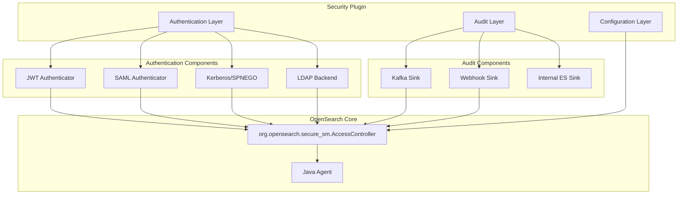
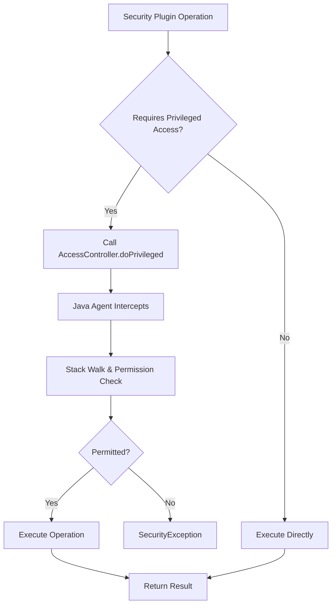

---
tags:
  - domain/security
  - component/server
  - ml
  - security
---
# Security Plugin AccessController Migration

## Summary

The OpenSearch Security plugin has migrated from Java's deprecated `java.security.AccessController` to OpenSearch's custom `org.opensearch.secure_sm.AccessController`. This migration ensures compatibility with Java 21+ and aligns with OpenSearch core's strategy to replace the Java Security Manager (JSM), which is being permanently disabled in JDK 24.

## Details

### Background

Java's Security Manager and `AccessController` have been deprecated since JDK 17 (JEP 411) and are scheduled for permanent removal in JDK 24 (JEP 486). OpenSearch 3.0 introduced a Java agent-based security model as a replacement, with `org.opensearch.secure_sm.AccessController` providing equivalent functionality for privileged operations.

The security plugin extensively uses privileged operations for:
- Authentication (JWT, SAML, Kerberos, LDAP)
- Audit logging (Kafka, Webhook sinks)
- Configuration file access
- SSL/TLS certificate handling

### Architecture



### Data Flow



### Components

| Component | Description |
|-----------|-------------|
| `DefaultObjectMapper` | JSON serialization with privileged Jackson operations |
| `NonValidatingObjectMapper` | Non-validating JSON parsing |
| `OpenSearchSecurityPlugin` | Main plugin class with file permission checks |
| `AbstractAuditLog` | Base audit logging with system property access |
| `AuditLogImpl` | Audit log implementation with shutdown hooks |
| `KafkaSink` | Kafka producer for audit events |
| `WebhookSink` | HTTP webhook for audit events |
| `HTTPJwtAuthenticator` | JWT token parsing and validation |
| `AbstractHTTPJwtAuthenticator` | Base JWT authentication |
| `HTTPSpnegoAuthenticator` | Kerberos/SPNEGO authentication |
| `HTTPSamlAuthenticator` | SAML authentication with metadata resolution |
| `AuthTokenProcessorHandler` | SAML token processing |
| `Saml2SettingsProvider` | SAML configuration provider |
| `SamlHTTPMetadataResolver` | HTTP-based SAML metadata |
| `SamlFilesystemMetadataResolver` | File-based SAML metadata |
| `LDAPAuthorizationBackend` | LDAP connection and authorization |
| `LdapHelper` | LDAP search utilities |

### Configuration

No additional configuration is required. The migration is transparent to users and administrators. Existing `plugin-security.policy` files continue to work without modification.

### Usage Examples

#### Privileged JSON Parsing

```java
import org.opensearch.secure_sm.AccessController;

public static <T> T readValue(String string, Class<T> clazz) throws IOException {
    try {
        return AccessController.doPrivilegedChecked(() -> objectMapper.readValue(string, clazz));
    } catch (final Exception e) {
        throw (IOException) e;
    }
}
```

#### Privileged File Operations

```java
import org.opensearch.secure_sm.AccessController;

final List<Path> filesWithWrongPermissions = AccessController.doPrivileged(() -> {
    final Path confPath = new Environment(settings, configPath).configDir().toAbsolutePath();
    if (Files.isDirectory(confPath, LinkOption.NOFOLLOW_LINKS)) {
        try (Stream<Path> s = Files.walk(confPath)) {
            return s.distinct().filter(p -> checkFilePermissions(p)).collect(Collectors.toList());
        } catch (Exception e) {
            log.error(e.toString());
            return null;
        }
    }
    return Collections.emptyList();
});
```

#### Privileged Network Operations (LDAP)

```java
import org.opensearch.secure_sm.AccessController;

public static Connection getConnection(final Settings settings, final Path configPath) throws Exception {
    return AccessController.doPrivilegedChecked(() -> {
        boolean isJava9OrHigher = PlatformDependent.javaVersion() >= 9;
        ClassLoader originalClassloader = null;
        if (isJava9OrHigher) {
            originalClassloader = Thread.currentThread().getContextClassLoader();
            Thread.currentThread().setContextClassLoader(new Java9CL());
        }
        return getConnection0(settings, configPath, originalClassloader, isJava9OrHigher);
    });
}
```

## Limitations

- This is an internal refactoring with no user-facing changes
- The migration does not change the security model or permissions
- Plugin developers extending security plugin classes should update their code to use the new AccessController

## Change History

- **v3.4.0** (2026-01-11): Complete migration of security plugin from `java.security.AccessController` to `org.opensearch.secure_sm.AccessController`


## References

### Documentation
- [JEP 411](https://openjdk.org/jeps/411): Deprecate the Security Manager for Removal
- [JEP 486](https://openjdk.org/jeps/486): Permanently Disable the Security Manager

### Blog Posts
- [Blog: Finding a replacement for JSM in OpenSearch 3.0](https://opensearch.org/blog/finding-a-replacement-for-jsm-in-opensearch-3-0/)

### Pull Requests
| Version | PR | Description | Related Issue |
|---------|-----|-------------|---------------|
| v3.4.0 | [#5750](https://github.com/opensearch-project/security/pull/5750) | Replace AccessController and remove restriction on word Extension |   |
| v3.4.0 | [#5815](https://github.com/opensearch-project/security/pull/5815) | Clean up AccessController with Exception disambiguation |   |

### Issues (Design / RFC)
- [Issue #1687](https://github.com/opensearch-project/OpenSearch/issues/1687): RFC - Replace Java Security Manager (JSM)
- [Issue #17181](https://github.com/opensearch-project/OpenSearch/issues/17181): Permanently turn-off Security Manager starting 3.0
