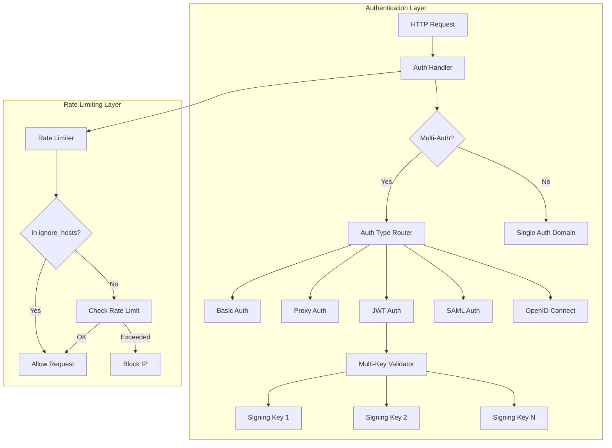
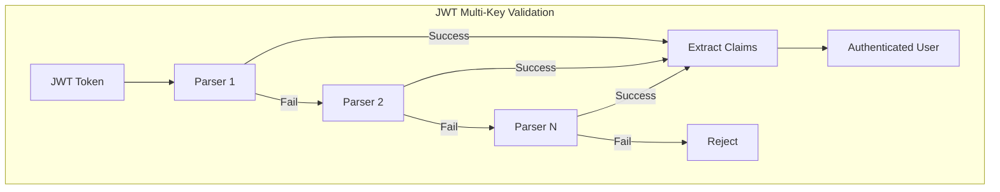

---
tags:
  - security
---

# Security Auth Enhancements

## Summary

Security Auth Enhancements provide improved authentication flexibility and security controls in OpenSearch. Key capabilities include support for multiple JWT signing keys enabling zero-downtime key rotation, proxy authentication in multi-auth configurations, and granular IP-based rate limiting with host exclusions. These features help organizations implement more robust and flexible authentication strategies.

## Details

### Architecture



### Data Flow



### Components

| Component | Description |
|-----------|-------------|
| `HTTPJwtAuthenticator` | JWT authentication handler supporting multiple signing keys |
| `AbstractRateLimiter` | Base rate limiter with `ignore_hosts` support |
| `BackendRegistry` | Authentication backend registry with host pattern matching |
| `MultipleAuthentication` | Multi-auth handler supporting proxy, basic, SAML, and OIDC |
| `ProxyAuthentication` | Proxy-based authentication handler |

### Configuration

| Setting | Description | Default |
|---------|-------------|---------|
| `signing_key` | JWT signing key(s) - supports single key or list | Required |
| `ignore_hosts` | List of IPs/hostnames to exclude from rate limiting | `[]` |
| `hosts_resolver_mode` | Mode for resolving hostnames (`ip-only`, `ip-hostname`) | `ip-only` |
| `opensearch_security.auth.type` | Authentication type(s) - supports array for multi-auth | `basicauth` |
| `opensearch_security.auth.multiple_auth_enabled` | Enable multi-auth support | `false` |

### Usage Examples

#### Multiple JWT Signing Keys

```yaml
# config.yml - Security plugin configuration
config:
  dynamic:
    authc:
      jwt_auth_domain:
        http_enabled: true
        transport_enabled: true
        order: 0
        http_authenticator:
          type: jwt
          challenge: false
          config:
            # Multiple keys for zero-downtime rotation
            signing_key:
              - "-----BEGIN PUBLIC KEY-----\nMIIBIjANBgkqhkiG9w0BAQEFAAOCAQ8AMIIBCgKCAQEA...\n-----END PUBLIC KEY-----"
              - "-----BEGIN PUBLIC KEY-----\nMIIBIjANBgkqhkiG9w0BAQEFAAOCAQ8AMIIBCgKCAQEA...\n-----END PUBLIC KEY-----"
            jwt_header: "Authorization"
            subject_key: "sub"
            roles_key: "roles"
        authentication_backend:
          type: noop
```

#### IP Rate Limiting with Ignore Hosts

```yaml
# config.yml - Auth failure listeners
config:
  dynamic:
    auth_failure_listeners:
      ip_rate_limiting:
        type: ip
        allowed_tries: 3
        time_window_seconds: 60
        block_expiry_seconds: 180
        max_blocked_clients: 100000
        max_tracked_clients: 100000
        ignore_hosts:
          - "127.0.0.1"
          - "10.0.0.*"
          - "trusted-proxy.example.com"
    hosts_resolver_mode: "ip-hostname"
```

#### Multi-Auth with Proxy

```yaml
# opensearch_dashboards.yml
opensearch_security.auth.type: ["proxy", "basicauth"]
opensearch_security.auth.multiple_auth_enabled: true
opensearch_security.proxycache:
  user_header: "x-proxy-user"
  roles_header: "x-proxy-roles"
```

## Limitations

- JWT keys are validated sequentially; many keys may add latency
- Hostname matching in `ignore_hosts` requires `hosts_resolver_mode: ip-hostname`
- Proxy auth in multi-auth requires proper header allowlist configuration
- Rate limiting `ignore_hosts` uses wildcard matching, not regex

## Change History

- **v2.17.0** (2024-10-22): Initial implementation
  - Added multiple JWT signing keys support for zero-downtime key rotation
  - Added `ignore_hosts` configuration for IP-based rate limiting
  - Added proxy authentication support in multi-auth configurations
  - Improved redirect URL handling in OpenSearch Dashboards

## Related Features
- [Security (Dashboards)](../security-dashboards-plugin/security-dashboards-plugin-security-dashboards-role-management.md)

## References

### Documentation
- [JWT Documentation](https://docs.opensearch.org/2.17/security/authentication-backends/jwt/): JSON Web Token authentication
- [API Rate Limiting](https://docs.opensearch.org/2.17/security/configuration/api-rate-limiting/): Rate limiting configuration
- [Proxy Authentication](https://docs.opensearch.org/2.17/security/authentication-backends/proxy/): Proxy-based authentication

### Pull Requests
| Version | PR | Description | Related Issue |
|---------|-----|-------------|---------------|
| v2.17.0 | [#4632](https://github.com/opensearch-project/security/pull/4632) | Allow multiple signing keys to be provided | [#4613](https://github.com/opensearch-project/security/issues/4613) |
| v2.17.0 | [#4666](https://github.com/opensearch-project/security/pull/4666) | Backport multiple signing keys to 2.x |   |
| v2.17.0 | [#4538](https://github.com/opensearch-project/security/pull/4538) | Add `ignore_hosts` config option for auth failure listener | [#4262](https://github.com/opensearch-project/security/issues/4262) |
| v2.17.0 | [#2076](https://github.com/opensearch-project/security-dashboards-plugin/pull/2076) | Add Proxy Auth to Multi Auth Options | [#1724](https://github.com/opensearch-project/security-dashboards-plugin/issues/1724) |
| v2.17.0 | [#2072](https://github.com/opensearch-project/security-dashboards-plugin/pull/2072) | Use `getRedirectUrl` from OSD to generate nextUrl |   |

### Issues (Design / RFC)
- [Issue #4613](https://github.com/opensearch-project/security/issues/4613): Support multiple keys in JWT configuration
- [Issue #4262](https://github.com/opensearch-project/security/issues/4262): IP rate-limiting should support ignore hosts
- [Issue #1724](https://github.com/opensearch-project/security-dashboards-plugin/issues/1724): Add proxy authentication support to multi-auth framework
