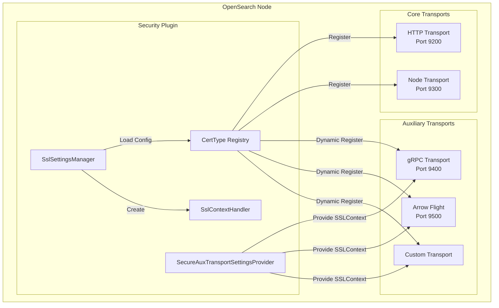
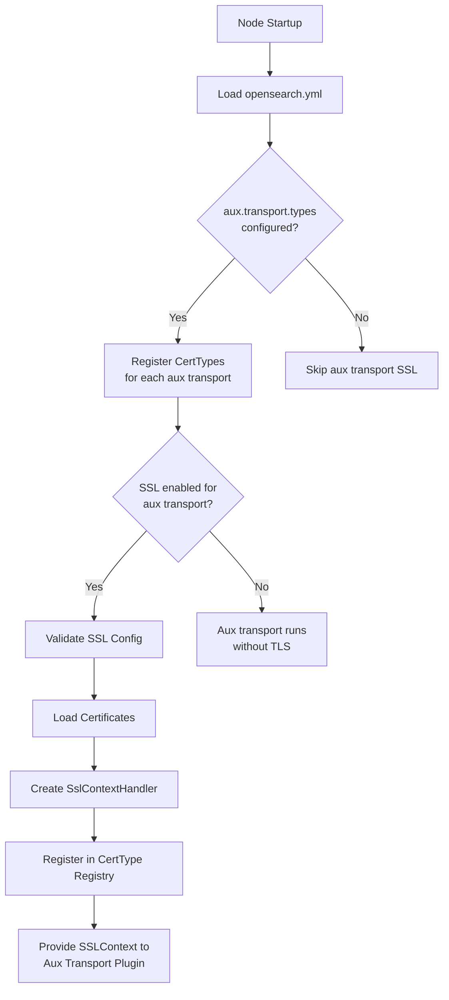

---
tags:
  - security
---

# Auxiliary Transport SSL

## Summary

Auxiliary Transport SSL enables independent TLS/SSL configuration for pluggable auxiliary transports in OpenSearch. This feature allows each auxiliary transport (such as gRPC, Arrow Flight, or custom transports) to have its own certificate settings, client authentication mode, and cipher suites, providing encryption in transit for non-standard transport protocols.

## Details

### Architecture



### Data Flow



### Components

| Component | Description |
|-----------|-------------|
| `CertType` | Identifies SSL configuration namespace and certificate type ID. Refactored from enum to class for dynamic registration |
| `NodeCertTypeRegistry` | Thread-safe registry tracking all certificate types discovered on a node |
| `SslSettingsManager` | Manages SSL configurations for all transport types, including dynamic auxiliary transports |
| `SslContextHandler` | Wraps Netty SslContext and provides certificate management and hot-reload support |
| `SecureAuxTransportSettingsProvider` | Interface providing SSL context and parameters to auxiliary transport plugins |
| `SslParameters` | Encapsulates SSL parameters including provider, client auth mode, protocols, and ciphers |

### Configuration

Settings follow the pattern `plugins.security.ssl.aux.<transport-id>.<setting>`:

| Setting | Description | Default |
|---------|-------------|---------|
| `enabled` | Enable TLS for the auxiliary transport | `false` |
| `pemkey_filepath` | Path to private key file (PKCS #8 format) | Required if enabled |
| `pemcert_filepath` | Path to X.509 certificate chain (PEM format) | Required if enabled |
| `pemtrustedcas_filepath` | Path to root CA certificates (PEM format) | Required if `clientauth_mode: REQUIRE` |
| `pemkey_password` | Password for encrypted private key | Optional |
| `clientauth_mode` | Client authentication: `NONE`, `OPTIONAL`, `REQUIRE` | `OPTIONAL` |
| `enabled_ciphers` | List of allowed TLS cipher suites | Default secure ciphers |
| `enabled_protocols` | List of allowed TLS protocols | `TLSv1.3`, `TLSv1.2` |
| `keystore_filepath` | Path to keystore file (JKS/PKCS12) | Alternative to PEM |
| `keystore_type` | Keystore type: `JKS` or `PKCS12` | `JKS` |
| `truststore_filepath` | Path to truststore file | Alternative to PEM trusted CAs |
| `truststore_type` | Truststore type: `JKS` or `PKCS12` | `JKS` |

### Usage Example

```yaml
# opensearch.yml

# Enable secure gRPC auxiliary transport
aux.transport.types: experimental-secure-transport-grpc
aux.transport.experimental-secure-transport-grpc.port: '9400-9500'

# Configure TLS for gRPC transport using PEM certificates
plugins.security.ssl.aux.experimental-secure-transport-grpc.enabled: true
plugins.security.ssl.aux.experimental-secure-transport-grpc.pemcert_filepath: node-cert.pem
plugins.security.ssl.aux.experimental-secure-transport-grpc.pemkey_filepath: node-key.pem
plugins.security.ssl.aux.experimental-secure-transport-grpc.pemtrustedcas_filepath: root-ca.pem
plugins.security.ssl.aux.experimental-secure-transport-grpc.clientauth_mode: REQUIRE

# Optional: Restrict ciphers and protocols
plugins.security.ssl.aux.experimental-secure-transport-grpc.enabled_protocols:
  - TLSv1.3
plugins.security.ssl.aux.experimental-secure-transport-grpc.enabled_ciphers:
  - TLS_AES_256_GCM_SHA384
  - TLS_AES_128_GCM_SHA256
```

### Client Authentication Modes

| Mode | Behavior |
|------|----------|
| `NONE` | Server does not request client certificate. Any TLS client can connect |
| `OPTIONAL` | Server requests client certificate but accepts connections without one |
| `REQUIRE` | Server requires valid client certificate from trusted CA |

## Limitations

- **TLS only, no authorization**: Provides encryption in transit only. No role-based access control or user authentication is enforced
- **Certificate-based access control only**: Access is controlled solely through `clientauth_mode` and certificate trust
- **JDK SSL provider**: Uses JDK SSL provider; OpenSSL provider is not supported
- **No hot-reload for auxiliary transports**: Certificate hot-reload is supported but requires the same infrastructure as HTTP/Transport layers

## Change History

- **v3.2.0** (2025-08-01): Initial implementation - TLS support for auxiliary transports with per-transport configuration namespace

## Related Features
- [Security (Dashboards)](../security-dashboards-plugin/security-dashboards-plugin-security-dashboards-role-management.md)

## References

### Documentation
- [Documentation: Configuring TLS certificates](https://docs.opensearch.org/3.2/security/configuration/tls/): Official TLS configuration guide
- [gRPC APIs Documentation](https://docs.opensearch.org/3.2/api-reference/grpc-apis/index/): gRPC transport documentation

### Pull Requests
| Version | PR | Description | Related Issue |
|---------|-----|-------------|---------------|
| v3.2.0 | [#5375](https://github.com/opensearch-project/security/pull/5375) | Add support for configuring auxiliary transports for SSL only | [#17795](https://github.com/opensearch-project/OpenSearch/issues/17795) |

### Issues (Design / RFC)
- [Issue #17795](https://github.com/opensearch-project/OpenSearch/issues/17795): Feature request for separation of auxiliary transport SSL configurations
