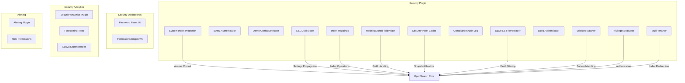

# Security Bugfixes

## Summary

This document tracks security-related bug fixes across OpenSearch Security plugin, Security Analytics plugin, Security Dashboards plugin, and related components. These fixes address various issues including system index access control, authentication audit logging, configuration detection, SSL settings propagation, stored field handling, cache synchronization, compliance audit logging, and DLS/FLS filtering.

## Details

### Architecture



### Components

| Component | Description | Repository |
|-----------|-------------|------------|
| System Index Protection | Prevents unauthorized access to security system indices | security |
| SAML Authenticator | Handles SAML-based authentication and audit logging | security |
| Demo Config Detection | Detects existing security configuration in YAML files | security |
| SSL Dual Mode | Manages SSL/TLS dual mode settings propagation | security |
| HashingStoredFieldVisitor | Handles stored fields in search operations | security |
| Index Mappings | Manages index mapping operations for closed indices | security |
| Security Index Cache | Manages in-memory cache of security index data | security |
| Compliance Audit Log | Logs diffs for security index write operations | security |
| DLS/FLS Filter Reader | Handles document and field level security filtering | security |
| Basic Authenticator | Handles HTTP Basic authentication and logging | security |
| WildcardMatcher | Pattern matching for index and role names | security |
| PrivilegesEvaluator | Authorization and privilege evaluation | security |
| Multi-tenancy | Virtual index redirection for Dashboards tenants | security |
| Password Reset UI | Manages password reset form in dashboards | security-dashboards-plugin |
| Permissions Dropdown | Static dropdown for cluster/index permissions | security-dashboards-plugin |
| Guava Dependencies | Runtime dependencies for security analytics | security-analytics |
| Role Permissions | Manages alerting role permissions | alerting |

### Configuration

| Setting | Description | Default |
|---------|-------------|---------|
| `plugins.security_config.ssl_dual_mode_enabled` | Enable SSL dual mode for mixed cluster configurations | `false` |
| `plugins.security.ssl_only` | Run in SSL-only mode | `false` |

### Usage Example

**Dynamically changing SSL dual mode:**
```bash
curl -XPUT https://localhost:9200/_cluster/settings \
  -k -H "Content-Type: application/json" \
  -d '{"persistent": {"plugins.security_config.ssl_dual_mode_enabled": false}}'
```

**Using stored_fields in search:**
```json
GET /my-index/_search
{
  "stored_fields": ["title", "date"],
  "query": {
    "match": {
      "content": "opensearch"
    }
  }
}
```

## Limitations

- SSL dual mode changes require companion OpenSearch core changes
- Some fixes are backports and may have version-specific behavior
- Demo configuration detection requires SnakeYaml library for nested YAML parsing
- Cache reload on snapshot restore adds small overhead during restore operations
- Compliance audit log fix requires proper configuration of `write_log_diffs` and `write_metadata_only` settings

## Related PRs

| Version | PR | Repository | Description |
|---------|-----|------------|-------------|
| v3.4.0 | [#5694](https://github.com/opensearch-project/security/pull/5694) | security | Create WildcardMatcher.NONE for empty string input |
| v3.4.0 | [#5714](https://github.com/opensearch-project/security/pull/5714) | security | Improve array validator to check for blank strings |
| v3.4.0 | [#5710](https://github.com/opensearch-project/security/pull/5710) | security | Use RestRequestFilter.getFilteredRequest for sensitive params |
| v3.4.0 | [#5723](https://github.com/opensearch-project/security/pull/5723) | security | Fix deprecated SSL transport settings in demo certificates |
| v3.4.0 | [#5721](https://github.com/opensearch-project/security/pull/5721) | security | Fix DlsFlsValveImpl condition for internal requests |
| v3.4.0 | [#5778](https://github.com/opensearch-project/security/pull/5778) | security | Fix `.kibana` index update operations in multi-tenancy |
| v3.4.0 | [#5750](https://github.com/opensearch-project/security/pull/5750) | security | Replace AccessController and remove Extension restriction |
| v3.4.0 | [#5749](https://github.com/opensearch-project/security/pull/5749) | security | Add security provider earlier in bootstrap process |
| v3.4.0 | [#5791](https://github.com/opensearch-project/security/pull/5791) | security | Modularized PrivilegesEvaluator |
| v3.4.0 | [#5804](https://github.com/opensearch-project/security/pull/5804) | security | Cleaned up use of PrivilegesEvaluatorResponse |
| v3.4.0 | [#5816](https://github.com/opensearch-project/security/pull/5816) | security | Remove reflective call to getInnerChannel |
| v3.4.0 | [#5736](https://github.com/opensearch-project/security/pull/5736) | security | Fix build failure in SecurityFilterTests |
| v3.3.0 | [#5579](https://github.com/opensearch-project/security/pull/5579) | security | Allow plugin system requests when system_indices.enabled is false |
| v3.3.0 | [#5640](https://github.com/opensearch-project/security/pull/5640) | security | Fix JWT log spam with empty roles_key |
| v3.3.0 | [#5675](https://github.com/opensearch-project/security/pull/5675) | security | Fix incorrect licenses in Security Principal files |
| v3.3.0 | [#1577](https://github.com/opensearch-project/security-analytics/pull/1577) | security-analytics | Remove direct reference to Job Scheduler Lock Index |
| v3.3.0 | [#1583](https://github.com/opensearch-project/security-analytics/pull/1583) | security-analytics | Ensure user attributes in expected format |
| v3.3.0 | [#1330](https://github.com/opensearch-project/security-analytics-dashboards-plugin/pull/1330) | security-analytics-dashboards-plugin | Upgrade js-yaml to v4.1 |
| v3.3.0 | [#4245](https://github.com/opensearch-project/sql/pull/4245) | sql | Support serializing/deserializing UDTs in pushed-down scripts |
| v3.1.0 | [#5307](https://github.com/opensearch-project/security/pull/5307) | security | Fix security index stale cache post snapshot restore |
| v3.1.0 | [#5279](https://github.com/opensearch-project/security/pull/5279) | security | Fix compliance audit log diff computation |
| v3.1.0 | [#5303](https://github.com/opensearch-project/security/pull/5303) | security | Fix DlsFlsFilterLeafReader PointValues handling |
| v3.1.0 | [#5377](https://github.com/opensearch-project/security/pull/5377) | security | Conditional invalid auth header logging |
| v3.1.0 | [#5331](https://github.com/opensearch-project/security/pull/5331) | security | Fix dependabot changelog workflow |
| v3.1.0 | [#5334](https://github.com/opensearch-project/security/pull/5334) | security | Fix assemble workflow for Jenkins build |
| v3.1.0 | [#2238](https://github.com/opensearch-project/security-dashboards-plugin/pull/2238) | security-dashboards-plugin | Fix page reload on invalid password |
| v3.1.0 | [#2253](https://github.com/opensearch-project/security-dashboards-plugin/pull/2253) | security-dashboards-plugin | Add forecasting transport actions to dropdown |
| v3.1.0 | [#1530](https://github.com/opensearch-project/security-analytics/pull/1530) | security-analytics | Fix guava dependency scope |
| v2.18.0 | [#4775](https://github.com/opensearch-project/security/pull/4775) | security | Fix admin system index read |
| v2.18.0 | [#4770](https://github.com/opensearch-project/security/pull/4770) | security | Remove SAML failed login audit |
| v2.18.0 | [#4798](https://github.com/opensearch-project/security/pull/4798) | security | Handle non-flat YAML settings |
| v2.18.0 | [#4830](https://github.com/opensearch-project/security/pull/4830) | security | SSL dual mode propagation |
| v2.18.0 | [#4827](https://github.com/opensearch-project/security/pull/4827) | security | Fix HashingStoredFieldVisitor |
| v2.18.0 | [#4777](https://github.com/opensearch-project/security/pull/4777) | security | Fix closed index mappings |
| v2.18.0 | [#1303](https://github.com/opensearch-project/security-analytics/pull/1303) | security-analytics | Fix OS launch exception |

## References

- [Issue #1951](https://github.com/opensearch-project/observability/issues/1951): `.kibana` index update issue in multi-tenancy
- [Issue #5697](https://github.com/opensearch-project/security/issues/5697): Deprecated SSL transport settings
- [Issue #3420](https://github.com/opensearch-project/security/issues/3420): BCFKS keystore loading issue
- [Issue #5399](https://github.com/opensearch-project/security/issues/5399): Pluggable PrivilegesEvaluator
- [Issue #840](https://github.com/opensearch-project/performance-analyzer/issues/840): getInnerChannel reflection removal
- [Issue #5634](https://github.com/opensearch-project/security/issues/5634): JWT log spam bug report
- [Issue #792](https://github.com/opensearch-project/geospatial/issues/792): Geospatial permissions issue since 3.2.0
- [Issue #1829](https://github.com/opensearch-project/alerting/issues/1829): Alerting DLS user attribute issue
- [Issue #4063](https://github.com/opensearch-project/sql/issues/4063): SQL UDT serialization issue
- [Issue #5308](https://github.com/opensearch-project/security/issues/5308): Stale cache post snapshot restore
- [Issue #5280](https://github.com/opensearch-project/security/issues/5280): Compliance audit log diff computation issue
- [Issue #2189](https://github.com/opensearch-project/security-dashboards-plugin/issues/2189): Page reload on invalid password
- [Issue #4608](https://github.com/opensearch-project/security/issues/4608): SAML failed login audit issue
- [Issue #4735](https://github.com/opensearch-project/security/issues/4735): Demo config nested YAML issue
- [Issue #4755](https://github.com/opensearch-project/security/issues/4755): Admin system index read issue
- [Issue #1273](https://github.com/opensearch-project/security-analytics/issues/1273): OS launch exception issue
- [OpenSearch stored_fields documentation](https://opensearch.org/docs/latest/search-plugins/searching-data/retrieve-specific-fields/#searching-with-stored_fields)

## Change History

- **v3.4.0** (2026-01-11): Multi-tenancy `.kibana` index update fix, WildcardMatcher empty string handling, array validator blank string checks, audit log sensitive parameter filtering, deprecated SSL settings update, BCFIPS provider bootstrap timing, AccessController migration, PrivilegesEvaluator modularization, PrivilegesEvaluatorResponse cleanup, reflective getInnerChannel removal
- **v3.3.0** (2026-01-11): System index access fix for disabled protection, JWT log spam fix, user attribute format standardization, Job Scheduler lock management delegation, license corrections, js-yaml security upgrade, SQL UDT serialization fix
- **v3.1.0** (2025-06-10): Security backend bug fixes including stale cache post snapshot restore, compliance audit log diff computation, DLS/FLS filter reader corrections, authentication header logging improvements, password reset UI fixes, forecasting permissions, and guava dependency fixes
- **v2.18.0** (2024-10-29): Multiple security bug fixes including system index protection, SAML audit logging, demo config detection, SSL dual mode propagation, stored field handling, and closed index mappings
