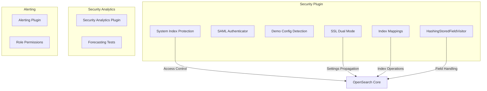

# Security Bugfixes

## Summary

This document tracks security-related bug fixes across OpenSearch Security plugin, Security Analytics plugin, and related components. These fixes address various issues including system index access control, authentication audit logging, configuration detection, SSL settings propagation, and stored field handling.

## Details

### Architecture



### Components

| Component | Description | Repository |
|-----------|-------------|------------|
| System Index Protection | Prevents unauthorized access to security system indices | security |
| SAML Authenticator | Handles SAML-based authentication and audit logging | security |
| Demo Config Detection | Detects existing security configuration in YAML files | security |
| SSL Dual Mode | Manages SSL/TLS dual mode settings propagation | security |
| HashingStoredFieldVisitor | Handles stored fields in search operations | security |
| Index Mappings | Manages index mapping operations for closed indices | security |
| Role Permissions | Manages alerting role permissions | alerting |

### Configuration

| Setting | Description | Default |
|---------|-------------|---------|
| `plugins.security_config.ssl_dual_mode_enabled` | Enable SSL dual mode for mixed cluster configurations | `false` |
| `plugins.security.ssl_only` | Run in SSL-only mode | `false` |

### Usage Example

**Dynamically changing SSL dual mode:**
```bash
curl -XPUT https://localhost:9200/_cluster/settings \
  -k -H "Content-Type: application/json" \
  -d '{"persistent": {"plugins.security_config.ssl_dual_mode_enabled": false}}'
```

**Using stored_fields in search:**
```json
GET /my-index/_search
{
  "stored_fields": ["title", "date"],
  "query": {
    "match": {
      "content": "opensearch"
    }
  }
}
```

## Limitations

- SSL dual mode changes require companion OpenSearch core changes
- Some fixes are backports and may have version-specific behavior
- Demo configuration detection requires SnakeYaml library for nested YAML parsing

## Related PRs

| Version | PR | Repository | Description |
|---------|-----|------------|-------------|
| v2.18.0 | [#4775](https://github.com/opensearch-project/security/pull/4775) | security | Fix admin system index read |
| v2.18.0 | [#4770](https://github.com/opensearch-project/security/pull/4770) | security | Remove SAML failed login audit |
| v2.18.0 | [#4798](https://github.com/opensearch-project/security/pull/4798) | security | Handle non-flat YAML settings |
| v2.18.0 | [#4830](https://github.com/opensearch-project/security/pull/4830) | security | SSL dual mode propagation |
| v2.18.0 | [#4827](https://github.com/opensearch-project/security/pull/4827) | security | Fix HashingStoredFieldVisitor |
| v2.18.0 | [#4777](https://github.com/opensearch-project/security/pull/4777) | security | Fix closed index mappings |
| v2.18.0 | [#1303](https://github.com/opensearch-project/security-analytics/pull/1303) | security-analytics | Fix OS launch exception |

## References

- [Issue #4608](https://github.com/opensearch-project/security/issues/4608): SAML failed login audit issue
- [Issue #4735](https://github.com/opensearch-project/security/issues/4735): Demo config nested YAML issue
- [Issue #4755](https://github.com/opensearch-project/security/issues/4755): Admin system index read issue
- [Issue #1273](https://github.com/opensearch-project/security-analytics/issues/1273): OS launch exception issue
- [OpenSearch stored_fields documentation](https://opensearch.org/docs/latest/search-plugins/searching-data/retrieve-specific-fields/#searching-with-stored_fields)

## Change History

- **v2.18.0** (2024-10-29): Multiple security bug fixes including system index protection, SAML audit logging, demo config detection, SSL dual mode propagation, stored field handling, and closed index mappings
