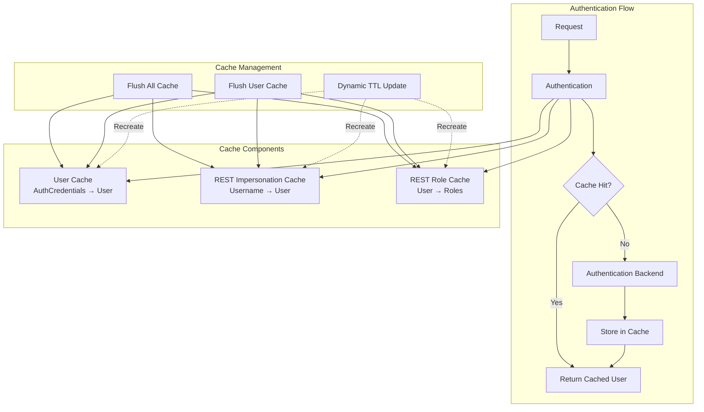

---
tags:
  - domain/security
  - component/server
  - performance
  - security
---
# Security Cache Management

## Summary

The OpenSearch Security plugin provides authentication caching to improve performance by temporarily storing user objects returned from authentication backends. This feature allows administrators to manage the authentication cache through REST APIs, including flushing the entire cache or invalidating entries for specific users. Dynamic configuration of cache TTL is also supported, enabling runtime adjustments without cluster restarts.

## Details

### Architecture



### Data Flow

```mermaid
flowchart TB
    subgraph "Cache Invalidation"
        A[Admin Request] --> B{Endpoint}
        B -->|/cache| C[Invalidate All]
        B -->|/cache/user/{name}| D[Invalidate User]
        C --> E[Clear All Caches]
        D --> F[Filter by Username]
        F --> G[Invalidate Matching Entries]
    end
```

### Components

| Component | Description |
|-----------|-------------|
| `BackendRegistry` | Central registry managing authentication backends and caches |
| `FlushCacheApiAction` | REST handler for cache management endpoints |
| `ConfigUpdateAction` | Transport action for propagating cache updates across nodes |
| `SecuritySettings` | Cluster settings definitions including dynamic TTL |

### Configuration

| Setting | Description | Default | Dynamic |
|---------|-------------|---------|---------|
| `plugins.security.cache.ttl_minutes` | Time-to-live for cached authentication entries in minutes | 60 | Yes (v3.1.0+) |

### Cache Types

The Security plugin maintains three separate caches:

1. **User Cache**: Maps `AuthCredentials` to `User` objects for standard REST authentication
2. **REST Impersonation Cache**: Maps usernames to `User` objects for impersonation scenarios
3. **REST Role Cache**: Maps `User` objects to their resolved backend roles

### API Endpoints

#### Flush All Cache

Invalidates all entries in all security caches.

```
DELETE /_plugins/_security/api/cache
```

**Response:**
```json
{
  "message": "Cache flushed successfully."
}
```

#### Flush User Cache (v3.1.0+)

Invalidates cache entries for a specific user across all cache types.

```
DELETE /_plugins/_security/api/cache/user/{username}
```

**Response:**
```json
{
  "message": "Cache invalidated for user: {username}"
}
```

#### Dynamic TTL Update (v3.1.0+)

Update cache TTL at runtime via cluster settings API.

```
PUT /_cluster/settings
{
  "transient": {
    "plugins.security.cache.ttl_minutes": "120"
  }
}
```

### Usage Example

```bash
# Check current cache TTL via health endpoint
curl -X GET "https://localhost:9200/_plugins/_security/health" \
  --cert admin.pem --key admin-key.pem --cacert root-ca.pem

# Flush cache for specific user after role change
curl -X DELETE "https://localhost:9200/_plugins/_security/api/cache/user/john_doe" \
  -H "Content-Type: application/json" \
  --cert admin.pem --key admin-key.pem --cacert root-ca.pem

# Flush entire cache
curl -X DELETE "https://localhost:9200/_plugins/_security/api/cache" \
  -H "Content-Type: application/json" \
  --cert admin.pem --key admin-key.pem --cacert root-ca.pem

# Update cache TTL dynamically
curl -X PUT "https://localhost:9200/_cluster/settings" \
  -H "Content-Type: application/json" \
  -d '{
    "transient": {
      "plugins.security.cache.ttl_minutes": "1440"
    }
  }' \
  --cert admin.pem --key admin-key.pem --cacert root-ca.pem
```

### Use Cases

1. **LDAP Role Changes**: When a user's backend roles change in LDAP, invalidate their cache entry to pick up new permissions immediately
2. **User Deactivation**: Immediately revoke access by invalidating a specific user's cache
3. **Performance Tuning**: Adjust cache TTL based on authentication backend load and security requirements
4. **Troubleshooting**: Clear cache to diagnose authentication issues

## Limitations

- Cache invalidation requires admin TLS certificate authentication
- User-specific invalidation does not validate user existence
- Dynamic TTL changes are transient (not persisted across restarts)
- Changing TTL recreates all caches, causing temporary cache misses
- Disabling cache (`ttl_minutes: 0`) increases load on authentication backends

## Change History

- **v3.1.0** (2026-01): Added selective user cache invalidation endpoint and dynamic TTL configuration


## References

### Documentation
- [Security Settings Documentation](https://docs.opensearch.org/3.0/install-and-configure/configuring-opensearch/security-settings/): Official security configuration

### Pull Requests
| Version | PR | Description | Related Issue |
|---------|-----|-------------|---------------|
| v3.1.0 | [#5337](https://github.com/opensearch-project/security/pull/5337) | Add flush cache endpoint for individual user | [#2829](https://github.com/opensearch-project/security/issues/2829) |
| v3.1.0 | [#5324](https://github.com/opensearch-project/security/pull/5324) | Register cluster settings listener for dynamic TTL |   |

### Issues (Design / RFC)
- [Issue #2829](https://github.com/opensearch-project/security/issues/2829): Feature request for per-user cache invalidation
