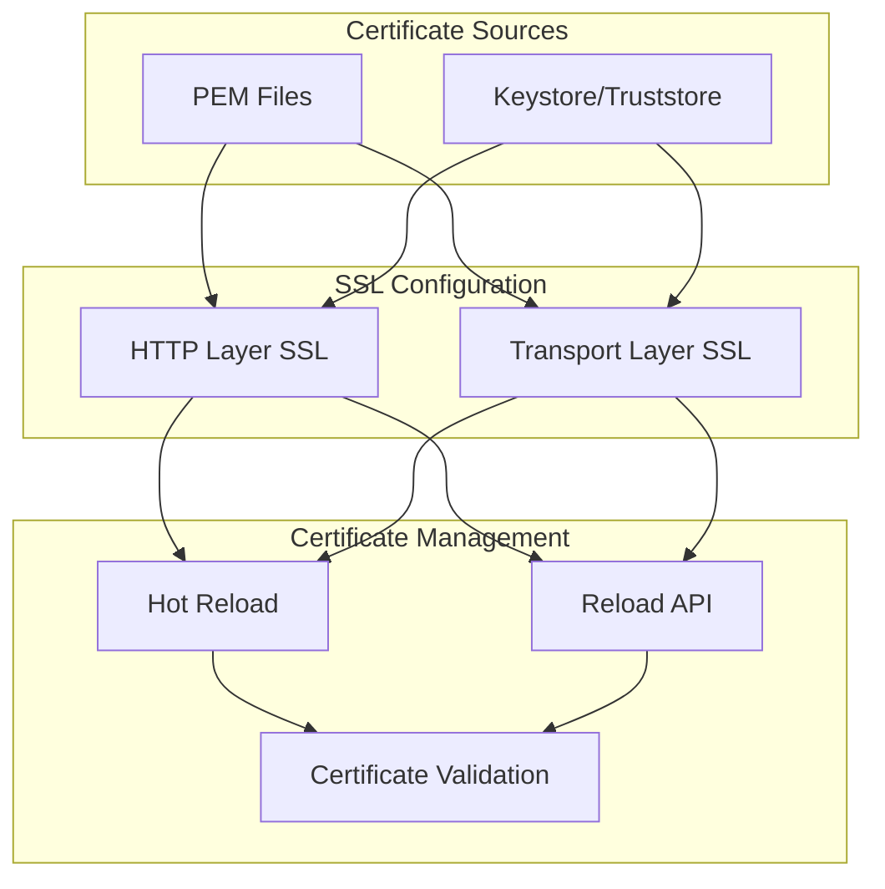

---
tags:
  - security
---
# Security Certificate Management

## Summary

The OpenSearch Security plugin provides comprehensive SSL/TLS certificate management capabilities for securing both transport layer (node-to-node) and REST layer (client-to-node) communication. This includes support for PEM certificates, PKCS#8 keys, JKS/PKCS12 keystores, certificate hot reloading, and configurable validation options.

## Details

### Architecture



### Components

| Component | Description |
|-----------|-------------|
| Transport Layer TLS | Secures node-to-node communication within the cluster |
| REST Layer TLS | Secures client-to-node communication via HTTPS |
| Certificate Hot Reload | Automatic certificate refresh without cluster restart |
| Reload Certificates API | Manual certificate reload via REST endpoint |
| DN Verification | Validates certificate Distinguished Names during reload |
| CA Validation | Validates authority certificates before SSL context reload |

### Configuration

#### PEM Certificate Settings

| Setting | Description | Default |
|---------|-------------|---------|
| `plugins.security.ssl.http.enabled` | Enable TLS on REST layer | `false` |
| `plugins.security.ssl.http.pemcert_filepath` | Path to node certificate (PEM) | Required |
| `plugins.security.ssl.http.pemkey_filepath` | Path to private key (PKCS#8) | Required |
| `plugins.security.ssl.http.pemtrustedcas_filepath` | Path to root CA (PEM) | Required |
| `plugins.security.ssl.transport.pemcert_filepath` | Path to transport certificate | Required |
| `plugins.security.ssl.transport.pemkey_filepath` | Path to transport private key | Required |
| `plugins.security.ssl.transport.pemtrustedcas_filepath` | Path to transport root CA | Required |

#### Hot Reload Settings

| Setting | Description | Default |
|---------|-------------|---------|
| `plugins.security.ssl.certificates_hot_reload.enabled` | Enable automatic certificate hot reload | `false` |
| `plugins.security.ssl_cert_reload_enabled` | Enable Reload Certificates API | `false` |
| `plugins.security.ssl.http.enforce_cert_reload_dn_verification` | Enforce DN verification for HTTP reload | `true` |
| `plugins.security.ssl.transport.enforce_cert_reload_dn_verification` | Enforce DN verification for transport reload | `true` |

### Usage Example

```yaml
# opensearch.yml - Certificate configuration with hot reload

# REST layer TLS
plugins.security.ssl.http.enabled: true
plugins.security.ssl.http.pemcert_filepath: node.pem
plugins.security.ssl.http.pemkey_filepath: node-key.pem
plugins.security.ssl.http.pemtrustedcas_filepath: root-ca.pem

# Transport layer TLS
plugins.security.ssl.transport.pemcert_filepath: node.pem
plugins.security.ssl.transport.pemkey_filepath: node-key.pem
plugins.security.ssl.transport.pemtrustedcas_filepath: root-ca.pem

# Enable automatic hot reload
plugins.security.ssl.certificates_hot_reload.enabled: true

# Or enable manual reload API
plugins.security.ssl_cert_reload_enabled: true

# Optional: Disable DN verification for Let's Encrypt rotation
plugins.security.ssl.http.enforce_cert_reload_dn_verification: false
plugins.security.ssl.transport.enforce_cert_reload_dn_verification: false
```

### Reload Certificates API

```bash
# Reload HTTP layer certificates
curl --cacert ca.pem --cert admin.pem --key admin.key \
  -XPUT https://localhost:9200/_plugins/_security/api/ssl/http/reloadcerts

# Reload transport layer certificates
curl --cacert ca.pem --cert admin.pem --key admin.key \
  -XPUT https://localhost:9200/_plugins/_security/api/ssl/transport/reloadcerts
```

## Limitations

- Hot reload monitoring interval is fixed at 5 seconds
- Certificates must be stored in the OpenSearch config directory
- Only superadmin users can use the Reload Certificates API
- When DN verification is disabled, additional security controls should be in place

## Change History

- **v2.19.0** (2025-02-18): Added file system hot reload, configurable DN verification, CA validation, JDK PKCS fixes

## References

### Documentation
- [Configuring TLS Certificates](https://docs.opensearch.org/latest/security/configuration/tls/): Official TLS configuration guide

### Pull Requests
| Version | PR | Description |
|---------|-----|-------------|
| v2.19.0 | [#4880](https://github.com/opensearch-project/security/pull/4880) | Add support for certificates hot reload |
| v2.19.0 | [#4752](https://github.com/opensearch-project/security/pull/4752) | Allow skipping hot reload DN validation |
| v2.19.0 | [#4835](https://github.com/opensearch-project/security/pull/4835) | Add validation of authority certificates |
| v2.19.0 | [#5000](https://github.com/opensearch-project/security/pull/5000) | Set default value for key/trust store type for JDK PKCS |
| v2.19.0 | [#4999](https://github.com/opensearch-project/security/pull/4999) | Fix SSL config for JDK PKCS setup |
