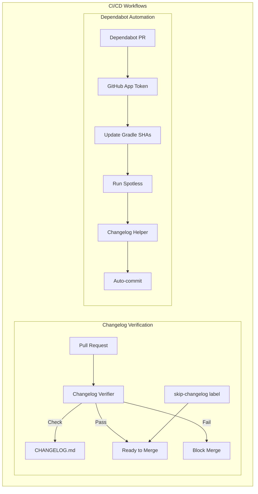

# Security CI/CD

## Summary

The OpenSearch Security plugin includes automated CI/CD workflows for changelog management and dependency updates. These GitHub Actions workflows enforce changelog updates on every pull request and automate housekeeping tasks for Dependabot PRs, improving release note quality and reducing manual maintenance burden.

## Details

### Architecture



### Components

| Component | Description |
|-----------|-------------|
| `changelog_verifier.yml` | GitHub Actions workflow that enforces changelog updates on PRs |
| `dependabot_pr.yml` | GitHub Actions workflow that automates Dependabot PR housekeeping |
| `CHANGELOG.md` | Changelog file following Keep a Changelog format |

### Configuration

| Setting | Description | Default |
|---------|-------------|---------|
| `skipLabels` | Labels that bypass changelog verification | `autocut, skip-changelog` |
| `version` | Target changelog section for Dependabot entries | `Unreleased 3.x` |

### Changelog Verifier Workflow

```yaml
name: "Changelog Verifier"
on:
  pull_request:
    types: [opened, edited, review_requested, synchronize, reopened, ready_for_review, labeled, unlabeled]

jobs:
  verify-changelog:
    if: github.repository == 'opensearch-project/security'
    runs-on: ubuntu-latest
    steps:
      - uses: actions/checkout@v4
      - uses: dangoslen/changelog-enforcer@v3
        with:
          skipLabels: "autocut, skip-changelog"
```

### Dependabot PR Workflow

The Dependabot workflow automates three tasks:

1. **Update Gradle SHAs** - Runs `./gradlew updateSHAs` to update dependency checksums
2. **Spotless Formatting** - Runs `./gradlew spotlessApply` for consistent code formatting
3. **Changelog Update** - Adds dependency update entries to the changelog

### Usage Example

#### Adding a Changelog Entry

```markdown

## Limitations

- Changelog verifier only runs for the `opensearch-project/security` repository
- Dependabot workflow requires GitHub App credentials configured as repository secrets
- Dependabot changelog helper targets a specific version section ("Unreleased 3.x")

## Change History

- **v3.1.0** (2025-05-12): Initial implementation with changelog verifier and Dependabot PR workflows

## References

### Documentation
- [Keep a Changelog](https://keepachangelog.com/en/1.0.0/): Changelog format specification
- [changelog-enforcer](https://github.com/dangoslen/changelog-enforcer): GitHub Action for enforcing changelog updates
- [dependabot-changelog-helper](https://github.com/dangoslen/dependabot-changelog-helper): GitHub Action for Dependabot changelog automation
- [Geospatial PR #238](https://github.com/opensearch-project/geospatial/pull/238): Reference implementation in another OpenSearch repository

### Pull Requests
| Version | PR | Description | Related Issue |
|---------|-----|-------------|---------------|
| v3.1.0 | [#5318](https://github.com/opensearch-project/security/pull/5318) | Add workflow for changelog verification | [#5095](https://github.com/opensearch-project/security/issues/5095) |

### Issues (Design / RFC)
- [Issue #5095](https://github.com/opensearch-project/security/issues/5095): Original feature request
