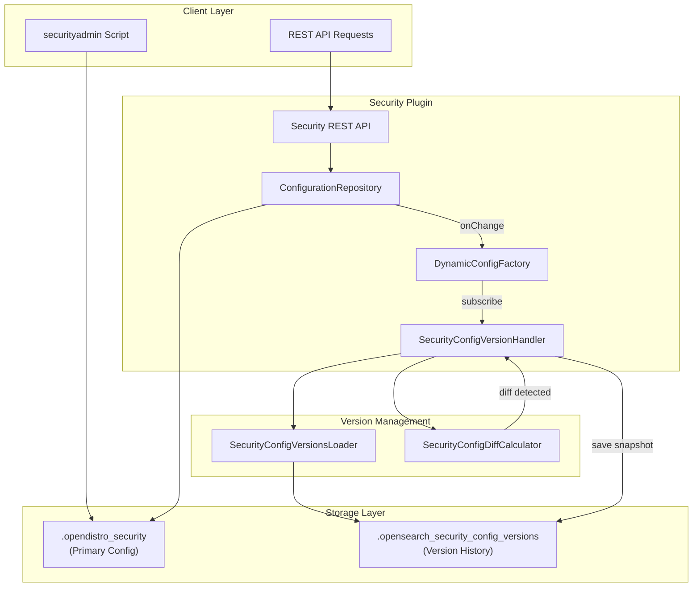
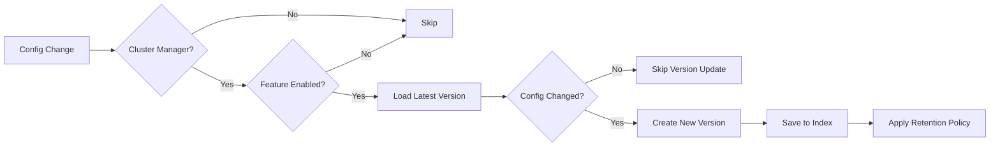

# Security Configuration Versioning

## Summary

Security Configuration Versioning is an experimental feature that provides a comprehensive versioning system for OpenSearch security configurations. It enables administrators to track all changes to security settings, view configuration history, and provides the foundation for future rollback and roll-forward capabilities. The feature automatically creates version snapshots whenever security configurations change, storing them in a dedicated system index.

## Details

### Architecture



### Data Flow



### Components

| Component | Description |
|-----------|-------------|
| `SecurityConfigVersionHandler` | Core handler that listens for configuration changes and manages version creation |
| `SecurityConfigVersionsLoader` | Utility for loading version documents from the system index (sync and async) |
| `SecurityConfigDiffCalculator` | Computes JSON diffs between configuration versions to detect changes |
| `SecurityConfigVersionDocument` | Data model representing the version document structure |
| `SecurityConfigVersionDocument.Version` | Individual version entry with timestamp, modifier, and config snapshot |
| `SecurityConfigVersionDocument.HistoricSecurityConfig` | Configuration snapshot for a specific config type |

### Configuration

| Setting | Description | Default | Scope |
|---------|-------------|---------|-------|
| `plugins.security.configurations_versions.enabled` | Enable/disable the versioning feature | `false` | Node |
| `plugins.security.config_versions_index_name` | Custom name for the versions index | `.opensearch_security_config_versions` | Node |
| `plugins.security.config_version.retention_count` | Maximum number of versions to retain | `10` | Node, Final |

### Version Document Schema

```json
{
  "_index": ".opensearch_security_config_versions",
  "_id": "opensearch_security_config_versions",
  "_source": {
    "versions": [
      {
        "version_id": "v1",
        "timestamp": "2025-05-22T08:46:11.887620466Z",
        "modified_by": "system",
        "security_configs": {
          "config": {
            "lastUpdated": "2025-05-22T08:46:11.887620466Z",
            "configData": { }
          },
          "roles": {
            "lastUpdated": "2025-05-22T08:46:11.887620466Z",
            "configData": { }
          },
          "rolesmapping": {
            "lastUpdated": "2025-05-22T08:46:11.887620466Z",
            "configData": { }
          },
          "internalusers": {
            "lastUpdated": "2025-05-22T08:46:11.887620466Z",
            "configData": { }
          },
          "actiongroups": {
            "lastUpdated": "2025-05-22T08:46:11.887620466Z",
            "configData": { }
          },
          "tenants": {
            "lastUpdated": "2025-05-22T08:46:11.887620466Z",
            "configData": { }
          },
          "nodesdn": {
            "lastUpdated": "2025-05-22T08:46:11.887620466Z",
            "configData": { }
          },
          "whitelist": {
            "lastUpdated": "2025-05-22T08:46:11.887620466Z",
            "configData": { }
          },
          "audit": {
            "lastUpdated": "2025-05-22T08:46:11.887620466Z",
            "configData": { }
          },
          "allowlist": {
            "lastUpdated": "2025-05-22T08:46:11.887620466Z",
            "configData": { }
          }
        }
      }
    ]
  }
}
```

### Usage Example

#### Enable the Feature

```yaml
# opensearch.yml
plugins.security.configurations_versions.enabled: true
plugins.security.config_version.retention_count: 20
```

#### Trigger Version Creation

Any security configuration change via REST API triggers version creation:

```bash
# Create internal user
curl -XPUT "https://localhost:9200/_plugins/_security/api/internalusers/newuser" \
  -u 'admin:admin' --insecure \
  -H 'Content-Type: application/json' \
  -d '{
    "password": "SecurePassword123!",
    "backend_roles": ["analyst"],
    "attributes": {
      "department": "security"
    }
  }'

# Update role mapping
curl -XPATCH "https://localhost:9200/_plugins/_security/api/rolesmapping/all_access" \
  -u 'admin:admin' --insecure \
  -H 'Content-Type: application/json' \
  -d '[
    {
      "op": "add",
      "path": "/backend_roles/-",
      "value": "new_admin_role"
    }
  ]'
```

#### View Version Index

```bash
curl -XGET "https://localhost:9200/.opensearch_security_config_versions/_search?pretty" \
  -u 'admin:admin' --insecure
```

### Key Behaviors

1. **Cluster Manager Exclusivity**: Only the elected cluster manager node creates versions to prevent duplicates
2. **Change Detection**: Uses JSON diff (zjsonpatch library) to detect actual configuration changes
3. **Idempotent Updates**: No version created if configuration content is identical to the latest version
4. **Automatic Retention**: Asynchronously prunes old versions exceeding the retention count
5. **Optimistic Concurrency Control**: Uses sequence numbers and primary terms to handle concurrent updates
6. **System Index Protection**: The versions index is created as a system index with appropriate settings

## Limitations

- **Experimental Status**: Feature is disabled by default and marked as experimental
- **No Rollback API Yet**: Current implementation provides versioning infrastructure only; rollback/roll-forward APIs are planned
- **Full Snapshots**: Each version stores complete configuration snapshots (not incremental diffs)
- **Single Document Storage**: All versions stored in a single document, which may impact performance with many versions
- **Cluster Manager Dependency**: Requires an elected cluster manager for version tracking

## Related PRs

| Version | PR | Description |
|---------|-----|-------------|
| v3.2.0 | [#5357](https://github.com/opensearch-project/security/pull/5357) | Initial implementation of versioned security configuration management |

## References

- [Issue #5093](https://github.com/opensearch-project/security/issues/5093): Original feature request for tracking security index patches
- [Security Configuration Documentation](https://docs.opensearch.org/3.0/security/configuration/index/)
- [Security Settings](https://docs.opensearch.org/3.0/install-and-configure/configuring-opensearch/security-settings/)

## Change History

- **v3.2.0** (2025-06-18): Initial implementation with versioning infrastructure, change detection, and retention policy
