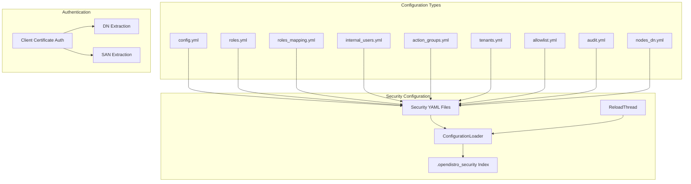

---
tags:
  - indexing
  - ml
  - security
---

# Security Configuration

## Summary

The OpenSearch Security plugin provides comprehensive security features including TLS encryption, authentication backends, data masking, audit logging, and role-based access control. The security configuration system manages how these features are configured and upgraded across OpenSearch versions.

## Details

### Architecture



### Configuration Version Model

The Security plugin uses versioned configuration models:

| Version | Description | OpenSearch Version |
|---------|-------------|-------------------|
| v6 | Legacy format | Pre-2.18 |
| v7 | Current format | 2.18+ |

Starting with OpenSearch 2.18, the plugin automatically converts v6 configurations to v7 format. In OpenSearch 3.0.0, the default assumption for configurations without explicit `_meta` version is v7.

### Configuration File Structure

Each security configuration file should include a `_meta` section:

```yaml
_meta:
  type: "config"
  config_version: 2

config:
  dynamic:
    # configuration options
```

### Configuration Reloading

Starting with v3.4.0, security configuration reloading is handled by a dedicated `ReloadThread` that:
- Prevents MANAGEMENT thread pool exhaustion during high-frequency configuration changes
- Merges consecutive reload requests to minimize queue buildup
- Improves overall node stability during configuration updates

### Authentication Handling

The Security plugin supports various authentication backends including:

- Internal user database
- LDAP/Active Directory
- OIDC (OpenID Connect)
- SAML
- Kerberos
- JWT
- Client Certificate (with DN or SAN extraction)

#### Client Certificate Authentication

Client certificate authentication supports two modes for extracting the username:

1. **Distinguished Name (DN)**: Traditional extraction from certificate subject
2. **Subject Alternative Name (SAN)**: Extract from X509v3 SAN fields (v3.4.0+)

Supported SAN types: EMAIL, DNS, IP, URI with glob pattern matching.

```yaml
# SAN-based authentication example
clientcert_auth_domain:
  http_enabled: true
  http_authenticator:
    type: clientcert
    config:
      username_attribute: "san:EMAIL:*@example.com"
```

#### OIDC Username Handling

OIDC providers may send usernames with special characters. The plugin handles pipe characters (`|`) by escaping them in the ThreadContext to prevent parsing issues.

### Components

| Component | Description |
|-----------|-------------|
| ConfigurationLoader | Loads and validates security configurations |
| ReloadThread | Dedicated thread for configuration reloading with request merging (v3.4.0+) |
| SecurityAdmin | CLI tool for managing security configurations |
| Installer | Demo configuration installer |
| ThreadContext | Stores user information during request processing |
| HTTPClientCertAuthenticator | Handles client certificate authentication with DN/SAN support |

### Configuration

| Setting | Description | Default | Dynamic |
|---------|-------------|---------|---------|
| `plugins.security.config_index_name` | Name of the security index | `.opendistro_security` | No |
| `plugins.security.allow_default_init_securityindex` | Allow default initialization | `false` | No |
| `plugins.security.audit.type` | Audit log type | `internal_opensearch` | No |
| `plugins.security.user_attribute_serialization.enabled` | Enable user attribute serialization | `false` | Yes |
| `plugins.security.experimental.resource_sharing.enabled` | Enable resource sharing framework | `false` | Yes (v3.4.0+) |
| `plugins.security.experimental.resource_sharing.protected_types` | List of resource types to protect | `[]` | Yes (v3.4.0+) |

### SecurityAdmin CLI

The `securityadmin.sh` tool manages security configurations:

```bash
# Basic usage
./securityadmin.sh -cd ../config/ -icl -nhnv \
  -cacert /path/to/root-ca.pem \
  -cert /path/to/admin.pem \
  -key /path/to/admin-key.pem

# With custom timeout (v3.4.0+)
./securityadmin.sh -cd ../config/ --timeout 60 ...
```

| Option | Description | Default |
|--------|-------------|---------|
| `-cd` | Configuration directory | - |
| `-icl` | Ignore cluster name | - |
| `-nhnv` | No hostname verification | - |
| `--timeout` / `-to` | Request timeout in seconds (v3.4.0+) | 30 |

### Usage Example

```yaml
# config.yml - Basic authentication configuration
_meta:
  type: "config"
  config_version: 2

config:
  dynamic:
    authc:
      basic_internal_auth_domain:
        http_enabled: true
        transport_enabled: true
        order: 1
        http_authenticator:
          type: basic
          challenge: true
        authentication_backend:
          type: internal
```

## Limitations

- Configuration changes require either a cluster restart or use of the Security Admin tool
- Some configuration options are not hot-reloadable
- OIDC usernames with escaped pipe characters may need special handling in downstream systems
- SAN extraction requires certificates with properly configured X509v3 extensions

## Change History

- **v3.4.0** (2025-01-11): Dedicated configuration reloading thread, dynamic resource settings, X509v3 SAN authentication, performance optimizations, securityadmin timeout option
- **v3.3.0** (2025-10-01): Added protected resource types setting, made user attribute serialization dynamic
- **v3.0.0** (2025-05-06): Default to v7 models, escape pipe characters in usernames, fix demo config version matcher
- **v2.18.0** (2024-11-05): Auto-convert security config models from v6 to v7

## References

### Documentation
- [Documentation: Client Certificate Authentication](https://docs.opensearch.org/3.4/security/authentication-backends/client-auth/)
- [Documentation: Configuration APIs](https://docs.opensearch.org/3.0/api-reference/security/configuration/index/)
- [Documentation: Upgrade Perform API](https://docs.opensearch.org/3.0/api-reference/security/configuration/upgrade-perform/)

### Pull Requests
| Version | PR | Description | Related Issue |
|---------|-----|-------------|---------------|
| v3.4.0 | [#5479](https://github.com/opensearch-project/security/pull/5479) | Moved configuration reloading to dedicated thread | [#5464](https://github.com/opensearch-project/security/issues/5464) |
| v3.4.0 | [#5677](https://github.com/opensearch-project/security/pull/5677) | Makes resource settings dynamic |   |
| v3.4.0 | [#5701](https://github.com/opensearch-project/security/pull/5701) | Add support for X509v3 extensions (SAN) for authentication | [#5643](https://github.com/opensearch-project/security/issues/5643) |
| v3.4.0 | [#5752](https://github.com/opensearch-project/security/pull/5752) | Call AdminDns.isAdmin once per request |   |
| v3.4.0 | [#5769](https://github.com/opensearch-project/security/pull/5769) | Headers copy optimization |   |
| v3.4.0 | [#5787](https://github.com/opensearch-project/security/pull/5787) | Add --timeout option to securityadmin.sh | [#5653](https://github.com/opensearch-project/security/issues/5653) |
| v3.3.0 | [#5671](https://github.com/opensearch-project/security/pull/5671) | Adds protected resource types setting |   |
| v3.3.0 | [#5673](https://github.com/opensearch-project/security/pull/5673) | Make user attribute serialization dynamic |   |
| v3.0.0 | [#5193](https://github.com/opensearch-project/security/pull/5193) | Default to v7 models if _meta not present | [#5191](https://github.com/opensearch-project/security/issues/5191) |
| v3.0.0 | [#5175](https://github.com/opensearch-project/security/pull/5175) | Escape pipe character for injected users | [#2756](https://github.com/opensearch-project/security/issues/2756) |
| v3.0.0 | [#5157](https://github.com/opensearch-project/security/pull/5157) | Fix version matcher in demo config installer |   |
| v2.18.0 | [#4753](https://github.com/opensearch-project/security/pull/4753) | Auto-convert security config models from v6 to v7 |   |

### Issues (Design / RFC)
- [Issue #5464](https://github.com/opensearch-project/security/issues/5464): ActionPrivileges initialization performance issue
- [Issue #5643](https://github.com/opensearch-project/security/issues/5643): SAN authentication feature request
- [Issue #5653](https://github.com/opensearch-project/security/issues/5653): SocketTimeoutException in securityadmin
- [Issue #4209](https://github.com/opensearch-project/security/issues/4209): X509v3 SAN support request
- [Issue #5191](https://github.com/opensearch-project/security/issues/5191): Upgrade failure from 2.19 to 3.0.0-alpha1
- [Issue #2756](https://github.com/opensearch-project/security/issues/2756): Username cannot have '|' in the security plugin
