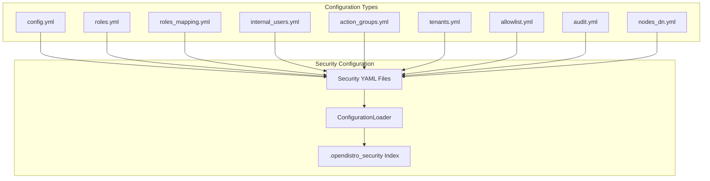

# Security Configuration

## Summary

The OpenSearch Security plugin provides comprehensive security features including TLS encryption, authentication backends, data masking, audit logging, and role-based access control. The security configuration system manages how these features are configured and upgraded across OpenSearch versions.

## Details

### Architecture



### Configuration Version Model

The Security plugin uses versioned configuration models:

| Version | Description | OpenSearch Version |
|---------|-------------|-------------------|
| v6 | Legacy format | Pre-2.18 |
| v7 | Current format | 2.18+ |

Starting with OpenSearch 2.18, the plugin automatically converts v6 configurations to v7 format. In OpenSearch 3.0.0, the default assumption for configurations without explicit `_meta` version is v7.

### Configuration File Structure

Each security configuration file should include a `_meta` section:

```yaml
_meta:
  type: "config"
  config_version: 2

config:
  dynamic:
    # configuration options
```

### Authentication Handling

The Security plugin supports various authentication backends including:

- Internal user database
- LDAP/Active Directory
- OIDC (OpenID Connect)
- SAML
- Kerberos
- JWT

#### OIDC Username Handling

OIDC providers may send usernames with special characters. The plugin handles pipe characters (`|`) by escaping them in the ThreadContext to prevent parsing issues.

### Components

| Component | Description |
|-----------|-------------|
| ConfigurationLoader | Loads and validates security configurations |
| SecurityAdmin | CLI tool for managing security configurations |
| Installer | Demo configuration installer |
| ThreadContext | Stores user information during request processing |

### Configuration

| Setting | Description | Default |
|---------|-------------|---------|
| `plugins.security.config_index_name` | Name of the security index | `.opendistro_security` |
| `plugins.security.allow_default_init_securityindex` | Allow default initialization | `false` |
| `plugins.security.audit.type` | Audit log type | `internal_opensearch` |

### Usage Example

```yaml
# config.yml - Basic authentication configuration
_meta:
  type: "config"
  config_version: 2

config:
  dynamic:
    authc:
      basic_internal_auth_domain:
        http_enabled: true
        transport_enabled: true
        order: 1
        http_authenticator:
          type: basic
          challenge: true
        authentication_backend:
          type: internal
```

## Limitations

- Configuration changes require either a cluster restart or use of the Security Admin tool
- Some configuration options are not hot-reloadable
- OIDC usernames with escaped pipe characters may need special handling in downstream systems

## Related PRs

| Version | PR | Description |
|---------|-----|-------------|
| v3.0.0 | [#5193](https://github.com/opensearch-project/security/pull/5193) | Default to v7 models if _meta not present |
| v3.0.0 | [#5175](https://github.com/opensearch-project/security/pull/5175) | Escape pipe character for injected users |
| v3.0.0 | [#5157](https://github.com/opensearch-project/security/pull/5157) | Fix version matcher in demo config installer |
| v2.18.0 | [#4753](https://github.com/opensearch-project/security/pull/4753) | Auto-convert security config models from v6 to v7 |

## References

- [Issue #5191](https://github.com/opensearch-project/security/issues/5191): Upgrade failure from 2.19 to 3.0.0-alpha1
- [Issue #2756](https://github.com/opensearch-project/security/issues/2756): Username cannot have '|' in the security plugin
- [Documentation: Configuration APIs](https://docs.opensearch.org/3.0/api-reference/security/configuration/index/)
- [Documentation: Upgrade Perform API](https://docs.opensearch.org/3.0/api-reference/security/configuration/upgrade-perform/)
- [Documentation: Rolling Upgrade](https://docs.opensearch.org/3.0/install-and-configure/upgrade-opensearch/rolling-upgrade/)

## Change History

- **v3.0.0** (2025-05-06): Default to v7 models, escape pipe characters in usernames, fix demo config version matcher
- **v2.18.0** (2024-11-05): Auto-convert security config models from v6 to v7
