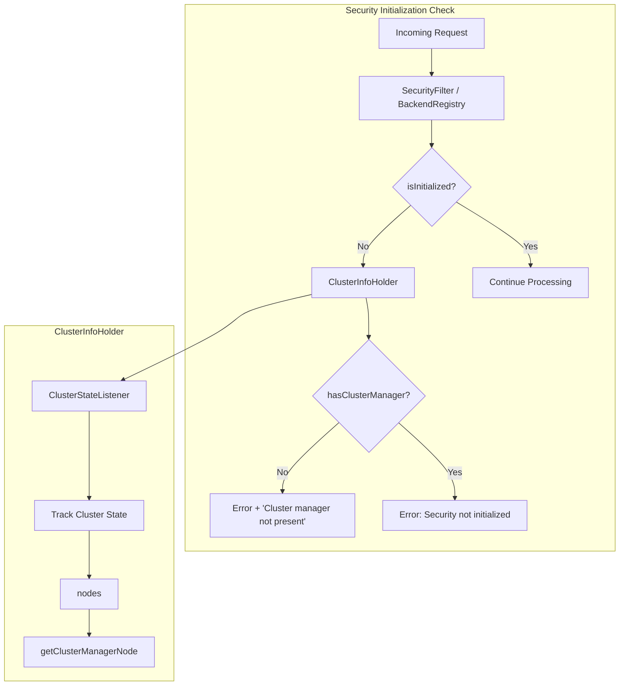
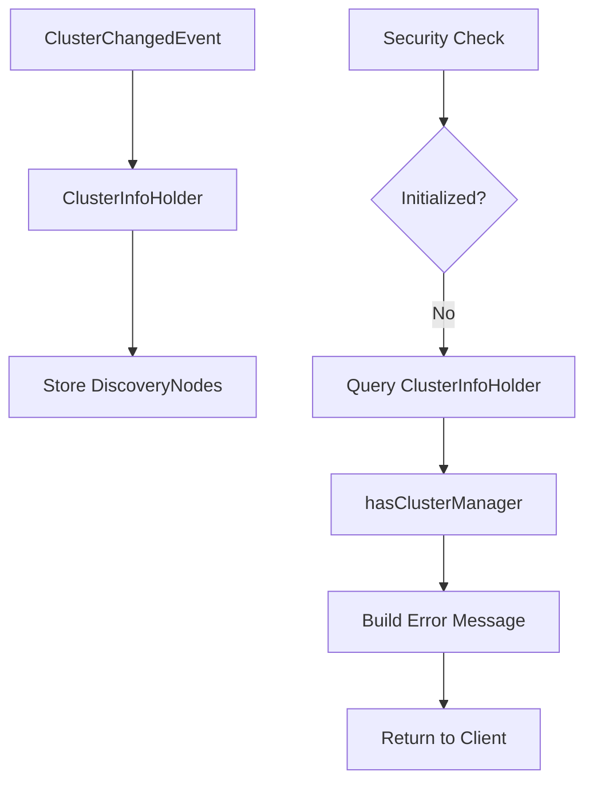

# Security Debugging

## Summary

Security Debugging provides enhanced error messages and diagnostic information when the OpenSearch Security plugin fails to initialize. This feature helps administrators quickly identify and resolve common security initialization issues by providing contextual information about the underlying cause of failures.

## Details

### Architecture



### Data Flow



### Components

| Component | Description |
|-----------|-------------|
| `ClusterInfoHolder` | Tracks cluster state including node information and cluster manager presence |
| `BackendRegistry` | Handles authentication and checks security initialization status |
| `SecurityFilter` | Action filter that validates security state before processing requests |
| `PrivilegesEvaluator` | Evaluates user privileges and includes diagnostic info in exceptions |
| `DynamicConfigFactory` | Manages dynamic security configuration with enhanced debug logging |

### Key Methods

| Method | Class | Description |
|--------|-------|-------------|
| `hasClusterManager()` | `ClusterInfoHolder` | Returns `true` if a cluster manager node is present in the cluster |
| `authenticate()` | `BackendRegistry` | Enhanced to include cluster manager status in error responses |
| `apply()` | `SecurityFilter` | Enhanced to include diagnostic info when security is not initialized |
| `createContext()` | `PrivilegesEvaluator` | Throws exception with cluster manager status if not initialized |
| `evaluate()` | `PrivilegesEvaluator` | Throws exception with cluster manager status if not initialized |

### Configuration

No additional configuration is required. The enhanced error messages are automatically included when security initialization fails.

### Usage Example

**Scenario: Cluster without a cluster manager**

```yaml
# opensearch.yml - Node configured without cluster manager role
node.roles: [data, ingest]
```

**API Request:**
```bash
curl -X GET "https://localhost:9200/my-index/_search" \
  -H 'Content-Type: application/json' \
  -u admin:admin \
  --insecure
```

**Response (v3.1.0+):**
```
OpenSearch Security is not initialized. Cluster manager not present
```

**Log Output:**
```
ERROR [...] OpenSearch Security not initialized. Cluster manager not present (you may need to run securityadmin)
```

### Common Causes of Security Not Initialized

| Cause | Error Message | Resolution |
|-------|---------------|------------|
| No cluster manager | "Cluster manager not present" | Ensure at least one node has `cluster_manager` or `master` role |
| Security index not created | Base message only | Run `securityadmin.sh` to initialize security index |
| Network partition | May show cluster manager missing | Check network connectivity between nodes |

## Limitations

- Currently only detects missing cluster manager as a diagnostic cause
- Other causes (network issues, disk space, etc.) are not yet detected
- Debug logging requires appropriate log level configuration

## Related PRs

| Version | PR | Description |
|---------|-----|-------------|
| v3.1.0 | [#5370](https://github.com/opensearch-project/security/pull/5370) | Adds details for debugging Security not initialized error |

## References

- [PR #5370](https://github.com/opensearch-project/security/pull/5370): Initial implementation
- [Security Settings Documentation](https://docs.opensearch.org/3.0/install-and-configure/configuring-opensearch/security-settings/): OpenSearch security configuration
- [About Security](https://docs.opensearch.org/3.0/security/): Security plugin overview

## Change History

- **v3.1.0** (2025-06-10): Initial implementation - Added cluster manager presence check to security initialization error messages
