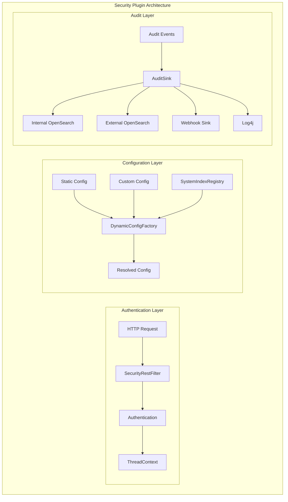
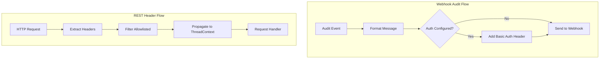

# Security Features

## Summary

The OpenSearch Security plugin provides comprehensive security capabilities including authentication, authorization, audit logging, and access control. This document covers the security features related to audit logging, configuration management, and REST header handling that have been enhanced across OpenSearch versions.

## Details

### Architecture



### Data Flow



### Components

| Component | Description |
|-----------|-------------|
| SecurityRestFilter | Filters REST requests and manages header propagation to ThreadContext |
| WebhookSink | Sends audit log events to external webhook endpoints with optional authentication |
| DynamicConfigFactory | Resolves security configuration from static and custom sources |
| SystemIndexRegistry | Central registry for system indices from all plugins |

### Configuration

| Setting | Description | Default |
|---------|-------------|---------|
| `plugins.security.audit.type` | Audit log storage type (debug, internal_opensearch, external_opensearch, webhook, log4j) | internal_opensearch |
| `plugins.security.audit.config.webhook.url` | Webhook endpoint URL | None |
| `plugins.security.audit.config.webhook.format` | Message format (URL_PARAMETER_GET, URL_PARAMETER_POST, TEXT, JSON, SLACK) | JSON |
| `plugins.security.audit.config.username` | Username for webhook/external_opensearch Basic Auth | None |
| `plugins.security.audit.config.password` | Password for webhook/external_opensearch Basic Auth | None |
| `plugins.security.audit.config.webhook.ssl.verify` | Verify TLS certificate of webhook endpoint | true |
| `plugins.security.system_indices.indices` | Manual system indices list (DEPRECATED in v3.4.0) | None |

### Usage Example

**Webhook Audit Log Configuration**:
```yaml
# opensearch.yml
plugins.security.audit.type: webhook
plugins.security.audit.config.webhook.url: "https://audit-collector.example.com/logs"
plugins.security.audit.config.webhook.format: json
plugins.security.audit.config.username: "opensearch_audit"
plugins.security.audit.config.password: "secure_audit_password"
plugins.security.audit.config.webhook.ssl.verify: true
plugins.security.audit.config.webhook.ssl.pemtrustedcas_filepath: /path/to/ca.pem
```

**Search Relevance Permissions**:
```json
PUT _plugins/_security/api/roles/search_relevance_reader
{
  "cluster_permissions": [
    "cluster:admin/opensearch/search_relevance/experiment/get",
    "cluster:admin/opensearch/search_relevance/judgment/get",
    "cluster:admin/opensearch/search_relevance/queryset/get",
    "cluster:admin/opensearch/search_relevance/search_configuration/get"
  ],
  "index_permissions": [
    {
      "index_patterns": ["search-relevance-*"],
      "allowed_actions": [
        "indices:admin/mappings/get",
        "indices:data/read/search*",
        "indices:data/read/get*"
      ]
    }
  ]
}
```

## Limitations

- Webhook audit log authentication only supports HTTP Basic Authentication
- Static security configs always take precedence over custom configs when there is overlap
- The `plugins.security.system_indices.indices` setting is deprecated and will be removed in v4.0.0

## Change History

- **v3.4.0** (2026-01): Added webhook Basic Auth support, fixed REST header propagation, deprecated system_indices.indices setting, allowed static/custom config overlap, updated search relevance permissions; Bug fixes for multi-tenancy `.kibana` index updates, WildcardMatcher empty string handling, array validator blank string checks, audit log sensitive parameter filtering, deprecated SSL settings, BCFIPS provider bootstrap timing, AccessController migration, PrivilegesEvaluator modularization
- **v3.3.0** (2026-01): Bug fixes for system index access when protection disabled, JWT log spam with empty roles_key
- **v3.1.0** (2025-06-10): Bug fixes for stale cache post snapshot restore, compliance audit log diff computation, DLS/FLS filter reader corrections, authentication header logging improvements
- **v2.18.0** (2024-10-29): Bug fixes for system index protection, SAML audit logging, demo config detection, SSL dual mode propagation, stored field handling, and closed index mappings

## References

### Documentation
- [Audit Log Storage Types Documentation](https://docs.opensearch.org/3.0/security/audit-logs/storage-types/)
- [System Indexes Documentation](https://docs.opensearch.org/3.0/security/configuration/system-indices/)
- [Security Settings Documentation](https://docs.opensearch.org/3.0/install-and-configure/configuring-opensearch/security-settings/)

### Pull Requests
| Version | PR | Description | Related Issue |
|---------|-----|-------------|---------------|
| v3.4.0 | [#5792](https://github.com/opensearch-project/security/pull/5792) | Add Basic Authentication support for webhook audit log sink | [#5738](https://github.com/opensearch-project/security/issues/5738) |
| v3.4.0 | [#5396](https://github.com/opensearch-project/security/pull/5396) | Ensure REST headers from ActionPlugin.getRestHeaders are carried to ThreadContext | [#4799](https://github.com/opensearch-project/security/issues/4799) |
| v3.4.0 | [#5775](https://github.com/opensearch-project/security/pull/5775) | Deprecate plugins.security.system_indices.indices setting |   |
| v3.4.0 | [#5805](https://github.com/opensearch-project/security/pull/5805) | Allow overlap of static and custom security configs, prefer static |   |
| v3.4.0 | [#5590](https://github.com/opensearch-project/security/pull/5590) | Update read access to search-relevance indices |   |
| v3.4.0 | [#5694](https://github.com/opensearch-project/security/pull/5694) | Fix: Create WildcardMatcher.NONE for empty string input |   |
| v3.4.0 | [#5714](https://github.com/opensearch-project/security/pull/5714) | Fix: Improve array validator to check for blank strings |   |
| v3.4.0 | [#5710](https://github.com/opensearch-project/security/pull/5710) | Fix: Use RestRequestFilter.getFilteredRequest for sensitive params |   |
| v3.4.0 | [#5723](https://github.com/opensearch-project/security/pull/5723) | Fix: Deprecated SSL transport settings in demo certificates | [#5697](https://github.com/opensearch-project/security/issues/5697) |
| v3.4.0 | [#5721](https://github.com/opensearch-project/security/pull/5721) | Fix: DlsFlsValveImpl condition for internal requests |   |
| v3.4.0 | [#5778](https://github.com/opensearch-project/security/pull/5778) | Fix: `.kibana` index update operations in multi-tenancy |   |
| v3.4.0 | [#5750](https://github.com/opensearch-project/security/pull/5750) | Fix: Replace AccessController and remove Extension restriction |   |
| v3.4.0 | [#5749](https://github.com/opensearch-project/security/pull/5749) | Fix: Add security provider earlier in bootstrap process |   |
| v3.4.0 | [#5791](https://github.com/opensearch-project/security/pull/5791) | Fix: Modularized PrivilegesEvaluator |   |
| v3.3.0 | [#5579](https://github.com/opensearch-project/security/pull/5579) | Fix: Allow plugin system requests when system_indices.enabled is false | [#792](https://github.com/opensearch-project/security/issues/792) |
| v3.3.0 | [#5640](https://github.com/opensearch-project/security/pull/5640) | Fix: JWT log spam with empty roles_key | [#5634](https://github.com/opensearch-project/security/issues/5634) |
| v3.1.0 | [#5307](https://github.com/opensearch-project/security/pull/5307) | Fix: Security index stale cache post snapshot restore |   |
| v3.1.0 | [#5279](https://github.com/opensearch-project/security/pull/5279) | Fix: Compliance audit log diff computation | [#5280](https://github.com/opensearch-project/security/issues/5280) |
| v3.1.0 | [#5303](https://github.com/opensearch-project/security/pull/5303) | Fix: DlsFlsFilterLeafReader PointValues handling |   |
| v3.1.0 | [#5377](https://github.com/opensearch-project/security/pull/5377) | Fix: Conditional invalid auth header logging |   |
| v2.18.0 | [#4775](https://github.com/opensearch-project/security/pull/4775) | Fix: Admin system index read |   |
| v2.18.0 | [#4770](https://github.com/opensearch-project/security/pull/4770) | Fix: Remove SAML failed login audit |   |
| v2.18.0 | [#4798](https://github.com/opensearch-project/security/pull/4798) | Fix: Handle non-flat YAML settings |   |
| v2.18.0 | [#4830](https://github.com/opensearch-project/security/pull/4830) | Fix: SSL dual mode propagation |   |
| v2.18.0 | [#4827](https://github.com/opensearch-project/security/pull/4827) | Fix: HashingStoredFieldVisitor |   |
| v2.18.0 | [#4777](https://github.com/opensearch-project/security/pull/4777) | Fix: Closed index mappings |   |

### Issues (Design / RFC)
- [Issue #5738](https://github.com/opensearch-project/security/issues/5738): Webhook audit log authentication bug report
- [Issue #4799](https://github.com/opensearch-project/security/issues/4799): SecurityRestFilter drops ThreadContext headers
- [Issue #5565](https://github.com/opensearch-project/security/issues/5565): Deprecate system_indices.indices setting
- [Issue #5308](https://github.com/opensearch-project/security/issues/5308): Stale cache post snapshot restore
- [Issue #5280](https://github.com/opensearch-project/security/issues/5280): Compliance audit log diff computation issue
- [Issue #4608](https://github.com/opensearch-project/security/issues/4608): SAML failed login audit issue
- [Issue #4735](https://github.com/opensearch-project/security/issues/4735): Demo config nested YAML issue
- [Issue #4755](https://github.com/opensearch-project/security/issues/4755): Admin system index read issue
