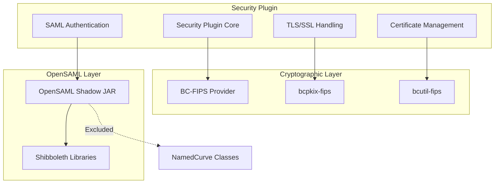
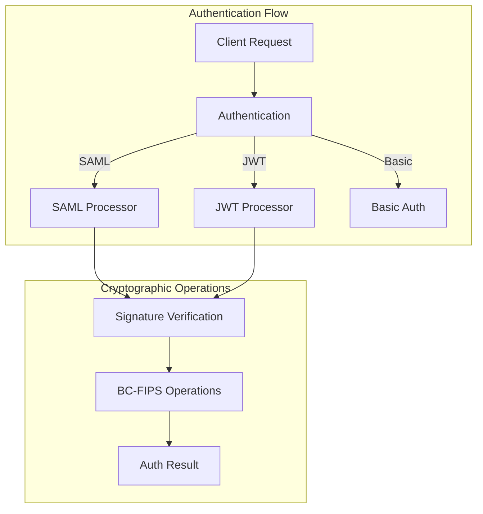

---
tags:
  - security
---

# Security FIPS Compliance

## Summary

OpenSearch Security plugin supports FIPS 140-2 compliance, enabling deployment in government and regulated environments that require FIPS-validated cryptographic modules. This is achieved through the use of BouncyCastle FIPS (BC-FIPS) libraries and careful isolation of dependencies that have FIPS compatibility issues.

FIPS 140-2 (Federal Information Processing Standard) is a U.S. government security standard that specifies requirements for cryptographic modules. Organizations in government, healthcare, finance, and other regulated industries often require FIPS-compliant software.

## Details

### Architecture



### Data Flow



### Components

| Component | Description |
|-----------|-------------|
| `BouncyCastleFipsProvider` | FIPS 140-2 validated cryptographic provider |
| `bc-fips` | Core FIPS cryptographic library |
| `bcpkix-fips` | PKIX/CMS/EAC/PKCS/OCSP/TSP/OPENSSL support |
| `bcutil-fips` | Utility classes for FIPS operations |
| `libs/opensaml` | Shadow JAR subproject isolating OpenSAML dependencies |

### Configuration

FIPS compliance is enabled by default in v3.2.0+. No additional configuration is required.

| Setting | Description | Default |
|---------|-------------|---------|
| N/A | FIPS libraries are the default | Enabled |

### Usage Example

FIPS compliance is transparent to users. Standard security configurations work without modification:

```yaml
# opensearch.yml - Standard TLS configuration works with FIPS
plugins.security.ssl.transport.enabled: true
plugins.security.ssl.transport.pemcert_filepath: node.pem
plugins.security.ssl.transport.pemkey_filepath: node-key.pem
plugins.security.ssl.transport.pemtrustedcas_filepath: root-ca.pem

plugins.security.ssl.http.enabled: true
plugins.security.ssl.http.pemcert_filepath: node.pem
plugins.security.ssl.http.pemkey_filepath: node-key.pem
plugins.security.ssl.http.pemtrustedcas_filepath: root-ca.pem
```

SAML authentication configuration remains unchanged:

```yaml
# config.yml - SAML configuration
authc:
  saml_auth_domain:
    http_enabled: true
    transport_enabled: false
    order: 1
    http_authenticator:
      type: saml
      challenge: true
      config:
        idp:
          metadata_file: idp-metadata.xml
          entity_id: urn:example:idp
        sp:
          entity_id: https://opensearch.example.com
        kibana_url: https://dashboards.example.com
        roles_key: Role
```

## Limitations

- **OpenSAML Compatibility**: OpenSAML versions 4.0+ have dependencies on standard BouncyCastle classes not present in BC-FIPS. The shadow JAR approach excludes these classes, which may affect certain elliptic curve operations
- **NamedCurve Service**: The `org.opensaml.security.crypto.ec.NamedCurve` service is excluded from the shadow JAR
- **JDK Requirements**: FIPS mode may have specific JDK version requirements depending on the deployment environment

## Change History

- **v3.2.0** (2025-06): Full FIPS 140-2 compliance with BC-FIPS libraries and OpenSAML shadow JAR isolation

## Related Features
- [Security (Dashboards)](../security-dashboards-plugin/security-dashboards-plugin-security-dashboards-role-management.md)

## References

### Documentation
- [Shibboleth FIPS Documentation](https://shibboleth.atlassian.net/wiki/spaces/DEV/pages/1159627167/FIPS): OpenSAML FIPS considerations

### Pull Requests
| Version | PR | Description | Related Issue |
|---------|-----|-------------|---------------|
| v3.2.0 | [#5404](https://github.com/opensearch-project/security/pull/5404) | Moved OpenSAML jars to Shadow Jar configuration | [#4915](https://github.com/opensearch-project/security/issues/4915) |
| v3.2.0 | [#5439](https://github.com/opensearch-project/security/pull/5439) | Replaced standard BouncyCastle with BC-FIPS | [#5438](https://github.com/opensearch-project/security/issues/5438) |

### Issues (Design / RFC)
- [Issue #5438](https://github.com/opensearch-project/security/issues/5438): Complete transition to FIPS distribution of BouncyCastle
- [Issue #4915](https://github.com/opensearch-project/security/issues/4915): OpenSAML incompatibility with BC-FIPS
- [Issue #3420](https://github.com/opensearch-project/security/issues/3420): RFC for FIPS 140-2 enforced mode support
