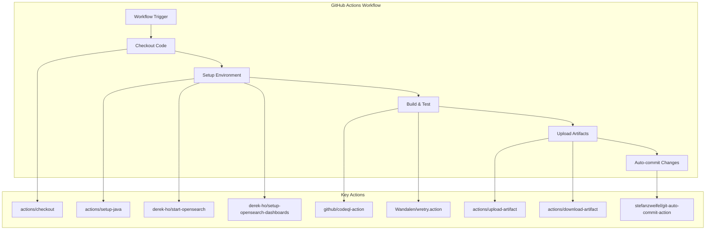

---
tags:
  - domain/security
  - component/server
  - dashboards
  - security
---
# GitHub Actions Updates

## Summary

The OpenSearch Security repositories maintain their CI/CD pipelines using GitHub Actions. Regular updates to action dependencies ensure workflows benefit from the latest features, security patches, and runtime improvements. These updates are typically automated via Dependabot.

## Details

### Architecture



### Components

| Component | Description |
|-----------|-------------|
| `actions/checkout` | Checks out repository code for workflow access |
| `actions/setup-java` | Sets up Java JDK environment for builds |
| `actions/upload-artifact` | Uploads build artifacts for sharing between jobs |
| `actions/download-artifact` | Downloads artifacts from previous workflow runs |
| `github/codeql-action` | Performs CodeQL security analysis |
| `stefanzweifel/git-auto-commit-action` | Auto-commits changes made during workflow |
| `derek-ho/start-opensearch` | Starts OpenSearch instance for integration tests |
| `derek-ho/setup-opensearch-dashboards` | Sets up OpenSearch Dashboards for plugin testing |
| `Wandalen/wretry.action` | Retries flaky workflow steps |

### Configuration

GitHub Actions are configured in `.github/workflows/` directory. Example workflow using these actions:

```yaml
name: CI
on: [push, pull_request]

jobs:
  build:
    runs-on: ubuntu-latest
    steps:
      - uses: actions/checkout@v6
      - uses: actions/setup-java@v5
        with:
          distribution: 'temurin'
          java-version: '21'
      - name: Build
        run: ./gradlew build
      - uses: actions/upload-artifact@v5
        with:
          name: build-artifacts
          path: build/
```

### Usage Example

```yaml
# Integration test with OpenSearch
- uses: derek-ho/start-opensearch@v8
  with:
    opensearch-version: '3.4.0'
    security-enabled: true

# Retry flaky tests
- uses: Wandalen/wretry.action@v3.8.0
  with:
    command: ./gradlew integTest
    attempt_limit: 3
```

## Limitations

- GitHub Actions runner version requirements may vary by action version
- Node.js runtime version changes may affect custom JavaScript actions
- Some actions require specific permissions in workflow files

## Change History

- **v3.4.0**: Updated multiple GitHub Actions to support Node.js 24 runtime

## Related Features
- [Security (Dashboards)](../security-dashboards-plugin/security-dashboards-plugin-security-dashboards-role-management.md)

## References

### Documentation
- [GitHub Actions Documentation](https://docs.github.com/en/actions)
- [actions/checkout](https://github.com/actions/checkout)
- [actions/setup-java](https://github.com/actions/setup-java)
- [actions/upload-artifact](https://github.com/actions/upload-artifact)
- [actions/download-artifact](https://github.com/actions/download-artifact)
- [github/codeql-action](https://github.com/github/codeql-action)
- [stefanzweifel/git-auto-commit-action](https://github.com/stefanzweifel/git-auto-commit-action)
- [derek-ho/start-opensearch](https://github.com/derek-ho/start-opensearch)
- [derek-ho/setup-opensearch-dashboards](https://github.com/derek-ho/setup-opensearch-dashboards)
- [Wandalen/wretry.action](https://github.com/Wandalen/wretry.action)

### Pull Requests
| Version | PR | Description | Related Issue |
|---------|-----|-------------|---------------|
| v3.4.0 | [security#5810](https://github.com/opensearch-project/security/pull/5810) | Bump actions/checkout from 5 to 6 |   |
| v3.4.0 | [security#5740](https://github.com/opensearch-project/security/pull/5740) | Bump actions/upload-artifact from 4 to 5 |   |
| v3.4.0 | [security#5739](https://github.com/opensearch-project/security/pull/5739) | Bump actions/download-artifact from 5 to 6 |   |
| v3.4.0 | [security#5704](https://github.com/opensearch-project/security/pull/5704) | Bump stefanzweifel/git-auto-commit-action from 6 to 7 |   |
| v3.4.0 | [security#5702](https://github.com/opensearch-project/security/pull/5702) | Bump github/codeql-action from 3 to 4 |   |
| v3.4.0 | [security#5630](https://github.com/opensearch-project/security/pull/5630) | Bump derek-ho/start-opensearch from 7 to 8 |   |
| v3.4.0 | [security-dashboards-plugin#2339](https://github.com/opensearch-project/security-dashboards-plugin/pull/2339) | Bump actions/checkout from 5 to 6 |   |
| v3.4.0 | [security-dashboards-plugin#2329](https://github.com/opensearch-project/security-dashboards-plugin/pull/2329) | Bump stefanzweifel/git-auto-commit-action from 6 to 7 |   |
| v3.4.0 | [security-dashboards-plugin#2323](https://github.com/opensearch-project/security-dashboards-plugin/pull/2323) | Bump actions/setup-java from 4 to 5 |   |
| v3.4.0 | [security-dashboards-plugin#2322](https://github.com/opensearch-project/security-dashboards-plugin/pull/2322) | Bump Wandalen/wretry.action from 3.3.0 to 3.8.0 |   |
| v3.4.0 | [security-dashboards-plugin#2321](https://github.com/opensearch-project/security-dashboards-plugin/pull/2321) | Bump derek-ho/setup-opensearch-dashboards from 1 to 3 |   |
