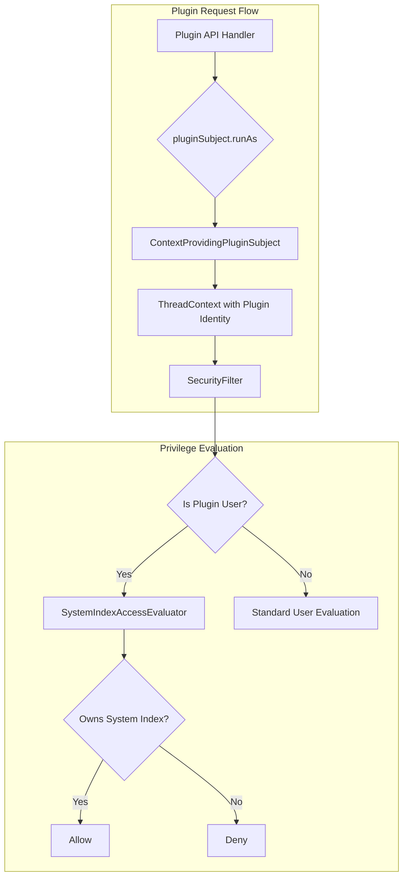

---
tags:
  - security
---
# Security Identity Plugin

## Summary

The Security Identity Plugin feature provides plugin-aware identity management in OpenSearch, enabling plugins to securely access their own system indices while preventing unauthorized cross-plugin access. This strengthens the security model by replacing the previous "trusted mode" approach where stashing the ThreadContext granted unrestricted access.

## Details

### Architecture



### Components

| Component | Description |
|-----------|-------------|
| `IdentityPlugin` | Core interface implemented by security plugin for identity management |
| `PluginSubject` | Interface representing a plugin's identity for privileged operations |
| `ContextProvidingPluginSubject` | Security plugin implementation that injects plugin identity into ThreadContext |
| `UserSubject` | Interface representing an authenticated user's identity |
| `UserSubjectImpl` | Security plugin implementation for user subjects |
| `SystemIndexAccessEvaluator` | Evaluates plugin access to system indices based on ownership |

### Configuration

The feature is controlled by the following setting:

| Setting | Description | Default |
|---------|-------------|---------|
| `plugins.security.system_indices.enabled` | Enable system index protection | `true` |

When enabled, plugins can only access system indices they registered via `SystemIndexPlugin.getSystemIndexDescriptors()`.

### Usage Example

Plugins implementing `IdentityAwarePlugin` receive a `PluginSubject` during initialization:

```java
public class MyPlugin extends Plugin implements SystemIndexPlugin, IdentityAwarePlugin {
    private PluginSubject pluginSubject;
    
    @Override
    public void assignSubject(PluginSubject pluginSubject) {
        this.pluginSubject = pluginSubject;
    }
    
    // Use pluginSubject.runAs() for system index operations
    public void indexDocument() {
        pluginSubject.runAs(() -> {
            client.index(new IndexRequest(MY_SYSTEM_INDEX)
                .source("{\"data\":\"value\"}", XContentType.JSON));
            return null;
        });
    }
}
```

### Plugin Identity Convention

Plugin users follow the naming convention:
- Format: `plugin:{canonical-class-name}`
- Example: `plugin:org.opensearch.alerting.AlertingPlugin`

The `:` character is forbidden in regular usernames, preventing identity spoofing.

## Limitations

- Plugins cannot perform cluster-level actions using `pluginSubject.runAs()`
- Cross-plugin system index access is blocked
- Bulk operations spanning multiple plugins' system indices are rejected
- Backward compatibility: Plugin users are not serialized to nodes running versions prior to v2.19.0

## Change History

- **v2.19.0** (2025-02): Initial implementation of IdentityPlugin extension points and ContextProvidingPluginSubject

## References

### Documentation

- [Authorization tokens](https://docs.opensearch.org/2.19/security/access-control/authentication-tokens/) - IdentityPlugin interface documentation

### Pull Requests

| Version | PR | Description |
|---------|-----|-------------|
| v2.19.0 | [#5028](https://github.com/opensearch-project/security/pull/5028) | Backport IdentityPlugin implementation to 2.x |
| v2.19.0 | [#5037](https://github.com/opensearch-project/security/pull/5037) | Legacy authz code path support |
| v2.19.0 | [#5032](https://github.com/opensearch-project/security/pull/5032) | Fix search operations with pluginSubject.runAs |
| v2.19.0 | [#5055](https://github.com/opensearch-project/security/pull/5055) | Fix update operations with pluginSubject.runAs |

### Related Issues

- [#4439](https://github.com/opensearch-project/security/issues/4439): RFC - Strengthen System Index Protection in the Plugin Ecosystem
