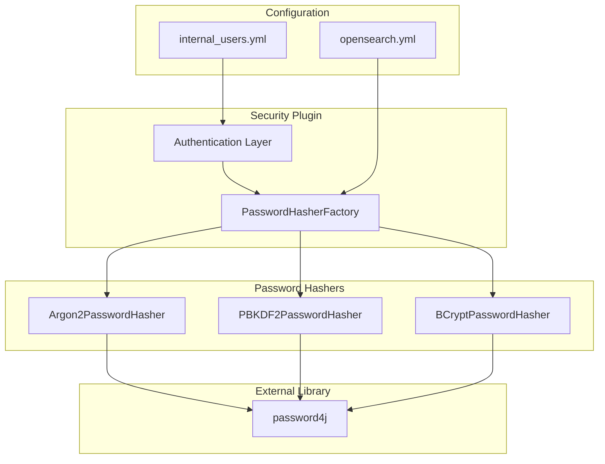

---
tags:
  - security
---
# Password Hashing

## Summary

OpenSearch Security plugin supports multiple password hashing algorithms with configurable parameters. This allows administrators to choose the appropriate algorithm based on security requirements, compliance needs (e.g., FIPS), and performance considerations.

Supported algorithms:
- **BCrypt** (default): Traditional, well-established algorithm with configurable rounds
- **PBKDF2**: Standards-based, FIPS-compliant algorithm with configurable iterations
- **Argon2**: Modern memory-hard algorithm with maximum configurability (v3.2.0+)

## Details

### Architecture



### Components

| Component | Description |
|-----------|-------------|
| `PasswordHasherFactory` | Factory that creates appropriate hasher based on configuration |
| `BCryptPasswordHasher` | BCrypt implementation with configurable rounds and minor version |
| `PBKDF2PasswordHasher` | PBKDF2 implementation using password4j library |
| `Argon2PasswordHasher` | Argon2 implementation using password4j library (v3.2.0+) |
| `AbstractPasswordHasher` | Base class with common functionality |
| `Hasher` | CLI tool for generating password hashes |

### Configuration

#### Algorithm Selection

| Setting | Description | Default |
|---------|-------------|---------|
| `plugins.security.password.hashing.algorithm` | Algorithm: `bcrypt`, `pbkdf2`, or `argon2` | `bcrypt` |

#### BCrypt Settings

| Setting | Description | Default |
|---------|-------------|---------|
| `plugins.security.password.hashing.bcrypt.rounds` | Log rounds (4-31) | `12` |
| `plugins.security.password.hashing.bcrypt.minor` | Version: `A`, `B`, or `Y` | `Y` |

#### PBKDF2 Settings

| Setting | Description | Default |
|---------|-------------|---------|
| `plugins.security.password.hashing.pbkdf2.iterations` | Iteration count | `600000` |
| `plugins.security.password.hashing.pbkdf2.length` | Output key length in bits | `256` |
| `plugins.security.password.hashing.pbkdf2.function` | Hash function: `SHA1`, `SHA224`, `SHA256`, `SHA384`, `SHA512` | `SHA256` |

#### Argon2 Settings (v3.2.0+)

| Setting | Description | Default |
|---------|-------------|---------|
| `plugins.security.password.hashing.argon2.memory` | Memory usage in KiB | `65536` |
| `plugins.security.password.hashing.argon2.iterations` | Number of passes over memory | `3` |
| `plugins.security.password.hashing.argon2.parallelism` | Degree of parallelism | `1` |
| `plugins.security.password.hashing.argon2.length` | Output hash length in bytes | `32` |
| `plugins.security.password.hashing.argon2.type` | Variant: `argon2id`, `argon2i`, `argon2d` | `argon2id` |
| `plugins.security.password.hashing.argon2.version` | Algorithm version: `16` or `19` | `19` |

### Usage Examples

#### BCrypt Configuration

```yaml
# opensearch.yml
plugins.security.password.hashing.algorithm: bcrypt
plugins.security.password.hashing.bcrypt.rounds: 14
plugins.security.password.hashing.bcrypt.minor: Y
```

#### PBKDF2 Configuration (FIPS-compliant)

```yaml
# opensearch.yml
plugins.security.password.hashing.algorithm: pbkdf2
plugins.security.password.hashing.pbkdf2.iterations: 650000
plugins.security.password.hashing.pbkdf2.length: 512
plugins.security.password.hashing.pbkdf2.function: SHA512
```

#### Argon2 Configuration (v3.2.0+)

```yaml
# opensearch.yml
plugins.security.password.hashing.algorithm: argon2
plugins.security.password.hashing.argon2.memory: 65536
plugins.security.password.hashing.argon2.iterations: 3
plugins.security.password.hashing.argon2.parallelism: 1
plugins.security.password.hashing.argon2.type: argon2id
```

#### Generate Hashes Using CLI

```bash
# BCrypt (default)
./plugins/opensearch-security/tools/hash.sh -p "password"

# BCrypt with custom settings
./plugins/opensearch-security/tools/hash.sh -p "password" -a BCrypt -r 14 -min Y

# PBKDF2
./plugins/opensearch-security/tools/hash.sh -p "password" -a PBKDF2 -f SHA512 -l 512 -i 650000

# Argon2 (v3.2.0+)
./plugins/opensearch-security/tools/hash.sh -p "password" -a Argon2 --memory 65536 --iterations 3
```

### Hash Formats

#### BCrypt
```
$2y$12$<salt><hash>
```

#### PBKDF2
```
$<version>$<iterations><length>$<salt>$<hash>
```

#### Argon2
```
$argon2id$v=19$m=65536,t=3,p=1$<salt>$<hash>
```

## Limitations

- **Cluster Consistency**: All nodes must use identical password hashing configuration
- **Migration Overhead**: Switching algorithms requires regenerating all password hashes
- **Performance Trade-off**: Higher security settings increase authentication latency
- **Argon2 Memory**: Argon2 requires significant memory during authentication
- **Version Requirements**: Argon2 requires OpenSearch 3.2.0 or later

## Change History

- **v3.2.0** (2025-07): Added Argon2 support with full parameter configurability
- **v2.16.0** (2024-08): Added PBKDF2 support and BCrypt/PBKDF2 configuration options

## References

### Documentation
- [Security Settings](https://docs.opensearch.org/latest/install-and-configure/configuring-opensearch/security-settings/): Official configuration reference

### Pull Requests
| Version | PR | Description | Related Issue |
|---------|-----|-------------|---------------|
| v3.2.0 | [#5441](https://github.com/opensearch-project/security/pull/5441) | Argon2 implementation | [#4592](https://github.com/opensearch-project/security/issues/4592) |
| v2.16.0 | [#4524](https://github.com/opensearch-project/security/pull/4524) | PBKDF2 support and BCrypt/PBKDF2 configuration | [#4590](https://github.com/opensearch-project/security/issues/4590), [#3420](https://github.com/opensearch-project/security/issues/3420) |

### Issues (Design / RFC)
- [Issue #4592](https://github.com/opensearch-project/security/issues/4592): Feature request for Argon2 support
- [Issue #4590](https://github.com/opensearch-project/security/issues/4590): BCrypt configuration feature request
- [Issue #3420](https://github.com/opensearch-project/security/issues/3420): PBKDF2 support request
