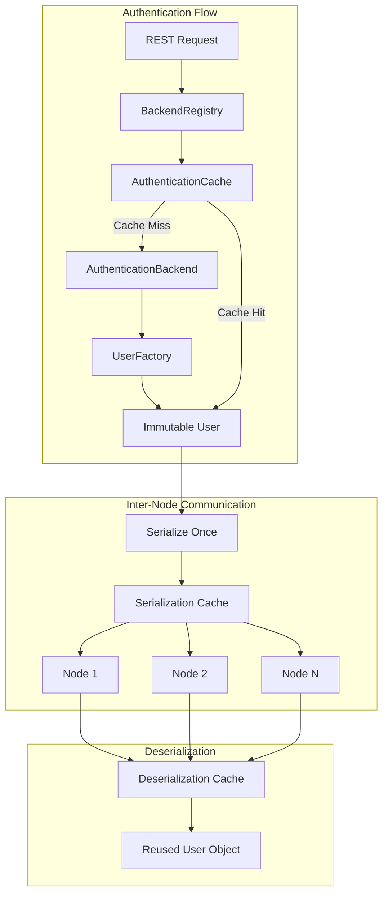
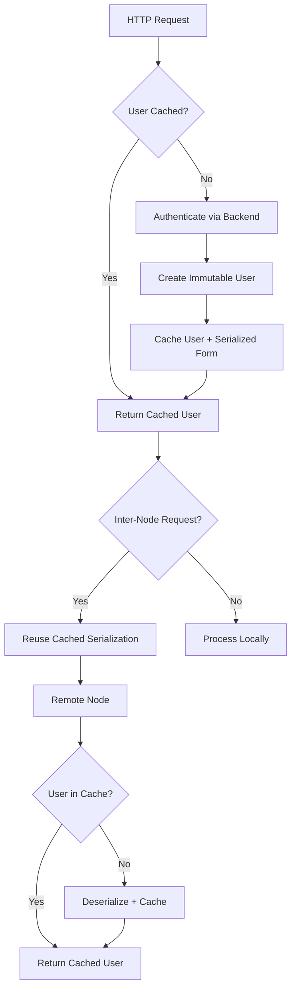

---
tags:
  - domain/security
  - component/server
  - performance
  - security
---
# Security Performance Improvements

## Summary

The OpenSearch security layer includes performance optimizations that reduce the overhead of authentication, authorization, and access control operations. These improvements focus on reducing serialization costs during inter-node communication, optimizing privilege evaluation, and improving wildcard pattern matching. Key features include the immutable User object (v3.1.0), configurable precomputed privileges (v3.2.0), and optimized wildcard matchers for common patterns (v3.2.0).

## Details

### Architecture



### Data Flow



### Components

| Component | Description |
|-----------|-------------|
| `User` | Immutable user object with builder-style modification methods |
| `UserFactory` | Factory interface for User object creation and deserialization |
| `UserFactory.Caching` | Production implementation with LRU cache for deserialized users |
| `UserFactory.Simple` | Simple implementation without caching for testing |
| `AuthenticationContext` | Context object passed through authentication/authorization flow |
| `ImpersonationBackend` | Interface for backends supporting user impersonation |
| `BackendRegistry` | Central authentication coordinator with user caching |
| `WildcardMatcher.PrefixMatcher` | Optimized matcher for `prefix*` patterns (v3.2.0) |
| `WildcardMatcher.ContainsMatcher` | Optimized matcher for `*contains*` patterns (v3.2.0) |
| `RoleBasedActionPrivileges` | Privilege evaluation with configurable precomputed data structures (v3.2.0) |

### Configuration

| Setting | Description | Default |
|---------|-------------|---------|
| `plugins.security.privileges_evaluation.precomputed_privileges.enabled` | Enable/disable precomputed privilege data structures (v3.2.0) | `true` |
| `plugins.security.privileges_evaluation.precomputed_privileges.max_heap_size` | Maximum heap size for precomputed privileges | - |
| `plugins.security.user_cache.max_size` | Maximum cached User objects in deserialization cache | 10000 |
| `plugins.security.user_cache.expire_after_access` | Time before cached entries expire | 1h |

### Usage Example

```java
// Creating an immutable User object
User user = new User("username")
    .withRoles(ImmutableSet.of("role1", "role2"))
    .withSecurityRoles(ImmutableSet.of("admin"))
    .withAttributes(ImmutableMap.of("attr1", "value1"));

// Modifying returns a new object (original unchanged)
User modifiedUser = user.withRoles("additional_role");

// Serialization is cached
String serialized = user.toSerializedBase64();  // Computed once, cached

// Deserialization uses cache
UserFactory factory = new UserFactory.Caching(settings);
User deserializedUser = factory.fromSerializedBase64(serialized);  // Cache lookup
```

### Custom Backend Migration

```java
// Old AuthenticationBackend implementation
public class CustomAuthBackend implements AuthenticationBackend {
    @Override
    public User authenticate(AuthCredentials credentials) {
        User user = new User(credentials.getUsername());
        user.addRoles(lookupRoles(credentials));
        return user;
    }
    
    @Override
    public boolean exists(User user) {
        return userExists(user.getName());
    }
}

// New implementation for v3.1.0+
public class CustomAuthBackend implements AuthenticationBackend, ImpersonationBackend {
    @Override
    public User authenticate(AuthenticationContext context) {
        AuthCredentials credentials = context.getCredentials();
        return new User(credentials.getUsername())
            .withRoles(lookupRoles(credentials));
    }
    
    @Override
    public Optional<User> impersonate(User user) {
        if (userExists(user.getName())) {
            return Optional.of(user.withAttributes(lookupAttributes(user.getName())));
        }
        return Optional.empty();
    }
}
```

## Limitations

- Memory overhead from caching serialized User data and deserialized objects
- Custom authentication/authorization backends require code changes for v3.1.0 compatibility
- Cache effectiveness depends on user session patterns; highly dynamic user populations may see reduced benefits

## Change History

- **v3.2.0** (2025-09-16): Precomputed privileges toggle, optimized wildcard matching
- **v3.1.0** (2025-05-26): Immutable User object with serialization caching
- **v3.0.0**: Optimized privilege evaluation for document- and field-level security
- **v2.19.0**: Initial optimized privilege evaluation


## References

### Blog Posts
- [Blog: Performance optimizations for the OpenSearch security layer](https://opensearch.org/blog/performance-optimizations-for-the-opensearch-security-layer/)

### Pull Requests
| Version | PR | Description | Related Issue |
|---------|-----|-------------|---------------|
| v3.2.0 | [#5465](https://github.com/opensearch-project/security/pull/5465) | Precomputed privileges toggle setting |   |
| v3.2.0 | [#5470](https://github.com/opensearch-project/security/pull/5470) | Optimized wildcard matching |   |
| v3.1.0 | [#5339](https://github.com/opensearch-project/security/pull/5339) | Remove unused custom User serialization | [#5200](https://github.com/opensearch-project/security/issues/5200) |
| v3.1.0 | [#5212](https://github.com/opensearch-project/security/pull/5212) | Immutable user object | [#5168](https://github.com/opensearch-project/security/issues/5168) |

### Issues (Design / RFC)
- [Issue #5464](https://github.com/opensearch-project/security/issues/5464): ActionPrivileges initialization performance issue
- [Issue #5168](https://github.com/opensearch-project/security/issues/5168): Make User object immutable
- [Issue #5200](https://github.com/opensearch-project/security/issues/5200): Serialization backward compatibility
- [Issue #3870](https://github.com/opensearch-project/security/issues/3870): Optimized privilege evaluation
