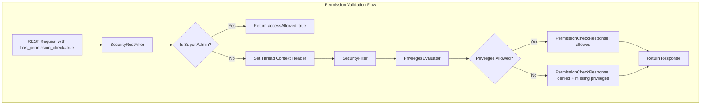
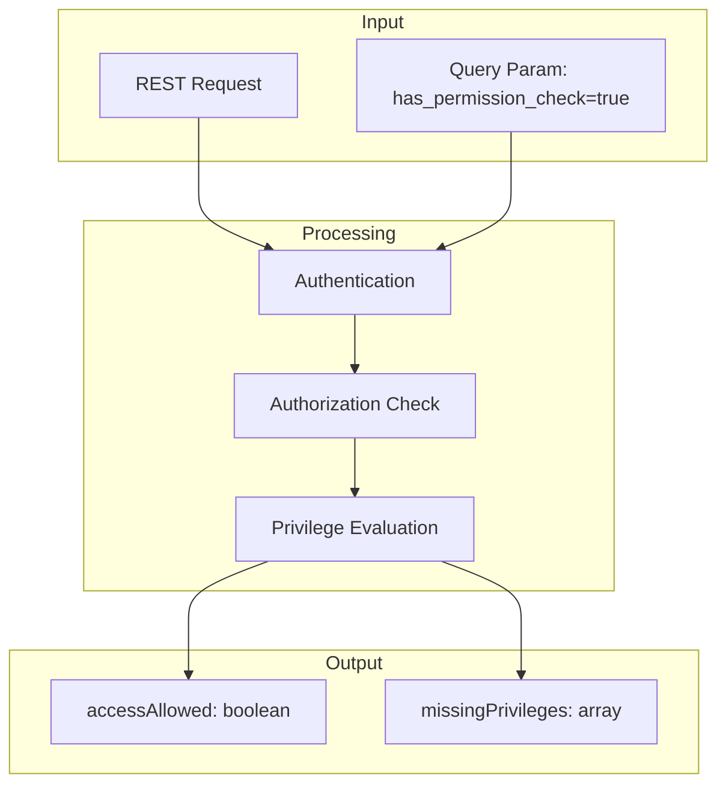

---
tags:
  - security
---
# Permission Validation

## Summary

Permission Validation is a security feature that allows users to test whether they have sufficient permissions to execute an API request without actually executing it. By adding a query parameter to any REST endpoint, users can safely preview authorization results, enabling risk-free permission testing and faster security configuration validation.

This feature addresses the challenge of configuring Fine-Grained Access Control (FGAC) permissions, where administrators previously had no way to verify permission configurations without actually executing operations and potentially impacting users.

## Details

### Architecture



### Data Flow



### Components

| Component | Description |
|-----------|-------------|
| `SecurityRestFilter` | Intercepts REST requests and detects the `has_permission_check` parameter |
| `SecurityFilter` | Handles the permission check after privilege evaluation |
| `PermissionCheckResponse` | Response object containing `accessAllowed` and `missingPrivileges` |
| `PrivilegesEvaluator` | Evaluates user privileges against requested actions |

### Configuration

This feature requires no additional configuration. It is enabled by default when the Security plugin is active.

| Setting | Description | Default |
|---------|-------------|---------|
| N/A | Feature is always available when Security plugin is enabled | Enabled |

### Usage Example

#### Basic Permission Check

```bash
# Check cluster health permission
GET /_cluster/health?has_permission_check=true
```

Response when allowed:
```json
{
  "accessAllowed": true,
  "missingPrivileges": []
}
```

Response when denied:
```json
{
  "accessAllowed": false,
  "missingPrivileges": ["cluster:monitor/health"]
}
```

#### Write Operation Check

```bash
# Check document write permission
PUT /my_index/_doc/1?has_permission_check=true
{
  "title": "Test Document"
}
```

#### Index Management Check

```bash
# Check index creation permission
PUT /new_index?has_permission_check=true
{
  "settings": {
    "number_of_shards": 1
  }
}
```

### Use Cases

1. **Role Configuration Validation**: Administrators can verify that a role has the correct permissions before assigning it to users
2. **Troubleshooting Access Issues**: Quickly identify which specific permissions a user is missing
3. **Pre-deployment Testing**: Validate permission configurations in staging before applying to production
4. **Audit and Compliance**: Document and verify that users have appropriate access levels

## Limitations

- Permission check only validates authorization; request syntax errors are still rejected before the check
- Super admins always receive `accessAllowed: true` as they bypass normal privilege evaluation
- The check reflects permissions at request time; very recent role changes may not be reflected if caching is involved
- Does not simulate document-level or field-level security restrictions

## Change History

- **v3.2.0** (2025-07-25): Initial implementation - Added `has_permission_check` query parameter for permission validation without request execution


## References

### Documentation
- [Permissions Documentation](https://docs.opensearch.org/3.2/security/access-control/permissions/): Official documentation on OpenSearch permissions

### Pull Requests
| Version | PR | Description | Related Issue |
|---------|-----|-------------|---------------|
| v3.2.0 | [#5496](https://github.com/opensearch-project/security/pull/5496) | Initial implementation of permission validation via query parameter | [#5468](https://github.com/opensearch-project/security/issues/5468) |

### Issues (Design / RFC)
- [Issue #5468](https://github.com/opensearch-project/security/issues/5468): Original feature request for Security Permissions Simulation
