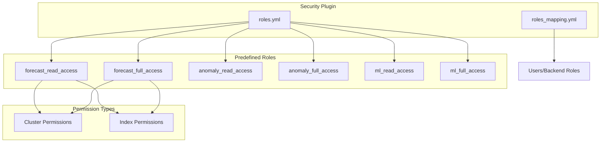

---
tags:
  - security
---
# Security Permissions

## Summary

OpenSearch Security plugin provides predefined roles for various features including Forecasting, Anomaly Detection, Machine Learning, and more. These roles define cluster-level and index-level permissions that control access to plugin functionality. The Security plugin's `roles.yml` configuration file contains reserved roles that are automatically available after installation.

## Details

### Architecture



### Components

| Component | Description |
|-----------|-------------|
| `roles.yml` | Defines predefined roles with cluster and index permissions |
| `roles_mapping.yml` | Maps users and backend roles to security roles |
| Cluster Permissions | Control access to cluster-wide operations |
| Index Permissions | Control access to specific indices and operations |

### Forecast Roles Configuration

#### forecast_read_access

Provides read-only access to forecast resources:

```yaml
forecast_read_access:
  reserved: true
  cluster_permissions:
    - 'cluster:admin/plugin/forecast/forecaster/info'
    - 'cluster:admin/plugin/forecast/forecaster/stats'
    - 'cluster:admin/plugin/forecast/forecaster/suggest'
    - 'cluster:admin/plugin/forecast/forecaster/validate'
    - 'cluster:admin/plugin/forecast/forecasters/get'
    - 'cluster:admin/plugin/forecast/forecasters/info'
    - 'cluster:admin/plugin/forecast/forecasters/search'
    - 'cluster:admin/plugin/forecast/result/topForecasts'
    - 'cluster:admin/plugin/forecast/tasks/search'
  index_permissions:
    - index_patterns:
        - 'opensearch-forecast-result*'
      allowed_actions:
        - 'indices:admin/mappings/fields/get*'
        - 'indices:admin/resolve/index'
        - 'indices:data/read*'
```

#### forecast_full_access

Provides full access to all forecasting functionality:

```yaml
forecast_full_access:
  reserved: true
  cluster_permissions:
    - 'cluster:admin/plugin/forecast/*'
    - 'cluster:admin/settings/update'
    - 'cluster_monitor'
  index_permissions:
    - index_patterns:
        - '*'
      allowed_actions:
        - 'indices:admin/aliases/get'
        - 'indices:admin/mapping/get'
        - 'indices:admin/mapping/put'
        - 'indices:admin/mappings/fields/get*'
        - 'indices:admin/mappings/get'
        - 'indices:admin/resolve/index'
        - 'indices:data/read*'
        - 'indices:data/read/field_caps*'
        - 'indices:data/read/search'
        - 'indices:data/write*'
        - 'indices_monitor'
```

### Usage Example

Map roles to users in `roles_mapping.yml`:

```yaml
forecast_full_access:
  reserved: false
  users:
    - "forecast_admin"
  backend_roles:
    - "forecast_admins"

forecast_read_access:
  reserved: false
  users:
    - "forecast_viewer"
  backend_roles:
    - "forecast_viewers"
```

## Limitations

- Forecast roles are separate from Anomaly Detection roles (`anomaly_read_access`, `anomaly_full_access`)
- LTR roles require the Learning to Rank plugin to be installed
- Cross-cluster forecasting requires `cluster_monitor` permission and proper cluster connectivity
- Reserved roles cannot be modified through the API; changes require editing `roles.yml` directly

### Learning to Rank (LTR) Roles Configuration

#### ltr_read_access

Provides read-only access to LTR resources:

```yaml
ltr_read_access:
  reserved: true
  cluster_permissions:
    - cluster:admin/ltr/caches/stats
    - cluster:admin/ltr/featurestore/list
    - cluster:admin/ltr/stats
```

#### ltr_full_access

Provides full access to all LTR functionality:

```yaml
ltr_full_access:
  reserved: true
  cluster_permissions:
    - cluster:admin/ltr/*
```

### Anomaly Detection Role Enhancements

The `anomaly_full_access` role includes permissions for ingest pipeline management:

```yaml
anomaly_full_access:
  reserved: true
  cluster_permissions:
    - cluster:admin/ingest/pipeline/delete
    - cluster:admin/ingest/pipeline/put
    - cluster_monitor
    - cluster:admin/opendistro/ad/*
  index_permissions:
    - index_patterns:
        - '*'
      allowed_actions:
        - indices:admin/setting/put
        # ... other permissions
```

## Change History

- **v3.1.0** (2025-06): Added `forecast_read_access` and `forecast_full_access` roles with complete permissions for forecasting feature including `cluster_monitor` and `indices:admin/mappings/get`
- **v2.19.0** (2025-01): Added `ltr_read_access` and `ltr_full_access` roles for Learning to Rank; Enhanced `anomaly_full_access` with ingest pipeline permissions


## References

### Documentation
- [OpenSearch Security Permissions Documentation](https://docs.opensearch.org/3.0/security/access-control/permissions/)
- [Defining Users and Roles](https://docs.opensearch.org/3.0/security/access-control/users-roles/)
- [Security Dashboards Plugin PR #2253](https://github.com/opensearch-project/security-dashboards-plugin/pull/2253): Frontend dropdown update

### Pull Requests
| Version | PR | Description | Related Issue |
|---------|-----|-------------|---------------|
| v3.1.0 | [#5386](https://github.com/opensearch-project/security/pull/5386) | Add forecast roles and permissions |   |
| v3.1.0 | [#5405](https://github.com/opensearch-project/security/pull/5405) | Add missing cluster:monitor permission |   |
| v3.1.0 | [#5412](https://github.com/opensearch-project/security/pull/5412) | Add missing mapping get permission |   |
| v2.19.0 | [#5069](https://github.com/opensearch-project/security/pull/5069) | Add ingest pipeline and indices permissions for anomaly_full_access |   |
| v2.19.0 | [#5070](https://github.com/opensearch-project/security/pull/5070) | Add LTR read and full access roles |   |
