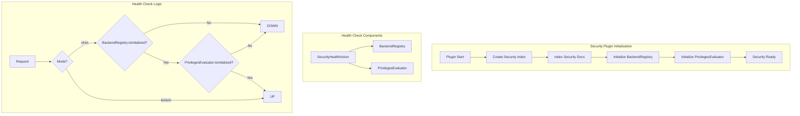

---
tags:
  - domain/security
  - component/server
  - indexing
  - performance
  - security
---
# Security Plugin Health Check

## Summary

The Security plugin health check API (`GET _plugins/_security/health`) provides a way to verify whether the Security plugin is fully initialized and operational. This is particularly useful for load balancers and orchestration systems that need to determine node readiness before routing traffic.

## Details

### Architecture



### Components

| Component | Description |
|-----------|-------------|
| `SecurityHealthAction` | REST handler for the health check endpoint |
| `BackendRegistry` | Manages authentication backends; must be initialized for AuthN |
| `PrivilegesEvaluator` | Evaluates user privileges; must be initialized for AuthZ |

### Configuration

| Setting | Description | Default |
|---------|-------------|---------|
| `plugins.security.cache.ttl_minutes` | Cache TTL reported in health response | 60 |

The health check mode is determined by the Security plugin's operational mode:
- **strict**: Full initialization checks (both AuthN and AuthZ)
- **lenient**: Bypasses initialization checks

### API Endpoint

```
GET _plugins/_security/health
```

### Response Fields

| Field | Type | Description |
|-------|------|-------------|
| `status` | String | `UP` if fully initialized, `DOWN` otherwise |
| `mode` | String | Current security mode (`strict` or `lenient`) |
| `message` | String | Error message if status is `DOWN`, null otherwise |
| `settings` | Object | Current security settings |

### Usage Example

```bash
# Check security plugin health
curl -XGET "https://localhost:9200/_plugins/_security/health"

# Successful response
{
  "message": null,
  "mode": "strict",
  "status": "UP",
  "settings": {
    "plugins.security.cache.ttl_minutes": 60
  }
}

# Not initialized response (HTTP 503)
{
  "message": "Not initialized",
  "mode": "strict",
  "status": "DOWN",
  "settings": {
    "plugins.security.cache.ttl_minutes": 60
  }
}
```

### Load Balancer Integration

The health check endpoint is designed for use with load balancers:

- Returns HTTP 200 when status is `UP`
- Returns HTTP 503 (Service Unavailable) when status is `DOWN`
- Does not require authentication, making it suitable for external health probes

## Limitations

- Only checks initialization status, not ongoing operational health
- Does not validate connectivity to external authentication backends (LDAP, SAML, etc.)
- In lenient mode, always reports `UP` regardless of actual initialization state

## Change History

- **v3.3.0**: Added PrivilegesEvaluator (AuthZ) initialization check to health API. Previously only checked BackendRegistry (AuthN) initialization.


## References

### Documentation
- [Security API Documentation](https://docs.opensearch.org/3.0/security/access-control/api/): Official API docs

### Pull Requests
| Version | PR | Description | Related Issue |
|---------|-----|-------------|---------------|
| v3.3.0 | [#5626](https://github.com/opensearch-project/security/pull/5626) | Add AuthZ initialization completion check | [#5603](https://github.com/opensearch-project/security/issues/5603) |

### Issues (Design / RFC)
- [Issue #5603](https://github.com/opensearch-project/security/issues/5603): Security Initialization Issues
