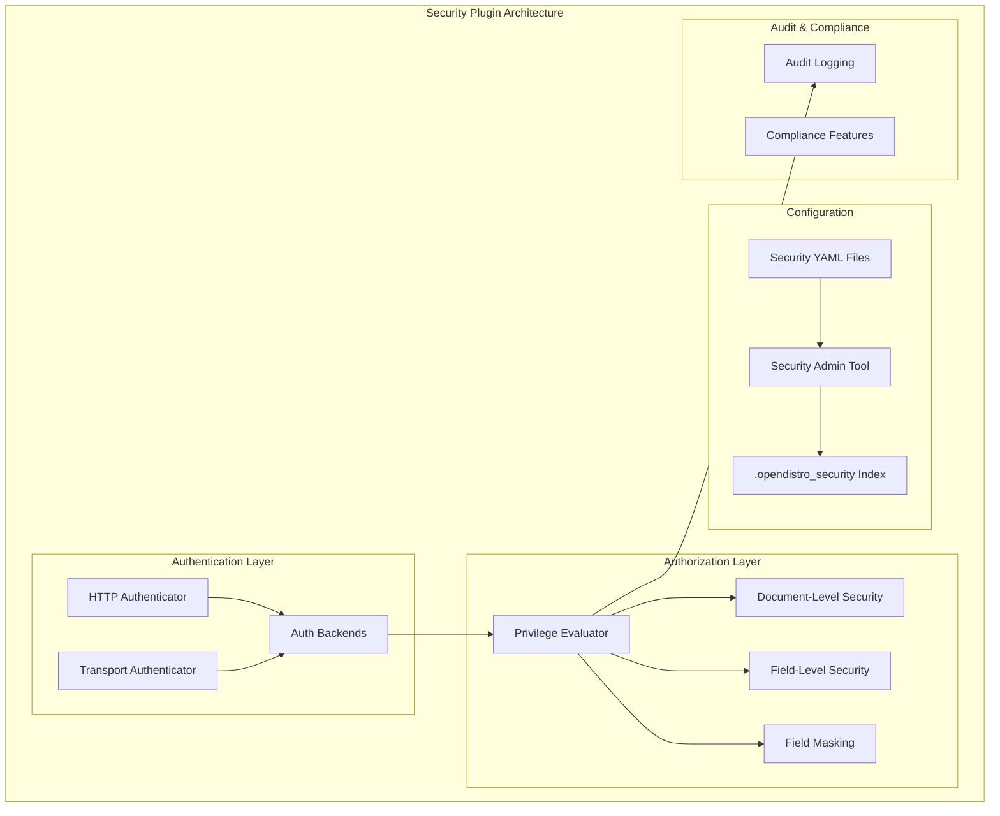
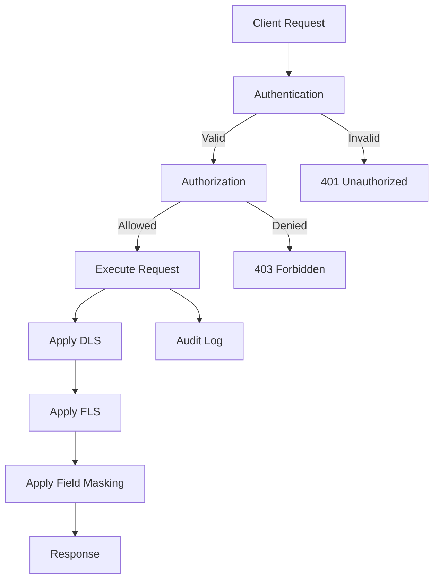

# Security Plugin

## Summary

The OpenSearch Security plugin provides comprehensive security features for OpenSearch clusters, including TLS encryption, authentication backends, data masking, audit logging, and role-based access control (RBAC) on indices, documents, and fields. It supports multiple authentication methods and provides fine-grained access control for enterprise deployments.

## Details

### Architecture



### Data Flow



### Components

| Component | Description |
|-----------|-------------|
| HTTP Authenticator | Handles REST API authentication |
| Transport Authenticator | Handles node-to-node authentication |
| Privilege Evaluator | Evaluates user permissions against requested actions |
| DLS Filter | Applies document-level security filters |
| FLS Filter | Applies field-level security filters |
| Field Masking | Masks sensitive field values |
| Audit Logger | Records security events |
| Security Admin | CLI tool for configuration management |

### Authentication Backends

| Backend | Description |
|---------|-------------|
| Internal | Built-in user database |
| LDAP/AD | LDAP and Active Directory integration |
| OIDC | OpenID Connect providers |
| SAML | SAML 2.0 identity providers |
| JWT | JSON Web Token authentication |
| Kerberos | Kerberos/SPNEGO authentication |
| Proxy | Proxy-based authentication |
| Client Certificate | X.509 client certificate authentication |

### Configuration

| Setting | Description | Default |
|---------|-------------|---------|
| `plugins.security.ssl.transport.enabled` | Enable TLS for transport layer | `true` |
| `plugins.security.ssl.http.enabled` | Enable TLS for HTTP layer | `true` |
| `plugins.security.allow_default_init_securityindex` | Allow default security index initialization | `false` |
| `plugins.security.audit.type` | Audit log storage type | `internal_opensearch` |
| `plugins.security.restapi.password_score_based_validation_strength` | Password strength requirement | `fair` |
| `plugins.security.restapi.roles_enabled` | Roles allowed to use REST API | `[]` |

### Configuration Files

| File | Description |
|------|-------------|
| `config.yml` | Main security configuration |
| `roles.yml` | Role definitions |
| `roles_mapping.yml` | User-to-role mappings |
| `internal_users.yml` | Internal user database |
| `action_groups.yml` | Action group definitions |
| `tenants.yml` | Multi-tenancy configuration |
| `allowlist.yml` | API allowlist configuration |
| `audit.yml` | Audit logging configuration |
| `nodes_dn.yml` | Node distinguished names |

### Usage Example

```yaml
# roles.yml - Define a custom role
custom_read_role:
  cluster_permissions:
    - cluster_composite_ops_ro
  index_permissions:
    - index_patterns:
        - "logs-*"
      allowed_actions:
        - read
      dls: '{"term": {"department": "${user.department}"}}'
      fls:
        - "~password"
        - "~ssn"
      masked_fields:
        - "email"

# roles_mapping.yml - Map users to roles
custom_read_role:
  users:
    - analyst_user
  backend_roles:
    - analysts
```

### Rate Limiting Configuration

```yaml
# config.yml - Rate limiting with CIDR support (v3.0.0+)
config:
  dynamic:
    auth_failure_listeners:
      ip_rate_limiting:
        type: ip
        allowed_tries: 5
        time_window_seconds: 60
        block_expiry_seconds: 600
        max_blocked_clients: 100000
        max_tracked_clients: 100000
        ignore_hosts:
          - 127.0.0.0/8
          - 10.0.0.0/8
```

## Limitations

- Configuration changes require `securityadmin.sh` or cluster restart
- Some settings are not hot-reloadable
- Blake2b hash change in v3.0.0 requires password re-hashing
- OpenSSL TLS provider removed in v3.0.0 (JDK TLS only)
- Whitelist settings removed in v3.0.0 (use allowlist)

## Related PRs

| Version | PR | Description |
|---------|-----|-------------|
| v3.0.0 | [#5089](https://github.com/opensearch-project/security/pull/5089) | Fix Blake2b hash implementation (breaking) |
| v3.0.0 | [#5220](https://github.com/opensearch-project/security/pull/5220) | Remove OpenSSL provider (breaking) |
| v3.0.0 | [#5224](https://github.com/opensearch-project/security/pull/5224) | Remove whitelist settings (breaking) |
| v3.0.0 | [#4380](https://github.com/opensearch-project/security/pull/4380) | Optimized Privilege Evaluation |
| v3.0.0 | [#5099](https://github.com/opensearch-project/security/pull/5099) | CIDR ranges in ignore_hosts |
| v3.0.0 | [#5119](https://github.com/opensearch-project/security/pull/5119) | Add 'good' password validation strength |
| v3.0.0 | [#5160](https://github.com/opensearch-project/security/pull/5160) | Add stop-replication permission |
| v3.0.0 | [#5153](https://github.com/opensearch-project/security/pull/5153) | Secure password generator action |
| v3.0.0 | [#5193](https://github.com/opensearch-project/security/pull/5193) | Default to v7 config models |
| v3.0.0 | [#5175](https://github.com/opensearch-project/security/pull/5175) | Escape pipe character in usernames |
| v3.0.0 | [#5217](https://github.com/opensearch-project/security/pull/5217) | Fix IllegalArgumentException in stateful index privileges |
| v3.0.0 | [#5243](https://github.com/opensearch-project/security/pull/5243) | Fix DlsFlsFilterLeafReader termVectors assertion errors |
| v3.0.0 | [#5304](https://github.com/opensearch-project/security/pull/5304) | Fix DlsFlsFilterLeafReader PointValues and object attributes |
| v3.0.0 | [#4979](https://github.com/opensearch-project/security/pull/4979) | Only check validity of certs in node certificate chain |
| v3.0.0 | [#5157](https://github.com/opensearch-project/security/pull/5157) | Fix version matcher in demo config installer |
| v3.0.0 | [#2218](https://github.com/opensearch-project/security/pull/2218) | Remove tenant panels when multitenancy disabled |
| v3.0.0 | [#2223](https://github.com/opensearch-project/security/pull/2223) | Add cat shard API permission |
| v3.0.0 | [#4966](https://github.com/opensearch-project/security/pull/4966) | Run Security build on opensearch-build image |
| v3.0.0 | [#1454](https://github.com/opensearch-project/security/pull/1454) | Java-agent gradle plugin for SecurityManager phase-off |
| v3.0.0 | [#1414](https://github.com/opensearch-project/security/pull/1414) | Use testclusters when testing with security |
| v3.0.0 | [#713](https://github.com/opensearch-project/security/pull/713) | Fetch certs from security repo, remove local demo certs |
| v3.0.0 | [#1281](https://github.com/opensearch-project/security/pull/1281) | Fix custom rule creation |
| v3.0.0 | [#1401](https://github.com/opensearch-project/security/pull/1401) | Fix Docker Security Tests qualifier parsing |
| v3.0.0 | [#1467](https://github.com/opensearch-project/security/pull/1467) | Refactored flaky test |
| v3.0.0 | [#1498](https://github.com/opensearch-project/security/pull/1498) | Remove overrides of preserveIndicesUponCompletion |
| v3.0.0 | [#1503](https://github.com/opensearch-project/security/pull/1503) | Remove usage of deprecated batchSize() method |
| v2.18.0 | [#4776](https://github.com/opensearch-project/security/pull/4776) | Add deprecation warning for GET/POST/PUT cache |
| v2.18.0 | [#4768](https://github.com/opensearch-project/security/pull/4768) | Undeprecate securityadmin script |
| v2.18.0 | [#4765](https://github.com/opensearch-project/security/pull/4765) | Add isActionPaginated to DelegatingRestHandler |
| v2.18.0 | [#4740](https://github.com/opensearch-project/security/pull/4740) | Refactor ASN1 call for FIPS compatibility |
| v2.18.0 | [#4792](https://github.com/opensearch-project/security/pull/4792) | Fix CVE-2024-47554 (commons-io upgrade) |
| v2.18.0 | [#4831](https://github.com/opensearch-project/security/pull/4831) | Fix bulk index requests in BWC tests |
| v2.18.0 | [#4815](https://github.com/opensearch-project/security/pull/4815) | Fix integTest not called during release |
| v2.17.0 | [#4603](https://github.com/opensearch-project/security/pull/4603) | Fix demo certificate hash validation |
| v2.17.0 | [#4631](https://github.com/opensearch-project/security/pull/4631) | Fix authtoken endpoint |
| v2.17.0 | [#4664](https://github.com/opensearch-project/security/pull/4664) | Handle null audit config |
| v2.17.0 | [#4640](https://github.com/opensearch-project/security/pull/4640) | Sort DNS names in SANs for certificate comparison |
| v2.17.0 | [#4607](https://github.com/opensearch-project/security/pull/4607) | Fix TermsAggregationEvaluator READ_ACTIONS |
| v2.17.0 | [#4611](https://github.com/opensearch-project/security/pull/4611) | Refactor security provider instantiation |
| v2.17.0 | [#4653](https://github.com/opensearch-project/security/pull/4653) | Remove Log4j Strings utility usage |
| v2.17.0 | [#4694](https://github.com/opensearch-project/security/pull/4694) | PluginSubject build fix |

## References

- [Issue #4728](https://github.com/opensearch-project/security/issues/4728): ASN1 refactoring for FIPS support (v2.18.0)
- [Issue #4790](https://github.com/opensearch-project/security/issues/4790): CVE-2024-47554 tracking (v2.18.0)
- [Issue #4274](https://github.com/opensearch-project/security/issues/4274): Blake2b hash issue
- [Issue #3870](https://github.com/opensearch-project/security/issues/3870): Optimized privilege evaluation
- [Issue #4927](https://github.com/opensearch-project/security/issues/4927): CIDR range support
- [Issue #5238](https://github.com/opensearch-project/security/issues/5238): DlsFlsFilterLeafReader termVectors issue
- [Issue #1483](https://github.com/opensearch-project/OpenSearch/issues/1483): Deprecate non-inclusive terms
- [Issue #4599](https://github.com/opensearch-project/security/issues/4599): Demo certificate setting bug (v2.17.0)
- [Issue #4627](https://github.com/opensearch-project/security/issues/4627): Auth token endpoint issue (v2.17.0)
- [Issue #4480](https://github.com/opensearch-project/security/issues/4480): Certificate SAN ordering issue (v2.17.0)
- [Issue #4583](https://github.com/opensearch-project/security/issues/4583): Security provider refactoring (v2.17.0)
- [Documentation: Security](https://docs.opensearch.org/3.0/security/)
- [Documentation: Breaking Changes](https://docs.opensearch.org/3.0/breaking-changes/)
- [Documentation: Security Settings](https://docs.opensearch.org/3.0/install-and-configure/configuring-opensearch/security-settings/)
- [Documentation: Access Control API](https://docs.opensearch.org/3.0/security/access-control/api/)
- [Documentation: Security APIs](https://docs.opensearch.org/3.0/api-reference/security/index/)

## Change History

- **v3.0.0** (2025-05-06): Breaking changes - Blake2b hash fix, OpenSSL removal, whitelist→allowlist; Enhancements - optimized privilege evaluation, CIDR support in ignore_hosts, password validation improvements
- **v2.18.0** (2024-11-05): Maintenance - cache endpoint deprecation warning, undeprecate securityadmin script, ASN1 refactoring for FIPS compatibility, CVE-2024-47554 fix, pagination support, BWC test fixes
- **v2.17.0** (2024-09-17): Bugfixes - demo certificate validation, auth token endpoint, audit config null handling, certificate SAN ordering, TermsAggregationEvaluator permissions; Refactoring - security provider instantiation for FIPS support, Log4j utility removal
