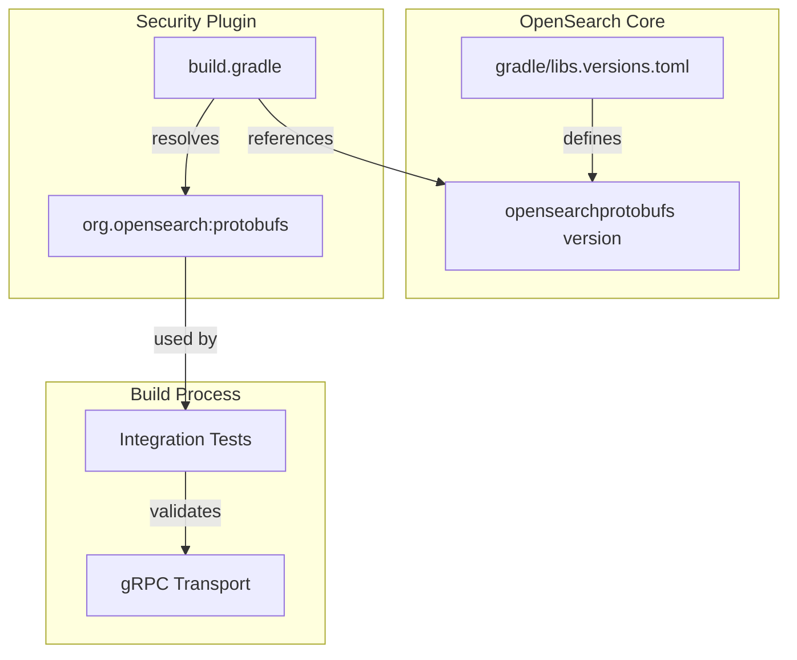

---
tags:
  - security
---
# Protobufs Version Synchronization

## Summary

The OpenSearch Security plugin synchronizes its `org.opensearch:protobufs` dependency version with OpenSearch core to ensure compatibility and reduce maintenance overhead. This eliminates the need for manual version updates when core updates the protobufs library.

## Details

### Architecture



### Components

| Component | Description |
|-----------|-------------|
| `gradle/libs.versions.toml` | OpenSearch core version catalog defining `opensearchprotobufs` |
| `build.gradle` | Security plugin build configuration referencing core's version |
| `org.opensearch:protobufs` | Protocol Buffers library for gRPC communication |

### Configuration

| Setting | Location | Description |
|---------|----------|-------------|
| `opensearchprotobufs` | `gradle/libs.versions.toml` (core) | Protobufs library version |
| `versions.opensearchprotobufs` | `build.gradle` (security) | Reference to core's version |

### Usage

The protobufs library is used in integration tests for gRPC transport testing:

```groovy
dependencies {
    integrationTestImplementation "org.opensearch:protobufs:${versions.opensearchprotobufs}"
    integrationTestImplementation "io.grpc:grpc-stub:${versions.grpc}"
    integrationTestImplementation "io.grpc:grpc-netty-shaded:${versions.grpc}"
    integrationTestImplementation "org.opensearch.plugin:transport-grpc:${opensearch_version}"
}
```

## Limitations

- Breaking changes in protobufs require coordinated updates between core and Security plugin
- Security plugin must be built against a compatible OpenSearch core version

## Change History

- **v3.3.0** (2026-01-11): Initial implementation - synchronized protobufs version with core


## References

### Documentation
- [OpenSearch core libs.versions.toml](https://github.com/opensearch-project/OpenSearch/blob/main/gradle/libs.versions.toml): Version catalog
- [Security plugin build.gradle](https://github.com/opensearch-project/security/blob/main/build.gradle): Build configuration

### Pull Requests
| Version | PR | Description | Related Issue |
|---------|-----|-------------|---------------|
| v3.3.0 | [#5659](https://github.com/opensearch-project/security/pull/5659) | Initial implementation of version sync |   |
