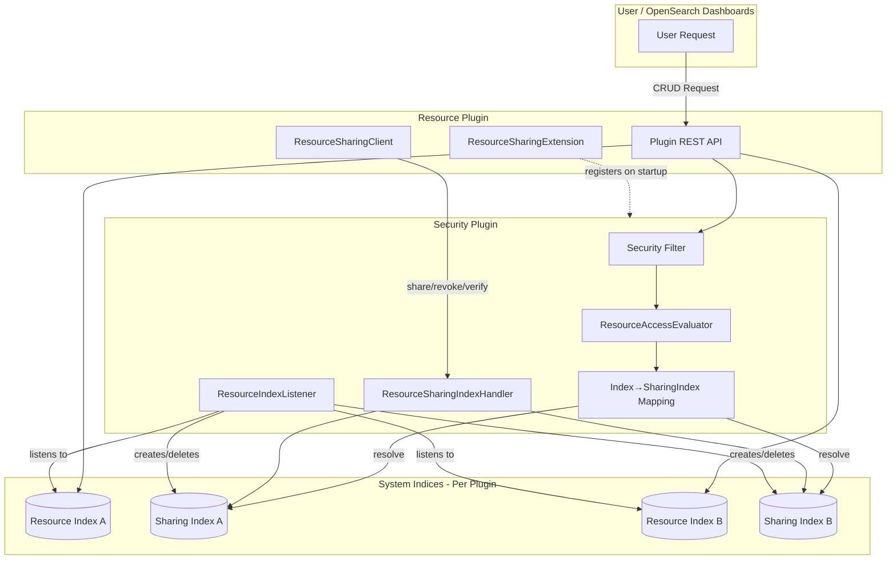
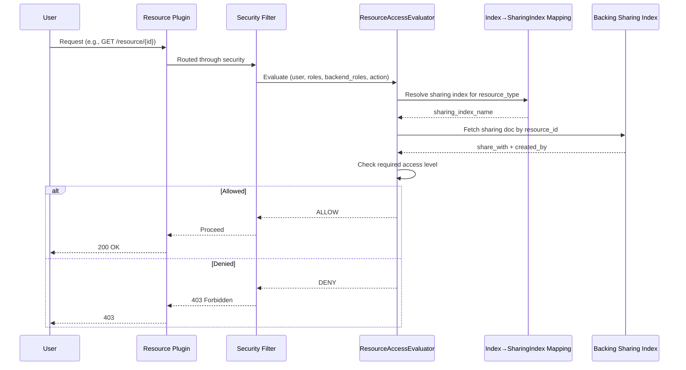

---
tags:
  - dashboards
  - indexing
  - ml
  - security
---

# Resource Access Control Framework

## Summary

The Resource Access Control Framework provides centralized, fine-grained access management for plugin-defined resources in OpenSearch. It enables document-level authorization for higher-level objects such as ML models, anomaly detectors, and reports, allowing resource owners to share their resources with specific users, roles, or backend roles while maintaining security and auditability.

This framework replaces the legacy backend-role-based access model (`filter_by_backend_role`) with an owner-controlled sharing model, providing more granular control over who can access specific resources.

## Details

### Architecture



### Data Flow



### Components

| Component | Description |
|-----------|-------------|
| `opensearch-security-spi` | Service Provider Interface package for plugins to implement resource sharing |
| `ResourceSharingExtension` | Interface that plugins implement to declare themselves as resource plugins |
| `ResourceProvider` | Interface (v3.4.0+) containing resource type, index name, and optional type field |
| `ResourceSharingClient` | Client interface for plugins to perform access control operations |
| `ResourceAccessEvaluator` | Evaluates access permissions automatically via Security Filter |
| `ResourceSharingIndexHandler` | Manages CRUD operations on per-resource sharing indices |
| `ResourceIndexListener` | IndexingOperationListener that maintains sharing metadata on resource changes |
| `ResourcePluginInfo` | Tracks registered resource sharing extensions |

### Configuration

| Setting | Description | Default |
|---------|-------------|---------|
| `plugins.security.experimental.resource_sharing.enabled` | Enable/disable resource sharing feature | `false` |
| `plugins.security.experimental.resource_sharing.protected_types` | List of resource types that use resource-level authorization | `[]` |
| `plugins.security.system_indices.enabled` | Enable system index protection (required) | `true` |

**Dynamic Configuration (v3.3.0+):**

Settings can be updated at runtime via the `_cluster/settings` API:

```json
PUT _cluster/settings
{
  "persistent": {
    "plugins.security.experimental.resource_sharing.enabled": "true",
    "plugins.security.experimental.resource_sharing.protected_types": ["anomaly-detector", "forecaster", "ml-model"]
  }
}
```

### Data Model

Each resource index has a backing sharing index with naming convention: `{resourceIndex}-sharing`

**Sharing Document Structure (v3.4.0+):**

```json
{
  "resource_id": "resource-123",
  "resource_type": "sample-resource",
  "created_by": {
    "user": "owner_username"
  },
  "share_with": {
    "READ_ONLY": {
      "users": ["user1", "user2"],
      "roles": ["viewer_role"],
      "backend_roles": ["data_analyst"]
    },
    "READ_WRITE": {
      "users": ["admin_user"],
      "roles": ["editor_role"],
      "backend_roles": ["content_manager"]
    }
  }
}
```

### Access Scopes

| Scope | Description | Example |
|-------|-------------|---------|
| Private | No `share_with` entry - only owner and super-admins can access | `"share_with": {}` |
| Restricted | Specific users/roles/backend_roles listed | `"share_with": {"READ_ONLY": {"users": ["alice"]}}` |
| Public | Wildcard `*` grants access to all | `"share_with": {"READ_ONLY": {"users": ["*"]}}` |

### Java APIs

| Method | Signature | Description |
|--------|-----------|-------------|
| `verifyAccess` | `void verifyAccess(String resourceId, String resourceIndex, String action, ActionListener<Boolean> listener)` | Check if current user has access with provided action |
| `share` | `void share(String resourceId, String resourceIndex, ShareWith target, ActionListener<ResourceSharing> listener)` | Grant access to specified entities |
| `revoke` | `void revoke(String resourceId, String resourceIndex, ShareWith target, ActionListener<ResourceSharing> listener)` | Remove access from specified entities |
| `getAccessibleResourceIds` | `void getAccessibleResourceIds(String resourceIndex, ActionListener<Set<String>> listener)` | Get all accessible resource IDs |
| `isFeatureEnabledForType` | `boolean isFeatureEnabledForType(String resourceType)` | Check if feature is enabled for a resource type |

### REST APIs (v3.3.0+)

| API | Method | Description | Permission |
|-----|--------|-------------|------------|
| `/_plugins/_security/api/resource/share` | PUT | Create/replace sharing settings | Resource Owner |
| `/_plugins/_security/api/resource/share` | PATCH/POST | Add or revoke recipients | Resource Owner / share permission |
| `/_plugins/_security/api/resource/share` | GET | Retrieve sharing configuration | Resource Owner / read permission |
| `/_plugins/_security/api/resource/types` | GET | List resource types and action groups | Dashboard access |
| `/_plugins/_security/api/resource/list` | GET | List accessible resources | Dashboard access |
| `/_plugins/_security/api/resources/migrate` | POST | Migrate legacy sharing metadata | REST admin / Super admin |

### Usage Example

**1. Implement ResourceSharingExtension:**

```java
public class SampleResourceExtension implements ResourceSharingExtension {
    @Override
    public Set<ResourceProvider> getResourceProviders() {
        return Set.of(new ResourceProvider(
            SampleResource.class.getCanonicalName(), 
            RESOURCE_INDEX_NAME
        ));
    }

    @Override
    public void assignResourceSharingClient(ResourceSharingClient client) {
        ResourceSharingClientAccessor.getInstance()
            .setResourceSharingClient(client);
    }
}
```

**2. Register via SPI:**

Create file: `src/main/resources/META-INF/services/org.opensearch.security.spi.ResourceSharingExtension`

```
org.opensearch.sample.SampleResourceExtension
```

**3. Add dependency in build.gradle:**

```gradle
compileOnly group: 'org.opensearch', name:'opensearch-security-spi', version:"${opensearch_build}"

opensearchplugin {
    extendedPlugins = ['opensearch-security;optional=true']
}
```

**4. Implement DocRequest interface (v3.3.0+):**

All ActionRequests related to resources must implement the DocRequest interface:

```java
public class ShareResourceRequest extends ActionRequest implements DocRequest {
    private final String resourceId;
    
    @Override
    public String index() {
        return RESOURCE_INDEX_NAME;
    }
    
    @Override
    public String id() {
        return resourceId;
    }
}
```

**5. Declare action groups in resource-action-groups.yml (v3.3.0+):**

```yaml
resource_types:
  sample-resource:
    sample_read_only:
      - "cluster:admin/sample-resource-plugin/get"
    sample_read_write:
      - "cluster:admin/sample-resource-plugin/*"
    sample_full_access:
      - "cluster:admin/sample-resource-plugin/*"
      - "cluster:admin/security/resource/share"
```

**6. Use client for access control:**

```java
ResourceSharingClient client = ResourceSharingClientAccessor.getInstance()
    .getResourceSharingClient();

client.share(
    resourceId,
    RESOURCE_INDEX_NAME,
    new Recipients(List.of("user1"), List.of("role1"), List.of()),
    ActionListener.wrap(
        sharing -> log.info("Shared: {}", sharing),
        e -> log.error("Failed to share", e)
    )
);
```

## Limitations

- Feature is marked as **experimental** and disabled by default
- Only resource owners and super-admins can share/revoke access
- No pattern matching for users/roles/backend_roles - each must be individually specified
- Resources must be stored in system indices with system index protection enabled
- Currently supports single action group (`default`) - multiple action groups planned for future

### Onboarded Plugins

#### ML-Commons (v3.3.0+)

ML-Commons is the first plugin to onboard to the centralized resource access control framework for model groups.

**Integration Components:**

| Component | Description |
|-----------|-------------|
| `ResourceSharingClientAccessor` | Singleton accessor for `ResourceSharingClient` |
| `ML_MODEL_GROUP_RESOURCE_TYPE` | Resource type constant: `"ml-model-group"` |
| `DocRequest` interface | Implemented by model group request classes |

**Modified Request Classes:**

- `MLModelGroupGetRequest` - implements `DocRequest`
- `MLModelGroupDeleteRequest` - implements `DocRequest`
- `MLUpdateModelGroupRequest` - implements `DocRequest`

**Index Mapping (schema version 4):**

```json
{
  "all_shared_principals": {
    "type": "keyword"
  }
}
```

### Resource Access Management Dashboard (v3.3.0+)

The Security Dashboards Plugin provides a UI for managing resource sharing.

**Dashboard Configuration:**

| Setting | Value |
|---------|-------|
| App ID | `resource_access_management` |
| Route | `/app/resource_access_management` |
| Feature Flag | `resource_sharing.enabled: true` |

**Dashboard API Routes:**

| Route | Method | Description |
|-------|--------|-------------|
| `/api/resource/types` | GET | List registered resource types |
| `/api/resource/list` | GET | List accessible resources by type |
| `/api/resource/view` | GET | Get sharing info for specific resource |
| `/api/resource/share` | PUT | Share a resource |
| `/api/resource/update_sharing` | PATCH | Update sharing (add/revoke) |

**UI Features:**

- Type selector dropdown for resource types
- Table view of accessible resources with owner, tenant, and sharing info
- Share/Update Access modal for managing permissions
- Support for users, roles, and backend_roles at different access levels

## Change History

- **v3.4.0** (2026-01): Multiple resource types per index support, resource_type tracking on sharing documents, ResourceProvider refactored to interface, ResourceSharing Builder pattern, POST support for update sharing API, removed Java share/revoke APIs in favor of REST, migration API requires default_owner parameter
- **v3.3.0** (2026-01): ML-Commons model group onboarding, Resource Access Management Dashboard UI, DLS-based automatic filtering with `all_shared_principals`, multi-tenancy support, dashboard APIs (`/resource/types`, `/resource/list`), bug fixes for case-sensitive search, PATCH visibility, resource updates, and multiple shares
- **v3.2.0** (2025): Migration API, Resource Access Evaluator for automatic authorization, client accessor pattern fix
- **v3.1.0** (2025): Initial implementation with centralized SPI, 1:1 backing sharing indices, and automatic access evaluation

## Related Features
- [Security (Dashboards)](../security-dashboards-plugin/security-dashboards-plugin-security-dashboards-role-management.md)

## References

### Documentation
- [RESOURCE_SHARING_AND_ACCESS_CONTROL.md](https://github.com/opensearch-project/security/blob/main/RESOURCE_SHARING_AND_ACCESS_CONTROL.md): Complete developer and user guide
- [spi/README.md](https://github.com/opensearch-project/security/blob/main/spi/README.md): SPI implementation guide

### Blog Posts
- [Blog: Introducing resource sharing](https://opensearch.org/blog/introducing-resource-sharing-a-new-access-control-model-for-opensearch/): Official announcement

### Pull Requests
| Version | PR | Repository | Description | Related Issue |
|---------|-----|------------|-------------|---------------|
| v3.4.0 | [#5713](https://github.com/opensearch-project/security/pull/5713) | security | Allow multiple sharable resource types in single resource index |   |
| v3.4.0 | [#5772](https://github.com/opensearch-project/security/pull/5772) | security | Keep track of resource_type on resource sharing document |   |
| v3.4.0 | [#5789](https://github.com/opensearch-project/security/pull/5789) | security | Requires default_owner for resource/migrate API |   |
| v3.4.0 | [#5717](https://github.com/opensearch-project/security/pull/5717) | security | Make migrate API require default access level |   |
| v3.4.0 | [#5718](https://github.com/opensearch-project/security/pull/5718) | security | Removes share and revoke Java APIs |   |
| v3.4.0 | [#5755](https://github.com/opensearch-project/security/pull/5755) | security | Refactor ResourceProvider to interface and ResourceSharing refactors |   |
| v3.4.0 | [#5799](https://github.com/opensearch-project/security/pull/5799) | security | Adds POST support for update sharing info API |   |
| v3.4.0 | [#2338](https://github.com/opensearch-project/security-dashboards-plugin/pull/2338) | security-dashboards-plugin | Changes PATCH update sharing API to POST |   |
| v3.3.0 | [#3715](https://github.com/opensearch-project/ml-commons/pull/3715) | ml-commons | Onboards ML-Model-Group to centralized resource access control | [#3890](https://github.com/opensearch-project/ml-commons/issues/3890) |
| v3.3.0 | [#2304](https://github.com/opensearch-project/security-dashboards-plugin/pull/2304) | security-dashboards-plugin | Adds Resource Access Management Dashboard |   |
| v3.3.0 | [#5600](https://github.com/opensearch-project/security/pull/5600) | security | DLS-based automatic filtering using `all_shared_principals` |   |
| v3.3.0 | [#5596](https://github.com/opensearch-project/security/pull/5596) | security | Track `all_shared_principals` for efficient searchability |   |
| v3.3.0 | [#5588](https://github.com/opensearch-project/security/pull/5588) | security | Multi-tenancy support with tenant tracking |   |
| v3.3.0 | [#5597](https://github.com/opensearch-project/security/pull/5597) | security | Dashboard APIs for resource access management | [#5607](https://github.com/opensearch-project/security/issues/5607) |
| v3.3.0 | [#5574](https://github.com/opensearch-project/security/pull/5574) | security | Fix case-sensitive user search |   |
| v3.3.0 | [#5576](https://github.com/opensearch-project/security/pull/5576) | security | Revert @Inject to client accessor pattern |   |
| v3.3.0 | [#5631](https://github.com/opensearch-project/security/pull/5631) | security | Fix GET _doc authorization on sharable indices |   |
| v3.3.0 | [#5654](https://github.com/opensearch-project/security/pull/5654) | security | Fix PATCH API visibility update |   |
| v3.3.0 | [#5658](https://github.com/opensearch-project/security/pull/5658) | security | Preserve `all_shared_principals` on resource updates |   |
| v3.3.0 | [#5666](https://github.com/opensearch-project/security/pull/5666) | security | Make initial share map mutable |   |
| v3.3.0 | [#5605](https://github.com/opensearch-project/security/pull/5605) | security | Match `.kibana` index settings |   |
| v3.3.0 | [#5540](https://github.com/opensearch-project/security/pull/5540) | security | Comprehensive documentation for Resource Access Control |   |
| v3.2.0 | [#5389](https://github.com/opensearch-project/security/pull/5389) | security | Migration API for existing sharing info |   |
| v3.2.0 | [#5408](https://github.com/opensearch-project/security/pull/5408) | security | Resource Access Evaluator for standalone authorization | [#5442](https://github.com/opensearch-project/security/issues/5442) |
| v3.2.0 | [#5541](https://github.com/opensearch-project/security/pull/5541) | security | Client accessor pattern fix for optional security plugin |   |
| v3.1.0 | [#5281](https://github.com/opensearch-project/security/pull/5281) | security | Introduces Centralized Resource Access Control Framework |   |
| v3.1.0 | [#5358](https://github.com/opensearch-project/security/pull/5358) | security | Store resource sharing info in 1:1 backing indices |   |

### Issues (Design / RFC)
- [Issue #4500](https://github.com/opensearch-project/security/issues/4500): Resource Permissions and Sharing proposal
- [Issue #5391](https://github.com/opensearch-project/security/issues/5391): Migration API tracking issue
- [Issue #5442](https://github.com/opensearch-project/security/issues/5442): Resource Access Evaluator tracking issue
- [Issue #3890](https://github.com/opensearch-project/ml-commons/issues/3890): Onboard ML plugin to Centralized Resource AuthZ framework
- [Issue #2303](https://github.com/opensearch-project/security-dashboards-plugin/issues/2303): Resource Access Management Dashboard feature request
