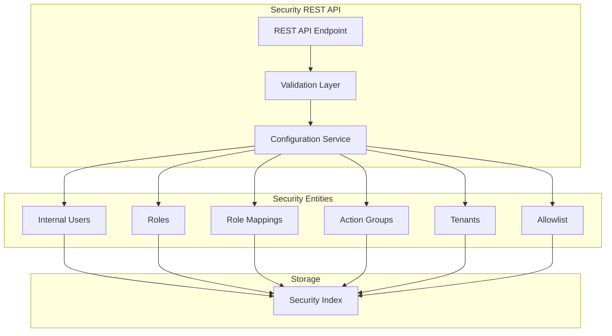

---
tags:
  - security
---
# Security REST API

## Summary

The OpenSearch Security plugin provides a comprehensive REST API for programmatically managing security configurations including users, roles, role mappings, action groups, tenants, and more. The API enables administrators to automate security management tasks without directly modifying YAML configuration files.

## Details

### Architecture



### API Endpoints

| Endpoint | Description |
|----------|-------------|
| `/_plugins/_security/api/account` | Current user account management |
| `/_plugins/_security/api/internalusers` | Internal user management |
| `/_plugins/_security/api/roles` | Role management |
| `/_plugins/_security/api/rolesmapping` | Role mapping management |
| `/_plugins/_security/api/actiongroups` | Action group management |
| `/_plugins/_security/api/tenants` | Tenant management |
| `/_plugins/_security/api/allowlist` | API allowlist management |
| `/_plugins/_security/api/securityconfig` | Security configuration |
| `/_plugins/_security/api/nodesdn` | Distinguished names management |
| `/_plugins/_security/api/ssl/certs` | Certificate management |
| `/_plugins/_security/api/cache` | Cache management |
| `/_plugins/_security/api/audit` | Audit log configuration |

### HTTP Methods

| Method | Operation |
|--------|-----------|
| GET | Retrieve resources |
| PUT | Create or replace resources |
| POST | Create resources |
| DELETE | Remove resources |
| PATCH | Partial updates |

### Configuration

| Setting | Description | Default |
|---------|-------------|---------|
| `plugins.security.restapi.roles_enabled` | Roles allowed to access REST API | `[]` |
| `plugins.security.restapi.endpoints_disabled.<role>.<endpoint>` | Disable specific endpoints for roles | - |
| `plugins.security.restapi.admin.enabled` | Enable admin REST API | `false` |
| `plugins.security.unsupported.restapi.allow_securityconfig_modification` | Allow config modification via API | `false` |

### Access Control Permissions

| Permission | APIs Granted |
|------------|--------------|
| `restapi:admin/actiongroups` | `/actiongroup`, `/actiongroups` |
| `restapi:admin/allowlist` | `/allowlist` |
| `restapi:admin/internalusers` | `/internaluser`, `/user` |
| `restapi:admin/nodesdn` | `/nodesdn` |
| `restapi:admin/roles` | `/roles` |
| `restapi:admin/rolesmapping` | `/rolesmapping` |
| `restapi:admin/ssl/certs/info` | `/ssl/certs/info` |
| `restapi:admin/ssl/certs/reload` | `/ssl/certs/reload` |
| `restapi:admin/tenants` | `/tenants` |

### Usage Examples

#### Create Internal User
```bash
PUT _plugins/_security/api/internalusers/new_user
{
  "password": "password123",
  "opendistro_security_roles": ["readall"],
  "backend_roles": ["role1"],
  "attributes": {
    "department": "engineering"
  }
}
```

#### PATCH User
```bash
PATCH _plugins/_security/api/internalusers/new_user
[
  {
    "op": "replace",
    "path": "/backend_roles",
    "value": ["new_role"]
  }
]
```

## Limitations

- Reserved resources (marked with `reserved: true`) cannot be modified via REST API
- Hidden resources (marked with `hidden: true`) are not returned by REST API
- Some configuration changes require `securityadmin.sh` for safety
- PATCH method not supported in OpenSearch Dashboards Dev Tools

## Change History

- **v2.16.0** (2024-08): PATCH API validation to fail if nothing changes, REST API test refactoring for InternalUsers, Role Mappings, Tenants, and Roles, PR template update for API spec changes
- **v2.14.0**: Configuration upgrade check and upgrade APIs added
- **v1.0.0**: Initial REST API implementation

## References

### Documentation

- [Security REST API](https://docs.opensearch.org/latest/security/access-control/api/)
- [Defining Users and Roles](https://docs.opensearch.org/latest/security/access-control/users-roles/)

### Pull Requests

| Version | PR | Description |
|---------|-----|-------------|
| v2.16.0 | [#4533](https://github.com/opensearch-project/security/pull/4533) | Update PR template for API spec changes |
| v2.16.0 | [#4530](https://github.com/opensearch-project/security/pull/4530) | PATCH API validation for no-op changes |
| v2.16.0 | [#4481](https://github.com/opensearch-project/security/pull/4481) | Refactor InternalUsers REST API test |
| v2.16.0 | [#4450](https://github.com/opensearch-project/security/pull/4450) | Refactor Role Mappings REST API test |
