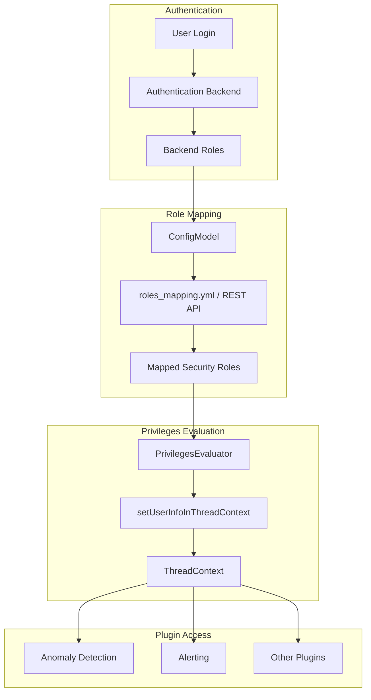
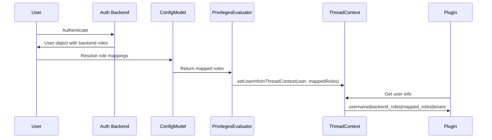

# Security Role Mapping

## Summary

Security Role Mapping in OpenSearch allows administrators to map backend roles (from external authentication systems like LDAP, SAML, or OpenID Connect) to OpenSearch security roles. This mapping determines what permissions users have based on their external identity attributes. The ThreadContext stores user information including mapped roles, which plugins can access to make authorization decisions.

## Details

### Architecture



### Data Flow



### Components

| Component | Description |
|-----------|-------------|
| `PrivilegesEvaluator` | Evaluates user privileges and sets user info in ThreadContext |
| `ConfigModel` | Resolves backend roles to security roles using role mappings |
| `ThreadContext` | Stores user information accessible to plugins |
| `roles_mapping.yml` | Configuration file for static role mappings |
| `User` | Immutable object containing user identity and backend roles |

### Configuration

Role mappings can be configured in `roles_mapping.yml`:

```yaml
all_access:
  reserved: false
  backend_roles:
    - "admin"
  users:
    - "admin"
    
readall:
  reserved: false
  backend_roles:
    - "readall"
```

Or via the REST API:

```bash
PUT _plugins/_security/api/rolesmapping/all_access
{
  "backend_roles": ["admin"],
  "users": ["admin"]
}
```

### ThreadContext User Info Format

The user information stored in ThreadContext follows this format:

```
username|backend_roles|mapped_roles|requested_tenant
```

Example:
```
john|ldap_admin,ldap_users|all_access,readall|global_tenant
```

### Usage Example

Plugins can access user information from ThreadContext:

```java
String userInfo = threadContext.getTransient(OPENDISTRO_SECURITY_USER_INFO_THREAD_CONTEXT);
if (userInfo != null) {
    String[] parts = userInfo.split("\\|");
    String username = parts[0];
    String[] backendRoles = parts[1].split(",");
    String[] mappedRoles = parts[2].split(",");
    String tenant = parts.length > 3 ? parts[3] : null;
}
```

## Limitations

- Role mappings are resolved at authentication time; changes to mappings require re-authentication
- The ThreadContext user info format uses pipe (`|`) as delimiter; values containing pipes must be escaped
- Backend roles from external systems must match exactly (case-sensitive) with role mapping configuration

## Related PRs

| Version | PR | Description |
|---------|-----|-------------|
| v3.1.0 | [#5369](https://github.com/opensearch-project/security/pull/5369) | Fix: Include mapped roles when setting userInfo in ThreadContext |
| v3.1.0 | [#5212](https://github.com/opensearch-project/security/pull/5212) | Performance: Immutable user object |

## References

- [Defining users and roles](https://docs.opensearch.org/3.0/security/access-control/users-roles/): Official documentation
- [Security settings](https://docs.opensearch.org/3.0/install-and-configure/configuring-opensearch/security-settings/): Configuration options including `plugins.security.roles_mapping_resolution`
- [PR #5369](https://github.com/opensearch-project/security/pull/5369): ThreadContext mapped roles fix
- [PR #5212](https://github.com/opensearch-project/security/pull/5212): Immutable user object implementation

## Change History

- **v3.1.0** (2026-01-10): Fix mapped roles not being included in ThreadContext userInfo after immutable User object change
