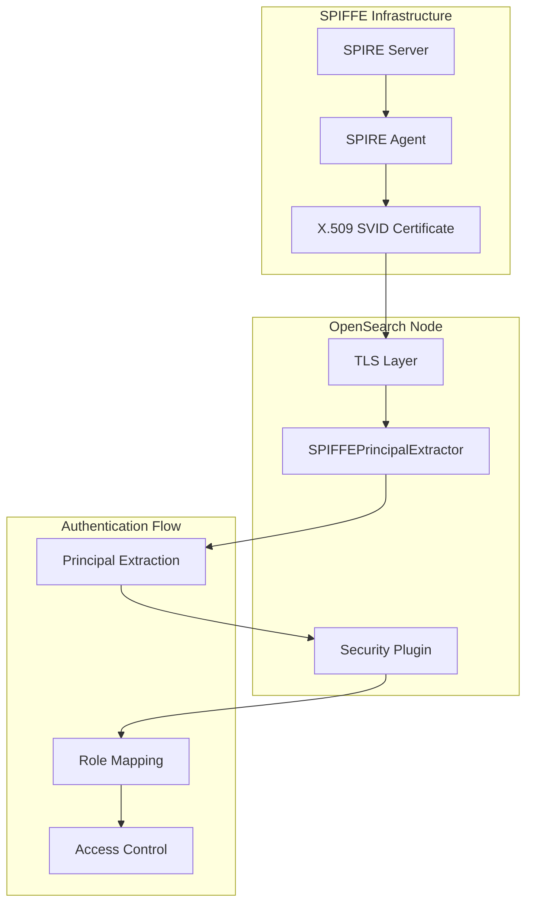
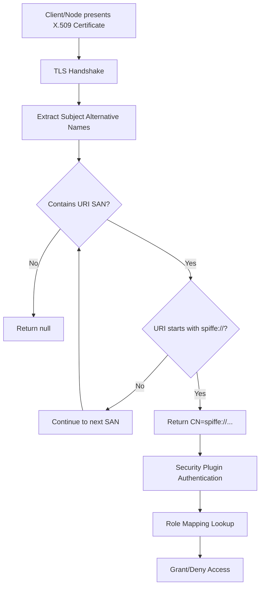

---
tags:
  - security
---
# SPIFFE X.509 SVID Support

## Summary

SPIFFE (Secure Production Identity Framework for Everyone) X.509 SVID support enables OpenSearch to authenticate nodes and administrators using SPIFFE-based workload identities. This allows organizations already using SPIFFE for service mesh or workload identity to leverage their existing PKI infrastructure for OpenSearch cluster authentication, reducing operational complexity and improving security posture.

## Details

### Architecture



### Data Flow



### Components

| Component | Description |
|-----------|-------------|
| `SPIFFEPrincipalExtractor` | Extracts SPIFFE URIs from X.509 certificate SANs and formats them as principals |
| `PrincipalExtractor` | Interface that `SPIFFEPrincipalExtractor` implements |

### Configuration

| Setting | Description | Default |
|---------|-------------|---------|
| `plugins.security.ssl.transport.principal_extractor_class` | Fully qualified class name of the principal extractor | Default DN-based extractor |

### Usage Example

#### Enable SPIFFE Authentication

```yaml
# opensearch.yml
plugins.security.ssl.transport.principal_extractor_class: org.opensearch.security.ssl.transport.SPIFFEPrincipalExtractor
```

#### Configure Role Mappings

```yaml
# roles_mapping.yml
all_access:
  users:
    - "CN=spiffe://example.org/admin"

readall:
  users:
    - "CN=spiffe://example.org/workload/*"
```

#### Certificate Requirements

Certificates must include a SPIFFE URI in the Subject Alternative Name extension:

```
X509v3 Subject Alternative Name:
    URI:spiffe://trust-domain/path/to/workload
```

Example SPIFFE ID format:
- `spiffe://example.org/ns/production/sa/opensearch`
- `spiffe://cluster.local/workload/opensearch-node-1`

## Limitations

- Only the first SPIFFE URI in the certificate SANs is used
- Certificates without SPIFFE URIs will have `null` returned (default behavior applies)
- Trust domain validation is not performed by the extractor (handled by TLS layer)
- Requires SPIFFE-compliant certificates following the X509-SVID specification

## Change History

- **v3.2.0**: Initial implementation of SPIFFE X.509 SVID support via `SPIFFEPrincipalExtractor`


## References

### Documentation
- [SPIRE Documentation](https://spiffe.io/docs/latest/spire-about/)
- [OpenSearch TLS Configuration](https://docs.opensearch.org/3.0/security/configuration/tls/)
- [Client Certificate Authentication](https://docs.opensearch.org/3.0/security/authentication-backends/client-auth/)
- [Security Settings](https://docs.opensearch.org/3.0/install-and-configure/configuring-opensearch/security-settings/)
- [SPIFFE Official Website](https://spiffe.io/)
- [X509-SVID Specification](https://github.com/spiffe/spiffe/blob/main/standards/X509-SVID.md)

### Pull Requests
| Version | PR | Description | Related Issue |
|---------|-----|-------------|---------------|
| v3.2.0 | [#5521](https://github.com/opensearch-project/security/pull/5521) | Initial implementation of SPIFFEPrincipalExtractor |   |
