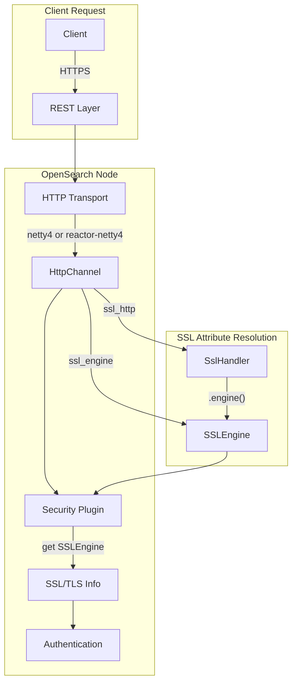
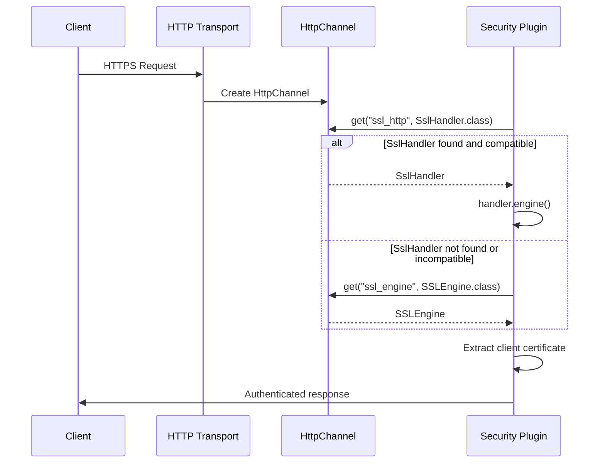

---
tags:
  - domain/security
  - component/server
  - security
---
# Security SSL/TLS Compatibility

## Summary

The Security plugin provides SSL/TLS encryption for both transport layer (node-to-node) and REST layer (client-to-node) communication in OpenSearch. This feature ensures secure communication and enables client certificate authentication. The SSL/TLS implementation must be compatible with different HTTP transport implementations, including the standard netty4 transport and the reactor-netty4 transport used for HTTP/2 and MCP server support.

## Details

### Architecture



### Data Flow



### Components

| Component | Description |
|-----------|-------------|
| `OpenSearchRequest` | Wrapper for REST requests that extracts SSL information |
| `ReactorNetty4BaseHttpChannel` | Base class for reactor-netty4 HTTP channels with SSL attribute support |
| `ReactorNetty4NonStreamingHttpChannel` | Non-streaming HTTP channel implementation |
| `ReactorNetty4StreamingHttpChannel` | Streaming HTTP channel implementation |

### Configuration

| Setting | Description | Default |
|---------|-------------|---------|
| `plugins.security.ssl.http.enabled` | Enable TLS on REST layer | `false` |
| `plugins.security.ssl.http.pemcert_filepath` | Path to node certificate (PEM) | Required |
| `plugins.security.ssl.http.pemkey_filepath` | Path to private key (PKCS#8) | Required |
| `plugins.security.ssl.http.pemtrustedcas_filepath` | Path to root CA (PEM) | Required |
| `plugins.security.ssl.http.clientauth_mode` | Client auth mode: NONE, OPTIONAL, REQUIRE | `OPTIONAL` |
| `http.type` | HTTP transport type | `netty4` |

### Usage Example

```yaml
# opensearch.yml - Using reactor-netty4 transport with security
http.type: reactor-netty4-secure

# REST layer TLS
plugins.security.ssl.http.enabled: true
plugins.security.ssl.http.pemcert_filepath: node.pem
plugins.security.ssl.http.pemkey_filepath: node-key.pem
plugins.security.ssl.http.pemtrustedcas_filepath: root-ca.pem
plugins.security.ssl.http.clientauth_mode: OPTIONAL

# Transport layer TLS
plugins.security.ssl.transport.pemcert_filepath: node.pem
plugins.security.ssl.transport.pemkey_filepath: node-key.pem
plugins.security.ssl.transport.pemtrustedcas_filepath: root-ca.pem
plugins.security.ssl.transport.enforce_hostname_verification: true
```

### SSL Attribute Resolution

The Security plugin retrieves SSL information from the HTTP channel using a fallback mechanism:

```java
// Primary: Try to get SslHandler (standard netty4)
httpChannel.get("ssl_http", SslHandler.class)
    .map(SslHandler::engine)
    // Fallback: Get SSLEngine directly (reactor-netty4)
    .or(() -> httpChannel.get("ssl_engine", SSLEngine.class))
    .orElse(null);
```

This approach handles:
1. **Different naming conventions**: reactor-netty4 uses `NettyPipeline.SslHandler` instead of `ssl_http`
2. **Classloader isolation**: Returning `SSLEngine` directly avoids classloader conflicts between plugins

## Limitations

- Custom HTTP transport implementations must expose either `ssl_http` (SslHandler) or `ssl_engine` (SSLEngine) attributes
- Client certificate authentication requires `clientauth_mode` to be `OPTIONAL` or `REQUIRE`
- The `ssl_engine` fallback is only available in OpenSearch 3.3.0+

## Change History

- **v3.3.0** (2025-09-29): Added fallback logic to use `ssl_engine` attribute when `ssl_handler` is unavailable or incompatible with reactor-netty4 transport


## References

### Documentation
- [TLS Configuration Documentation](https://docs.opensearch.org/3.0/security/configuration/tls/): Official TLS configuration guide
- [Network Settings](https://docs.opensearch.org/3.0/install-and-configure/configuring-opensearch/network-settings/): HTTP transport configuration
- [Forum Discussion](https://forum.opensearch.org/t/pods-not-coming-up-after-using-transport-reactor-netty4-plugin-for-mcp-server/26990): Original issue report and workarounds

### Pull Requests
| Version | PR | Description | Related Issue |
|---------|-----|-------------|---------------|
| v3.3.0 | [security#5667](https://github.com/opensearch-project/security/pull/5667) | Add fallback logic for ssl_engine attribute |   |
| v3.3.0 | [OpenSearch#19458](https://github.com/opensearch-project/OpenSearch/pull/19458) | Implement SslHandler retrieval for reactor-netty4 |   |
