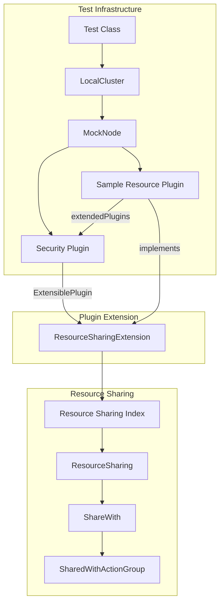
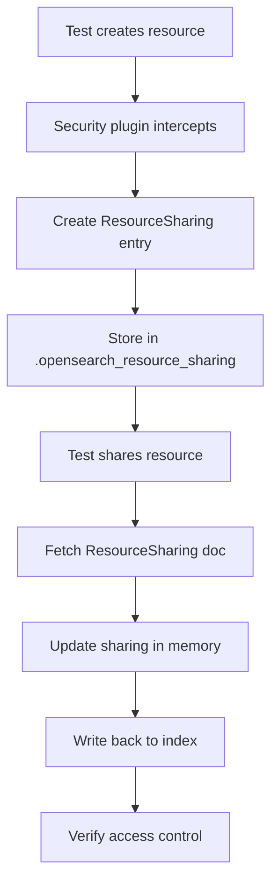

# Security Testing Framework

## Summary

The Security Testing Framework provides integration test infrastructure for the OpenSearch Security plugin, enabling comprehensive testing of security features including resource access control, plugin extensions, and the sample-resource-plugin. It leverages OpenSearch's Plugin Testing Framework to support `ExtensiblePlugin` patterns in integration tests.

## Details

### Architecture



### Data Flow



### Components

| Component | Description |
|-----------|-------------|
| `LocalCluster` | Test cluster builder supporting PluginInfo configuration |
| `SampleResourcePlugin` | Example plugin demonstrating resource access control |
| `ResourceSharing` | Model for resource sharing configuration with docId tracking |
| `ShareWith` | Container for access level configurations |
| `SharedWithActionGroup` | Access control configuration per action group |
| `ActionGroupRecipients` | Recipients (users, roles, backend_roles) for an action group |
| `ResourceSharingIndexHandler` | Handles CRUD operations on resource sharing index |

### Configuration

| Setting | Description | Default |
|---------|-------------|---------|
| `extendedPlugins` | List of plugins this plugin extends (in PluginInfo) | Empty list |
| `.opensearch_resource_sharing` | System index storing resource sharing entries | Auto-created |

### Usage Example

```java
// Define test cluster with Security plugin and extending plugin
@ClassRule
public static LocalCluster cluster = new LocalCluster.Builder()
    .clusterManager(ClusterManager.SINGLENODE)
    .plugin(PainlessModulePlugin.class)
    .plugin(
        new PluginInfo(
            SampleResourcePlugin.class.getName(),
            "classpath plugin",
            "NA",
            Version.CURRENT,
            "1.8",
            SampleResourcePlugin.class.getName(),
            null,
            List.of(OpenSearchSecurityPlugin.class.getName()),
            false
        )
    )
    .anonymousAuth(true)
    .authc(AUTHC_HTTPBASIC_INTERNAL)
    .users(USER_ADMIN, SHARED_WITH_USER)
    .build();

// Test resource creation and sharing
@Test
public void testCreateAndShareResource() throws Exception {
    // Create resource
    try (TestRestClient client = cluster.getRestClient(USER_ADMIN)) {
        String resource = """
            {"name": "test-resource"}
            """;
        HttpResponse response = client.postJson(SAMPLE_RESOURCE_CREATE_ENDPOINT, resource);
        response.assertStatusCode(HttpStatus.SC_OK);
        String resourceId = response.getTextFromJsonBody("/message").split(":")[1].trim();
        
        // Share with another user
        String sharePayload = shareWithPayload("read_access", SHARED_WITH_USER);
        response = client.postJson(SAMPLE_RESOURCE_SHARE_ENDPOINT + "/" + resourceId, sharePayload);
        response.assertStatusCode(HttpStatus.SC_OK);
    }
    
    // Verify shared user can access
    try (TestRestClient client = cluster.getRestClient(SHARED_WITH_USER)) {
        HttpResponse response = client.get(SAMPLE_RESOURCE_GET_ENDPOINT + "/" + resourceId);
        response.assertStatusCode(HttpStatus.SC_OK);
    }
}
```

## Limitations

- Requires OpenSearch core v3.1.0+ with Plugin Testing Framework enhancements
- Test plugins must be on the classpath
- Extensions require `META-INF/services` files for ServiceLoader discovery
- Resource sharing tests require the Security plugin to be properly configured

## Related PRs

| Version | PR | Description |
|---------|-----|-------------|
| v3.1.0 | [#5322](https://github.com/opensearch-project/security/pull/5322) | Use extendedPlugins in integrationTest framework |
| v3.1.0 | [#16908](https://github.com/opensearch-project/OpenSearch/pull/16908) | Core Plugin Testing Framework enhancement |

## References

- [PR #5322](https://github.com/opensearch-project/security/pull/5322): Security plugin test framework update
- [PR #16908](https://github.com/opensearch-project/OpenSearch/pull/16908): Core Plugin Testing Framework
- [Security Plugin Documentation](https://docs.opensearch.org/3.1/security/index/): OpenSearch Security plugin docs
- [Plugin Testing Framework](../opensearch/plugin-testing-framework.md): Core testing framework feature

## Change History

- **v3.1.0** (2025-05-13): Use extendedPlugins in integrationTest framework for sample resource plugin testing, refactor resource sharing to use in-memory updates
