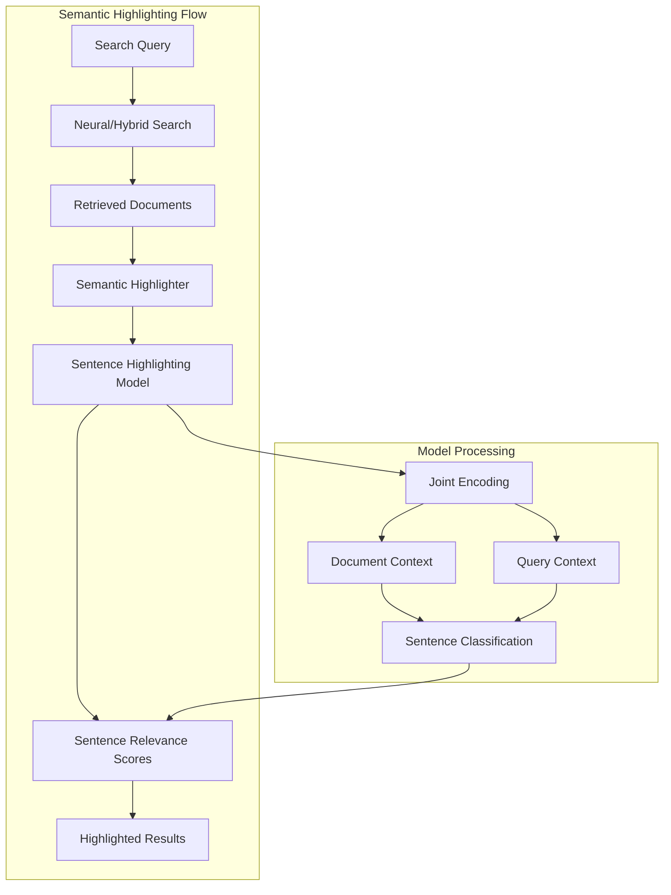
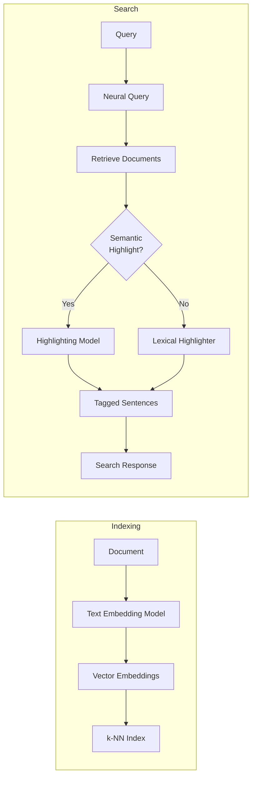

# Semantic Sentence Highlighting

## Summary

Semantic sentence highlighting is an AI-powered feature introduced in OpenSearch 3.0 that identifies and emphasizes the most semantically relevant sentences within documents based on query meaning. Unlike traditional highlighters that rely on exact keyword matches, semantic highlighting uses ML models to understand context and relevance, surfacing meaningful passages even when exact search terms aren't present.

Key benefits:
- **Meaning-based highlighting**: Identifies relevant content based on semantic similarity, not just keyword matches
- **Context-aware**: Uses surrounding text and query context to determine relevance
- **Works with AI search**: Complements neural and hybrid search workflows
- **Pretrained model available**: Includes `opensearch-semantic-highlighter-v1` for immediate use

## Details

### Architecture



### Data Flow



### Components

| Component | Description |
|-----------|-------------|
| Semantic Highlighter | New highlighter type (`semantic`) that uses ML models for relevance detection |
| Sentence Highlighting Model | BERT-based classifier trained on extractive QA datasets |
| Joint Encoder | Encodes both document and query text for context-aware classification |
| ML Commons Integration | Leverages ML Commons plugin for model deployment and inference |

### Configuration

| Setting | Description | Default |
|---------|-------------|---------|
| `highlight.fields.<field>.type` | Set to `semantic` to enable semantic highlighting | - |
| `highlight.options.model_id` | ID of deployed sentence highlighting model | Required |
| `pre_tags` | Opening tag for highlighted text | `<em>` |
| `post_tags` | Closing tag for highlighted text | `</em>` |

### Supported Queries

| Query Type | Support |
|------------|---------|
| Match queries | ✓ |
| Term queries | ✓ |
| Boolean queries | ✓ |
| Query string queries | ✓ |
| Neural queries | ✓ |
| Hybrid queries | ✓ |

### Pretrained Model

| Model Name | Version | Description |
|------------|---------|-------------|
| `amazon/sentence-highlighting/opensearch-semantic-highlighter-v1` | 1.0.0 | Optimized for identifying semantically relevant sentences |

### Usage Example

**Step 1: Deploy the semantic highlighting model**

```json
POST /_plugins/_ml/models/_register?deploy=true
{
  "name": "amazon/sentence-highlighting/opensearch-semantic-highlighter-v1",
  "version": "1.0.0",
  "model_format": "TORCH_SCRIPT",
  "function_name": "QUESTION_ANSWERING"
}
```

**Step 2: Use semantic highlighting in search**

```json
POST /neural-search-index/_search
{
  "query": {
    "neural": {
      "text_embedding": {
        "query_text": "treatments for neurodegenerative diseases",
        "model_id": "<text-embedding-model-id>",
        "k": 5
      }
    }
  },
  "highlight": {
    "fields": {
      "text": {
        "type": "semantic"
      }
    },
    "options": {
      "model_id": "<semantic-highlighting-model-id>"
    }
  }
}
```

**Example Response**

```json
{
  "hits": {
    "hits": [
      {
        "_source": {
          "text": "Alzheimer's disease is a progressive neurodegenerative disorder..."
        },
        "highlight": {
          "text": [
            "Alzheimer's disease is a progressive neurodegenerative disorder... <em>Recent clinical trials investigating monoclonal antibodies targeting amyloid-beta have shown promise in reducing plaque burden and slowing cognitive decline.</em> Early diagnosis using biomarkers..."
          ]
        }
      }
    ]
  }
}
```

### Performance Benchmarks

Benchmarks on MultiSpanQA dataset with GPU-accelerated model deployment (ml.g5.xlarge):

| k-value | Search Clients | Semantic Search P50 (ms) | With Semantic Highlighting P50 (ms) |
|---------|----------------|--------------------------|-------------------------------------|
| 1 | 1 | 21 | 38 |
| 10 | 1 | 26 | 180 |
| 20 | 1 | 24 | 348 |
| 50 | 1 | 24 | 806 |

**Accuracy Metrics:**

| Metric | Value |
|--------|-------|
| Precision | 66.4% |
| Recall | 79.2% |
| F1 Score | 72.2% |

## Limitations

- **Latency scales with k**: Highlighting latency increases with number of retrieved documents
- **GPU recommended**: Local CPU deployment is ~4.5x slower than GPU-based endpoints
- **Domain-specific accuracy**: Performance may vary on data substantially different from training set
- **Sentence-level only**: Highlights complete sentences, not arbitrary text spans

## Related PRs

| Repository | PR | Description |
|------------|-----|-------------|
| Neural Search | [#1193](https://github.com/opensearch-project/neural-search/pull/1193) | Initial semantic highlighting implementation |
| Neural Search | [#1254](https://github.com/opensearch-project/neural-search/pull/1254) | Additional semantic highlighting enhancements |

## References

- [Semantic highlighting tutorial](https://docs.opensearch.org/3.0/tutorials/vector-search/semantic-highlighting-tutorial/)
- [Highlight query matches documentation](https://docs.opensearch.org/3.0/search-plugins/searching-data/highlight/)
- [Pretrained models documentation](https://docs.opensearch.org/3.0/ml-commons-plugin/pretrained-models/)
- [Blog: Introducing semantic highlighting in OpenSearch](https://opensearch.org/blog/introducing-semantic-highlighting-in-opensearch/)

## Change History

- **v3.0.0** (2026): Initial release with pretrained `opensearch-semantic-highlighter-v1` model
