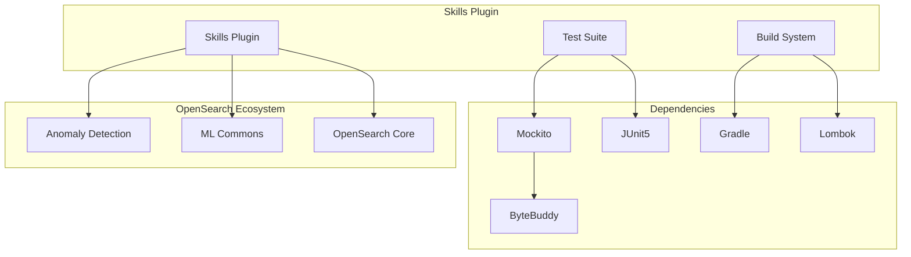

# Skills Plugin Dependencies

## Summary
The Skills plugin is part of the OpenSearch ML ecosystem, providing agent-based capabilities for AI/ML workflows. This document tracks dependency management and maintenance updates for the Skills plugin, ensuring compatibility with the broader OpenSearch ecosystem.

## Details

### Architecture

### Components
| Component | Description |
|-----------|-------------|
| Skills Plugin | Agent-based AI/ML capabilities for OpenSearch |
| Test Suite | Unit and integration tests using Mockito and JUnit5 |
| Build System | Gradle-based build with Lombok annotation processing |

### Key Dependencies
| Dependency | Purpose | Current Version |
|------------|---------|-----------------|
| Mockito | Mocking framework for unit tests | 5.14.2 |
| JUnit5 | Testing framework | 5.11.2 |
| ByteBuddy | Runtime code generation (used by Mockito) | 1.15.4 |
| Gradle | Build automation | 8.10.2 |
| io.freefair.lombok | Lombok Gradle plugin | 8.10.2 |

### Dependency Update Strategy
The Skills plugin follows automated dependency management using Mend (formerly WhiteSource) Renovate:
- Automated PRs for dependency updates
- Monorepo updates grouped together (e.g., Mockito core + junit-jupiter)
- Backport labels for 2.x branch compatibility

## Limitations
- Dependency updates may require coordination with upstream OpenSearch plugins
- ByteBuddy version must be compatible with Mockito version
- Test fixes may be needed when dependent plugins change their APIs

## Change History
- **v2.18.0** (2024-10-29): Updated Mockito to 5.14.2, JUnit5 to 5.11.2, ByteBuddy to 1.15.4, Gradle to 8.10.2, Lombok plugin to 8.10.2; Fixed test failures from AnomalyDetector API changes

## References

### Documentation
- [Mockito Documentation](https://site.mockito.org/)
- [Gradle Documentation](https://docs.gradle.org/)
- [Skills Plugin Repository](https://github.com/opensearch-project/skills)
- [JUnit5 User Guide](https://junit.org/junit5/docs/current/user-guide/)

### Pull Requests
| Version | PR | Description |
|---------|-----|-------------|
| v2.18.0 | [#427](https://github.com/opensearch-project/skills/pull/427) | Fix test failure due to external change |
| v2.18.0 | [#437](https://github.com/opensearch-project/skills/pull/437) | Update mockito monorepo to v5.14.2 |
| v2.18.0 | [#363](https://github.com/opensearch-project/skills/pull/363) | Update junit5 monorepo to v5.11.2 |
| v2.18.0 | [#43](https://github.com/opensearch-project/skills/pull/43) | Update byte-buddy to v1.15.4 |
| v2.18.0 | [#279](https://github.com/opensearch-project/skills/pull/279) | Update byte-buddy-agent to v1.15.4 |
| v2.18.0 | [#432](https://github.com/opensearch-project/skills/pull/432) | Update Gradle to v8.10.2 |
| v2.18.0 | [#434](https://github.com/opensearch-project/skills/pull/434) | Update io.freefair.lombok to v8.10.2 |
