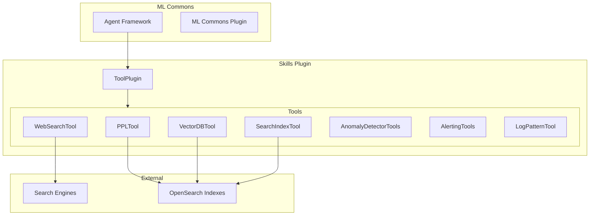

# Skills / Tools

## Summary

The Skills plugin provides a collection of tools for the OpenSearch ML Commons agent framework. These tools enable agents to perform various tasks such as searching indexes, querying data using PPL, performing web searches, and interacting with anomaly detection and alerting features. The plugin is designed to be extensible, allowing developers to create custom tools for specific use cases.

## Details

### Architecture



### Components

| Component | Description |
|-----------|-------------|
| `ToolPlugin` | Main plugin class that registers all tools with ML Commons |
| `PPLTool` | Translates natural language to PPL queries |
| `VectorDBTool` | Performs dense vector retrieval |
| `WebSearchTool` | Performs web searches using various search engines |
| `SearchIndexTool` | Searches indexes using query DSL |
| `SearchAnomalyDetectorsTool` | Searches for anomaly detectors |
| `SearchAnomalyResultsTool` | Searches anomaly detection results |
| `SearchMonitorsTool` | Searches for alerting monitors |
| `SearchAlertsTool` | Searches for alerts |
| `CreateAlertTool` | Creates alerting monitors |
| `CreateAnomalyDetectorTool` | Creates anomaly detectors |
| `LogPatternTool` | Analyzes log patterns |

### Tool Registration

Tools are registered with the ML Commons framework through the `ToolPlugin` class:

```java
@Override
public List<Tool.Factory<? extends Tool>> getToolFactories() {
    return List.of(
        PPLTool.Factory.getInstance(),
        VectorDBTool.Factory.getInstance(),
        WebSearchTool.Factory.getInstance(),
        SearchIndexTool.Factory.getInstance(),
        // ... other tools
    );
}
```

### WebSearchTool

The WebSearchTool enables agents to search the web and retrieve information. It supports multiple search engines:

| Engine | Endpoint | Authentication |
|--------|----------|----------------|
| Google | `https://customsearch.googleapis.com/customsearch/v1` | API key + Engine ID |
| Bing | `https://api.bing.microsoft.com/v7.0/search` | API key |
| DuckDuckGo | `https://duckduckgo.com/html` | None |
| Custom | User-defined | User-defined |

**Usage Example:**
```json
{
  "type": "WebSearchTool",
  "parameters": {
    "engine": "duckduckgo",
    "query": "OpenSearch vector search"
  }
}
```

### PPLTool

The PPLTool translates natural language questions into Piped Processing Language (PPL) queries:

**Usage Example:**
```json
{
  "type": "PPLTool",
  "parameters": {
    "model_id": "<llm_model_id>",
    "index": "my-index",
    "question": "Show me the top 10 errors"
  }
}
```

### Configuration

| Setting | Description | Default |
|---------|-------------|---------|
| `plugins.skills.enabled` | Enable/disable the skills plugin | `true` |
| Thread pool: `websearch-crawler-threadpool` | Thread pool for web crawling | CPU cores - 1 |

## Limitations

- WebSearchTool may be blocked by CAPTCHA or login-protected pages
- PPLTool requires an LLM model for natural language translation
- Some tools require specific plugins to be installed (e.g., anomaly detection, alerting)

## Related PRs

| Version | PR | Description |
|---------|-----|-------------|
| v3.0.0 | [#547](https://github.com/opensearch-project/skills/pull/547) | Add WebSearchTool |
| v3.0.0 | [#541](https://github.com/opensearch-project/skills/pull/541) | Fix PPLTool empty list bug |
| v3.0.0 | [#529](https://github.com/opensearch-project/skills/pull/529) | Update ML Commons dependencies |
| v3.0.0 | [#521](https://github.com/opensearch-project/skills/pull/521) | Developer guide enhancement |
| v2.18.0 | [#413](https://github.com/opensearch-project/skills/pull/413) | Add LogPatternTool |
| v2.18.0 | [#399](https://github.com/opensearch-project/skills/pull/399) | Customizable prompt for CreateAnomalyDetectorTool |

## References

- [Issue #538](https://github.com/opensearch-project/skills/issues/538): WebSearchTool feature request
- [Issue #337](https://github.com/opensearch-project/skills/issues/337): Create Anomaly Detector Tool feature request
- [Tools Documentation](https://docs.opensearch.org/3.0/ml-commons-plugin/agents-tools/tools/index/): Official tools documentation
- [WebSearchTool Documentation](https://docs.opensearch.org/3.0/ml-commons-plugin/agents-tools/tools/web-search-tool/): WebSearchTool reference
- [PPL Tool Documentation](https://docs.opensearch.org/3.0/ml-commons-plugin/agents-tools/tools/ppl-tool/): PPL tool reference
- [CreateAnomalyDetectorTool Documentation](https://docs.opensearch.org/2.18/ml-commons-plugin/agents-tools/tools/create-anomaly-detector/): CreateAnomalyDetectorTool reference
- [Skills Repository](https://github.com/opensearch-project/skills): Source code

## Change History

- **v3.0.0** (2025-02-25): Added WebSearchTool, fixed PPLTool empty list bug, updated dependencies, enhanced developer guide
- **v2.18.0** (2024-11-12): Added LogPatternTool for log pattern analysis, added customizable prompt support for CreateAnomalyDetectorTool
