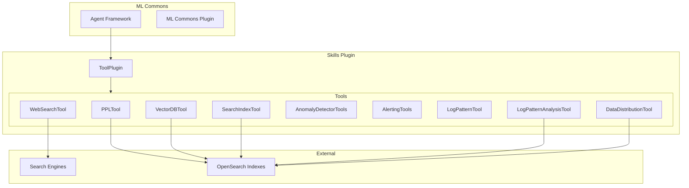

---
tags:
  - skills
---
# Skills / Tools

## Summary

The Skills plugin provides a collection of tools for the OpenSearch ML Commons agent framework. These tools enable agents to perform various tasks such as searching indexes, querying data using PPL, performing web searches, and interacting with anomaly detection and alerting features. The plugin is designed to be extensible, allowing developers to create custom tools for specific use cases.

## Details

### Architecture



### Components

| Component | Description |
|-----------|-------------|
| `ToolPlugin` | Main plugin class that registers all tools with ML Commons |
| `PPLTool` | Translates natural language to PPL queries |
| `VectorDBTool` | Performs dense vector retrieval |
| `WebSearchTool` | Performs web searches using various search engines |
| `SearchIndexTool` | Searches indexes using query DSL |
| `SearchAnomalyDetectorsTool` | Searches for anomaly detectors |
| `SearchAnomalyResultsTool` | Searches anomaly detection results |
| `SearchMonitorsTool` | Searches for alerting monitors |
| `SearchAlertsTool` | Searches for alerts |
| `CreateAlertTool` | Creates alerting monitors |
| `CreateAnomalyDetectorTool` | Creates anomaly detectors |
| `LogPatternAnalysisTool` | Analyzes log patterns and sequences |
| `DataDistributionTool` | Analyzes data distribution with statistical comparison |
| `LogPatternTool` | Analyzes log patterns using Brain algorithm |

### Tool Registration

Tools are registered with the ML Commons framework through the `ToolPlugin` class:

```java
@Override
public List<Tool.Factory<? extends Tool>> getToolFactories() {
    return List.of(
        PPLTool.Factory.getInstance(),
        VectorDBTool.Factory.getInstance(),
        WebSearchTool.Factory.getInstance(),
        SearchIndexTool.Factory.getInstance(),
        // ... other tools
    );
}
```

### WebSearchTool

The WebSearchTool enables agents to search the web and retrieve information. It supports multiple search engines:

| Engine | Endpoint | Authentication |
|--------|----------|----------------|
| Google | `https://customsearch.googleapis.com/customsearch/v1` | API key + Engine ID |
| Bing | `https://api.bing.microsoft.com/v7.0/search` | API key |
| DuckDuckGo | `https://duckduckgo.com/html` | None |
| Custom | User-defined | User-defined |

**Usage Example:**
```json
{
  "type": "WebSearchTool",
  "parameters": {
    "engine": "duckduckgo",
    "query": "OpenSearch vector search"
  }
}
```

### PPLTool

The PPLTool translates natural language questions into Piped Processing Language (PPL) queries. It supports both OpenSearch and Spark data sources through the `datasourceType` parameter.

**Usage Example (OpenSearch):**
```json
{
  "type": "PPLTool",
  "parameters": {
    "model_id": "<llm_model_id>",
    "index": "my-index",
    "question": "Show me the top 10 errors"
  }
}
```

**Usage Example (Spark/S3):**
```json
{
  "type": "PPLTool",
  "parameters": {
    "model_id": "<llm_model_id>",
    "index": "my-spark-table",
    "question": "Show me the top 10 records",
    "type": "s3"
  }
}
```

The `type` parameter (defaults to `Opensearch`) is passed to the LLM model as `datasourceType`, enabling the model to generate appropriate PPL syntax for the target data source.

### Configuration

| Setting | Description | Default |
|---------|-------------|---------|
| `plugins.skills.enabled` | Enable/disable the skills plugin | `true` |
| Thread pool: `websearch-crawler-threadpool` | Thread pool for web crawling | CPU cores - 1 |

## Limitations

- WebSearchTool may be blocked by CAPTCHA or login-protected pages
- PPLTool requires an LLM model for natural language translation
- Some tools require specific plugins to be installed (e.g., anomaly detection, alerting)

## Change History

- **v3.4.0** (2026-01-11): Increased max_sample_count from 2 to 5 for LogPatternAnalysisTool log insight mode, providing more representative sample logs per pattern
- **v2.16.0** (2024-08-06): Added nested query support for NeuralSparseSearchTool, VectorDBTool, and RAGTool via `nested_path` parameter; added `plugins.skills.ppl_execution_enabled` cluster setting to control PPL query execution (default: false); added CreateAnomalyDetectorTool for AI-assisted anomaly detector configuration
- **v3.3.0** (2026-01-11): Added LogPatternAnalysisTool for intelligent log pattern detection with sequence analysis and time-based comparison; added DataDistributionTool for statistical distribution analysis with divergence calculation; enhanced PPLTool to include mappings, current_time, and os_version when passing to SageMaker; fixed WebSearchTool using AsyncHttpClient from ml-commons; fixed DataDistributionTool to remove baselinePercentage when no baseline provided
- **v3.2.0** (2026-01-11): Added index schema merging for PPLTool when using index patterns (merges mappings from all matching indexes); added error message masking in PPLTool to redact SageMaker ARNs and AWS account numbers; standardized parameter handling across all tools using `extractInputParameters` utility
- **v3.1.0** (2025-05-06): Added data source type parameter (`datasourceType`) to PPLTool for Spark/S3 data source support; fixed PPLTool fields bug to properly expose multi-field mappings (e.g., `a.keyword`) to LLM for aggregation queries; fixed httpclient5 dependency version conflict in build.gradle, applied Spotless code formatting to WebSearchTool
- **v3.0.0** (2025-02-25): Added WebSearchTool, fixed PPLTool empty list bug, updated dependencies, enhanced developer guide; added `attributes` field to all tool classes for ML Commons Plan-Execute-Reflect agent compatibility ([#549](https://github.com/opensearch-project/skills/pull/549)); added Java Agent plugin support for SecurityManager deprecation ([#553](https://github.com/opensearch-project/skills/pull/553)); fixed jar hell issue by creating thin SQL JAR with only `org/opensearch/sql/**` classes ([#545](https://github.com/opensearch-project/skills/pull/545))
- **v2.19.0** (2025-01-16): Improved LogPatternTool with Brain algorithm for higher grouping accuracy; added PPL query support; fixed GitHub Actions CI Linux build failures by using shared CI image workflow from opensearch-build; fixed RAGTool missing return statement when content generation is disabled; improved test error handling and logging
- **v2.18.0** (2024-11-12): Added LogPatternTool for log pattern analysis, added customizable prompt support for CreateAnomalyDetectorTool


## References

### Documentation
- [Tools Documentation](https://docs.opensearch.org/3.0/ml-commons-plugin/agents-tools/tools/index/): Official tools documentation
- [WebSearchTool Documentation](https://docs.opensearch.org/3.0/ml-commons-plugin/agents-tools/tools/web-search-tool/): WebSearchTool reference
- [PPL Tool Documentation](https://docs.opensearch.org/3.0/ml-commons-plugin/agents-tools/tools/ppl-tool/): PPL tool reference
- [CreateAnomalyDetectorTool Documentation](https://docs.opensearch.org/2.18/ml-commons-plugin/agents-tools/tools/create-anomaly-detector/): CreateAnomalyDetectorTool reference
- [Skills Repository](https://github.com/opensearch-project/skills): Source code

### Pull Requests
| Version | PR | Description | Related Issue |
|---------|-----|-------------|---------------|
| v3.4.0 | [#678](https://github.com/opensearch-project/skills/pull/678) | Increase max_sample_count to 5 for log insight |   |
| v3.3.0 | [#625](https://github.com/opensearch-project/skills/pull/625) | Log patterns analysis tool |   |
| v3.3.0 | [#634](https://github.com/opensearch-project/skills/pull/634) | Data Distribution Tool |   |
| v3.3.0 | [#636](https://github.com/opensearch-project/skills/pull/636) | Add more information in PPL tool when passing to SageMaker |   |
| v3.3.0 | [#641](https://github.com/opensearch-project/skills/pull/641) | Delete-single-baseline (DataDistributionTool fix) |   |
| v3.3.0 | [#639](https://github.com/opensearch-project/skills/pull/639) | Fix WebSearchTool issue |   |
| v3.2.0 | [#596](https://github.com/opensearch-project/skills/pull/596) | Merge index schema meta for PPLTool |   |
| v3.2.0 | [#609](https://github.com/opensearch-project/skills/pull/609) | Mask error message in PPLTool |   |
| v3.2.0 | [#618](https://github.com/opensearch-project/skills/pull/618) | Update parameter handling of tools | [#617](https://github.com/opensearch-project/skills/issues/617) |
| v3.1.0 | [#587](https://github.com/opensearch-project/skills/pull/587) | Add data source type parameter to PPLTool for Spark/S3 support |   |
| v3.1.0 | [#581](https://github.com/opensearch-project/skills/pull/581) | Fix fields bug in PPL tool (multi-field mapping support) |   |
| v3.1.0 | [#575](https://github.com/opensearch-project/skills/pull/575) | Fix conflict in dependency versions |   |
| v3.0.0 | [#553](https://github.com/opensearch-project/skills/pull/553) | Support phasing off SecurityManager usage in favor of Java Agent |   |
| v3.0.0 | [#549](https://github.com/opensearch-project/skills/pull/549) | Add attributes to tools to adapt the upstream changes |   |
| v3.0.0 | [#547](https://github.com/opensearch-project/skills/pull/547) | Add WebSearchTool | [#538](https://github.com/opensearch-project/skills/issues/538) |
| v3.0.0 | [#545](https://github.com/opensearch-project/skills/pull/545) | Fix jar hell for SQL jar |   |
| v3.0.0 | [#541](https://github.com/opensearch-project/skills/pull/541) | Fix PPLTool empty list bug |   |
| v3.0.0 | [#529](https://github.com/opensearch-project/skills/pull/529) | Update ML Commons dependencies |   |
| v3.0.0 | [#521](https://github.com/opensearch-project/skills/pull/521) | Developer guide enhancement |   |
| v2.19.0 | [#474](https://github.com/opensearch-project/skills/pull/474) | Log pattern tool improvement with Brain algorithm | [OpenSearch#16627](https://github.com/opensearch-project/OpenSearch/issues/16627) |
| v2.19.0 | [#458](https://github.com/opensearch-project/skills/pull/458) | Fix compilation issue caused by AD change |   |
| v2.19.0 | [#477](https://github.com/opensearch-project/skills/pull/477) | Fix github ci linux build and RAG tool missing return | [#445](https://github.com/opensearch-project/skills/issues/445) |
| v2.18.0 | [#413](https://github.com/opensearch-project/skills/pull/413) | Add LogPatternTool |   |
| v2.18.0 | [#399](https://github.com/opensearch-project/skills/pull/399) | Customizable prompt for CreateAnomalyDetectorTool | [#337](https://github.com/opensearch-project/skills/issues/337) |
| v2.16.0 | [#350](https://github.com/opensearch-project/skills/pull/350) | Support nested query in neural sparse tool, vectorDB tool and RAG tool |   |
| v2.16.0 | [#344](https://github.com/opensearch-project/skills/pull/344) | Add cluster setting to control PPL execution |   |
| v2.16.0 | [#348](https://github.com/opensearch-project/skills/pull/348) | Add CreateAnomalyDetectorTool | [#337](https://github.com/opensearch-project/skills/issues/337) |

### Issues (Design / RFC)
- [Issue #538](https://github.com/opensearch-project/skills/issues/538): WebSearchTool feature request
- [Issue #337](https://github.com/opensearch-project/skills/issues/337): Create Anomaly Detector Tool feature request
