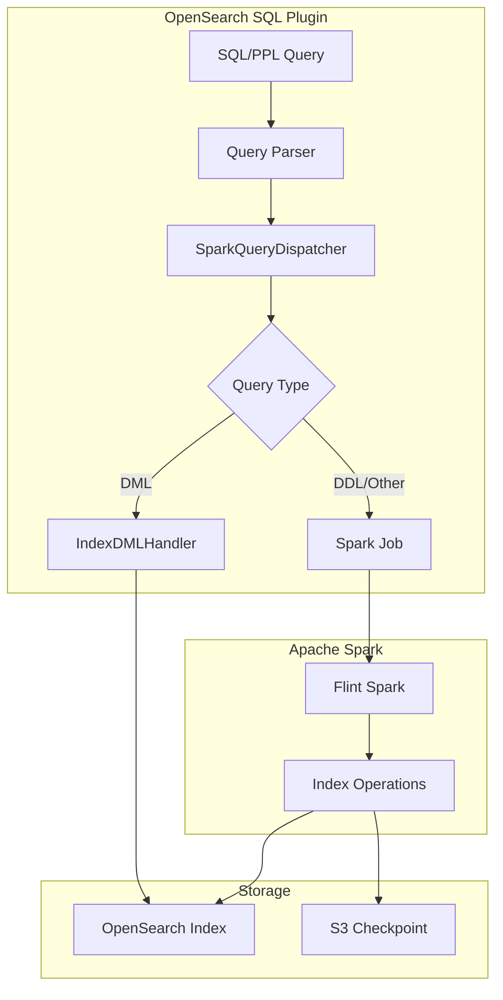
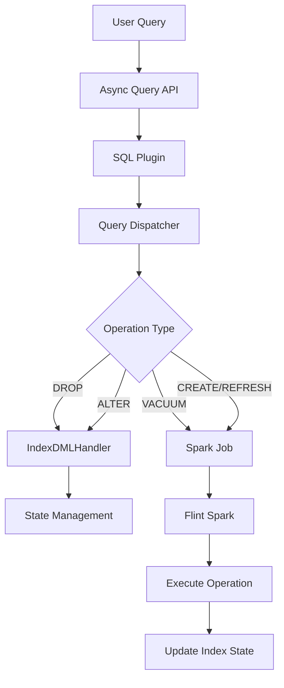

# Flint Index Operations

## Summary

Flint Index Operations provide SQL-based management commands for Flint indexes in OpenSearch. Flint indexes enable query acceleration by creating materialized views, skipping indexes, and covering indexes on external data sources (like S3) through Apache Spark integration. The operations include CREATE, DROP, ALTER, REFRESH, DESCRIBE, SHOW, and VACUUM commands for managing these indexes.

## Details

### Architecture



### Data Flow



### Components

| Component | Description |
|-----------|-------------|
| `SparkQueryDispatcher` | Routes queries to appropriate handlers based on query type |
| `IndexDMLHandler` | Handles DROP and ALTER operations directly in the SQL plugin |
| `FlintIndexOpFactory` | Factory for creating index operation handlers |
| `FlintIndexStateModelService` | Manages index state transitions |
| `AsyncQueryScheduler` | Handles scheduled refresh operations |

### Supported Operations

| Operation | Description | Handler |
|-----------|-------------|---------|
| CREATE INDEX | Creates a new Flint index | Spark Job |
| DROP INDEX | Marks index as deleted | IndexDMLHandler |
| ALTER INDEX | Modifies index options | IndexDMLHandler |
| REFRESH INDEX | Triggers manual refresh | Spark Job |
| VACUUM INDEX | Cleans up deleted index and checkpoint | Spark Job |
| DESCRIBE INDEX | Shows index metadata | Spark Job |
| SHOW INDEX | Lists indexes | Spark Job |

### Index Types

| Type | Description | Example |
|------|-------------|---------|
| Skipping Index | Partition pruning optimization | `CREATE SKIPPING INDEX ON table (col VALUE_SET)` |
| Covering Index | Materialized column subset | `CREATE INDEX idx ON table (col1, col2)` |
| Materialized View | Pre-computed query results | `CREATE MATERIALIZED VIEW mv AS SELECT ...` |

### Configuration

| Setting | Description | Default |
|---------|-------------|---------|
| `auto_refresh` | Enable automatic refresh | `false` |
| `checkpoint_location` | S3 path for streaming checkpoints | None |
| `scheduler_mode` | Refresh scheduler mode (`internal`/`external`) | `internal` |
| `refresh_interval` | Interval for auto-refresh | `15 minutes` |

### Usage Examples

#### Create Materialized View with Auto-Refresh

```sql
CREATE MATERIALIZED VIEW mys3.default.http_logs_metrics AS
SELECT 
    date_trunc('hour', timestamp) as hour,
    status,
    COUNT(*) as count
FROM mys3.default.http_logs
GROUP BY 1, 2
WITH (
    auto_refresh = true,
    checkpoint_location = 's3://my-bucket/checkpoints/http_logs_metrics'
)
```

#### Alter Index to Disable Auto-Refresh

```sql
ALTER INDEX my_index ON mys3.default.http_logs 
WITH (auto_refresh = false)
```

#### Vacuum Deleted Index

```sql
-- First drop the index
DROP MATERIALIZED VIEW mys3.default.http_logs_metrics

-- Then vacuum to clean up index and checkpoint data
VACUUM MATERIALIZED VIEW mys3.default.http_logs_metrics
```

## Limitations

- Vacuum operations require Spark job submission, adding latency compared to direct operations
- Checkpoint cleanup depends on proper S3 permissions
- Index state transitions must follow valid state machine paths
- External scheduler mode requires additional configuration

## Change History

- **v2.17.0** (2024-09-17): Delegated vacuum operation to Spark for checkpoint cleanup support
- **v2.14.0**: Initial vacuum operation implementation in SQL plugin

## References

### Documentation
- [Scheduled Query Acceleration](https://docs.opensearch.org/2.17/dashboards/management/scheduled-query-acceleration/): Official documentation

### Pull Requests
| Version | PR | Description | Related Issue |
|---------|-----|-------------|---------------|
| v2.17.0 | [#2995](https://github.com/opensearch-project/sql/pull/2995) | Delegate vacuum operation to Spark |   |
| v2.14.0 | [#2557](https://github.com/opensearch-project/sql/pull/2557) | Initial vacuum implementation in SQL plugin | [#104](https://github.com/opensearch-project/opensearch-spark/issues/104) |

### Issues (Design / RFC)
- [Issue #580](https://github.com/opensearch-project/opensearch-spark/issues/580): VACUUM should delete checkpoint data
- [Issue #104](https://github.com/opensearch-project/opensearch-spark/issues/104): Original VACUUM feature request
