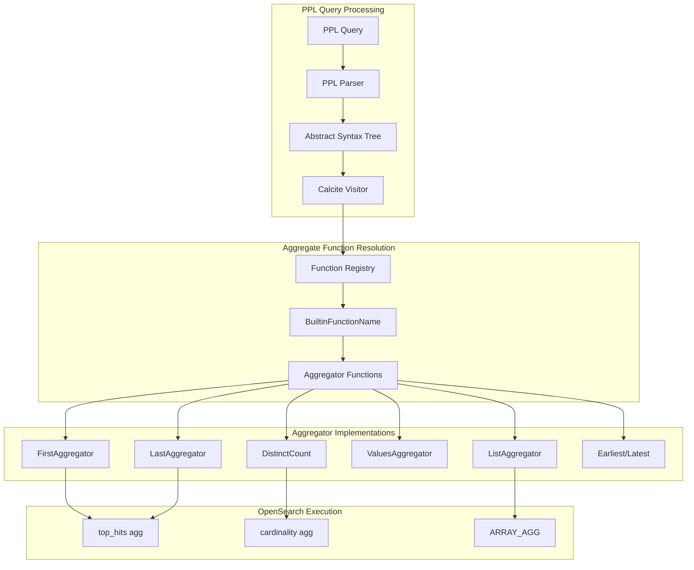
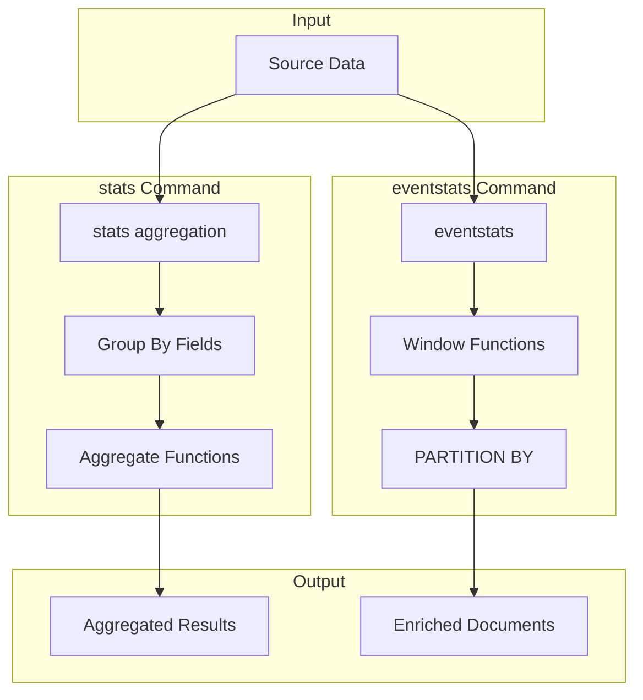

# PPL Aggregate Functions

## Summary

PPL (Piped Processing Language) aggregate functions enable statistical analysis and data aggregation in OpenSearch queries. These functions work with the `stats` and `eventstats` commands to compute aggregations across documents, supporting operations like counting, averaging, collecting values into arrays, and retrieving first/last values based on document or time order.

## Details

### Architecture



### Data Flow



### Components

| Component | Description |
|-----------|-------------|
| `BuiltinFunctionName` | Enum defining all built-in function names including aggregate functions |
| `AggregatorFunctions` | Registry for aggregate function implementations |
| `FirstAggregator` | Returns first value in document order |
| `LastAggregator` | Returns last value in reverse document order |
| `ListAggregator` | Collects values into an array preserving duplicates |
| `ValuesAggregator` | Collects unique values into an array |
| `CalciteAggCallVisitor` | Translates PPL aggregations to Calcite SQL |

### Configuration

| Setting | Description | Default |
|---------|-------------|---------|
| `plugins.calcite.enabled` | Enable Calcite engine for advanced PPL features | `false` |
| List max values | Maximum values collected by `list()` function | 100 |

### Aggregate Functions Reference

#### Standard Aggregate Functions (stats command)

| Function | Description | NULL Handling |
|----------|-------------|---------------|
| `COUNT(field)` | Count of non-null values | Not counted |
| `SUM(field)` | Sum of values | Ignored |
| `AVG(field)` | Average of values | Ignored |
| `MAX(field)` | Maximum value | Ignored |
| `MIN(field)` | Minimum value | Ignored |
| `FIRST(field)` | First value in document order | Returns NULL |
| `LAST(field)` | Last value in document order | Returns NULL |
| `list(field)` | Array of all values | Filtered out |
| `values(field)` | Array of unique values | Filtered out |
| `distinct_count(field)` / `dc(field)` | Count of distinct values | Ignored |

#### Window Aggregate Functions (eventstats command)

| Function | Description | Translation |
|----------|-------------|-------------|
| `distinct_count(field)` / `dc(field)` | Distinct count per partition | `APPROX_DISTINCT_COUNT(field) OVER (...)` |
| `earliest(field)` | Earliest value by time | Time-based window function |
| `latest(field)` | Latest value by time | Time-based window function |

### Usage Examples

#### Basic Aggregations
```ppl
# Calculate average age
source=accounts | stats avg(age)

# Group by field
source=accounts | stats avg(age), sum(age) by gender

# Multiple aggregations
source=accounts | stats max(age), min(age) by gender
```

#### First/Last Functions
```ppl
# Get first and last values
source=logs | stats first(message), last(status) by host

# Combined with sorting
source=events | sort timestamp | stats first(event_type), last(event_data) by session_id
```

#### Multi-value Functions
```ppl
# Collect all values
source=logs | stats list(user_id) as all_users by status

# Collect unique values
source=events | stats values(source_ip) as unique_ips by hour
```

#### Eventstats with Window Functions
```ppl
# Distinct count per partition
source=accounts | eventstats dc(state) as distinct_states
source=accounts | eventstats distinct_count(country) as unique_countries

# With partitioning
source=accounts | eventstats dc(state) as state_count by gender

# Earliest/Latest
source=transactions | eventstats earliest(amount), latest(amount) by account_id
```

### Supported Data Types

Both `list()` and `values()` functions support:

| Category | Types |
|----------|-------|
| Numeric | INTEGER, LONG, FLOAT, DOUBLE |
| String | STRING, TEXT |
| Boolean | BOOLEAN |
| Date/Time | DATE, TIME, TIMESTAMP |
| Complex | STRUCT, ARRAY |

## Limitations

- `first()` and `last()` use document order, not time-based ordering
- `list()` function returns a maximum of 100 values by default
- `values()` function has no default limit but can be configured
- `distinct_count()` in eventstats uses approximate counting
- Window functions require `plugins.calcite.enabled=true`
- Aggregate functions in eventstats are executed on the coordination node

## Change History

- **v3.3.0** (2026-01-11): Added first/last, list, earliest/latest aggregate functions; extended distinct_count/dc to eventstats command

## References

### Documentation
- [PPL Commands Documentation](https://docs.opensearch.org/3.0/search-plugins/sql/ppl/functions/)
- [SQL Aggregate Functions](https://docs.opensearch.org/3.0/search-plugins/sql/sql/aggregations/)

### Pull Requests
| Version | PR | Description |
|---------|-----|-------------|
| v3.3.0 | [#4223](https://github.com/opensearch-project/sql/pull/4223) | Support first/last aggregate functions for PPL |
| v3.3.0 | [#4161](https://github.com/opensearch-project/sql/pull/4161) | Add support for `list()` multi-value stats function |
| v3.3.0 | [#4084](https://github.com/opensearch-project/sql/pull/4084) | Support distinct_count/dc in eventstats |
| v3.3.0 | [#4212](https://github.com/opensearch-project/sql/pull/4212) | Add earliest/latest aggregate function for eventstats |

### Issues (Design / RFC)
- [Issue #4203](https://github.com/opensearch-project/sql/issues/4203): PPL first/last aggregate function
- [Issue #4026](https://github.com/opensearch-project/sql/issues/4026): Multivalue Statistics Functions for PPL Calcite Engine
- [Issue #4052](https://github.com/opensearch-project/sql/issues/4052): PPL distinct_count/dc function support for eventstats
- [Issue #4047](https://github.com/opensearch-project/sql/issues/4047): PPL eventstats command enhancement
