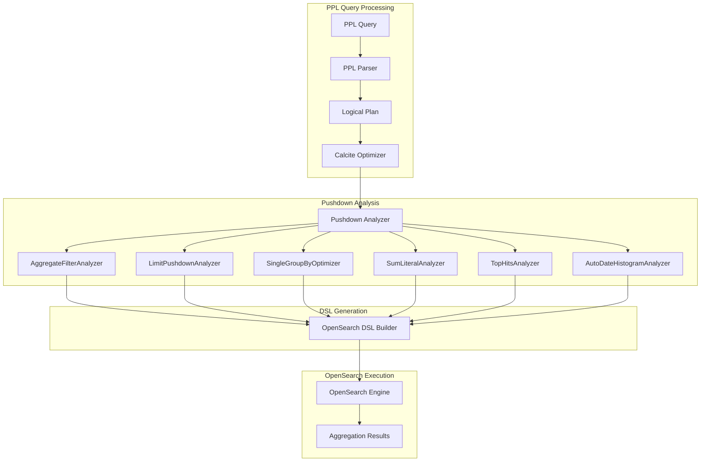
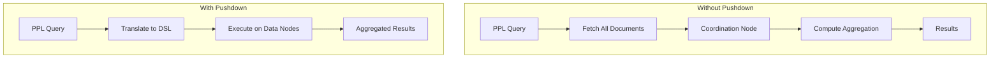

---
tags:
  - performance
  - search
  - sql
---

# PPL Aggregation Pushdown

## Summary

PPL Aggregation Pushdown is a query optimization feature that translates PPL (Piped Processing Language) aggregation operations directly into efficient OpenSearch DSL queries. Instead of fetching raw data and computing aggregations on the coordination node, pushdown optimization leverages OpenSearch's native aggregation capabilities, resulting in significant performance improvements—up to 100x faster for certain query patterns.

## Details

### Architecture



### Data Flow



### Components

| Component | Description |
|-----------|-------------|
| `AggregateFilterAnalyzer` | Translates `count(eval(...))` to OpenSearch filter aggregations |
| `LimitPushdownRule` | Pushes LIMIT operators into aggregation bucket sizes |
| `SingleGroupByOptimizer` | Converts single group-by to terms aggregation instead of composite |
| `SumLiteralOptimizer` | Rewrites `SUM(field + literal)` to `SUM(field) + literal * COUNT()` |
| `TopHitsAggregationBuilder` | Builds `top_hits` aggregations for earliest/latest functions |
| `AutoDateHistogramBuilder` | Builds `auto_date_histogram` for time-based binning |
| `PredicateAnalyzer` | Handles `IS_TRUE` operator for proper null handling in filters |

### Configuration

| Setting | Description | Default |
|---------|-------------|---------|
| `plugins.calcite.enabled` | Enable Calcite engine for advanced PPL optimizations | `false` |
| `plugins.ppl.syntax.legacy.preferred` | Use legacy PPL behavior for backward compatibility | `true` |

### Pushdown Optimizations

#### 1. Single Group-By Optimization

Replaces expensive composite aggregations with faster terms aggregations when there is only one group-by expression.

**Before (Composite Aggregation):**
```json
{
  "aggregations": {
    "composite_buckets": {
      "composite": {
        "size": 1000,
        "sources": [{ "field": { "terms": { "field": "state" } } }]
      }
    }
  }
}
```

**After (Terms Aggregation):**
```json
{
  "aggregations": {
    "state": {
      "terms": { "field": "state", "size": 1000 }
    }
  }
}
```

#### 2. Filtered Aggregation Pushdown

Translates `count(eval(...))` expressions into OpenSearch filter aggregations.

```ppl
source=accounts | stats count(eval(status="200")) as success_count
```

Generated DSL:
```json
{
  "aggregations": {
    "success_count": {
      "filter": { "term": { "status": "200" } },
      "aggregations": {
        "success_count": { "value_count": { "field": "_index" } }
      }
    }
  }
}
```

#### 3. Limit Pushdown

Pushes LIMIT operators into aggregation bucket sizes.

```ppl
source=accounts | stats avg(age) by state | head 10
```

The `head 10` is pushed into the aggregation's bucket size parameter.

#### 4. SUM with Literal Optimization

Optimizes `SUM(field + literal)` by rewriting to `SUM(field) + literal * COUNT()`.

```ppl
source=data | stats sum(price + 10) as total
# Optimized to: sum(price) + 10 * count()
```

#### 5. Earliest/Latest Pushdown

Pushes `earliest`/`latest` aggregate functions to `top_hits` aggregation.

```ppl
source=logs | stats earliest(message), latest(status) by host
```

Generated DSL uses `top_hits` with sort by timestamp.

#### 6. Auto Date Histogram

Pushes `stats` with `bins` on time fields into `auto_date_histogram`.

```ppl
source=logs | stats count() by bins(@timestamp, 20)
```

Generated DSL:
```json
{
  "aggregations": {
    "date": {
      "auto_date_histogram": {
        "field": "@timestamp",
        "buckets": 20
      }
    }
  }
}
```

### Usage Examples

#### Basic Aggregation with Pushdown
```ppl
# Pushed down to OpenSearch
source=accounts | stats avg(age), sum(balance) by state
```

#### Conditional Counting
```ppl
# Uses filter aggregation pushdown
source=logs | stats count(eval(http_status LIKE "2%")) as success,
                    count(eval(http_status LIKE "5%")) as errors
```

#### Time-Series Aggregation
```ppl
# Uses date_histogram pushdown
source=metrics | stats avg(cpu) by span(@timestamp, 1h)
```

#### Top N Results
```ppl
# Limit pushed to bucket size
source=sales | stats sum(amount) by product | sort -sum(amount) | head 10
```

## Limitations

- Pushdown requires `plugins.calcite.enabled=true`
- Single group-by optimization only applies with exactly one group-by expression
- Complex expressions may fall back to coordination node execution
- Some functions are not pushdown-compatible and execute post-aggregation
- `bucket_nullable` setting affects null bucket handling in results

## Change History

- **v3.3.0** (2026-01-11): Added single group-by optimization, filtered aggregation pushdown, limit pushdown, SUM literal optimization, earliest/latest pushdown, and auto_date_histogram support

## References

### Documentation
- [PPL Commands Documentation](https://docs.opensearch.org/3.0/search-plugins/sql/ppl/functions/)
- [OpenSearch Aggregations](https://docs.opensearch.org/3.0/aggregations/)

### Pull Requests
| Version | PR | Description | Related Issue |
|---------|-----|-------------|---------------|
| v3.3.0 | [#3550](https://github.com/opensearch-project/sql/pull/3550) | Speed up aggregation pushdown for single group-by expression | [#3528](https://github.com/opensearch-project/sql/issues/3528) |
| v3.3.0 | [#3971](https://github.com/opensearch-project/sql/pull/3971) | SUM aggregation enhancement on operations with literal | [#3967](https://github.com/opensearch-project/sql/issues/3967) |
| v3.3.0 | [#4166](https://github.com/opensearch-project/sql/pull/4166) | Pushdown earliest/latest aggregate functions | [#3639](https://github.com/opensearch-project/sql/issues/3639) |
| v3.3.0 | [#4213](https://github.com/opensearch-project/sql/pull/4213) | Enable pushdown optimization for filtered aggregation | [#3949](https://github.com/opensearch-project/sql/issues/3949) |
| v3.3.0 | [#4228](https://github.com/opensearch-project/sql/pull/4228) | Push down limit operator into aggregation bucket size | [#3961](https://github.com/opensearch-project/sql/issues/3961) |
| v3.3.0 | [#4329](https://github.com/opensearch-project/sql/pull/4329) | Push down stats with bins on time field into auto_date_histogram | [#4210](https://github.com/opensearch-project/sql/issues/4210) |

### Issues (Design / RFC)
- [Issue #3528](https://github.com/opensearch-project/sql/issues/3528): Span query in PPL is slower than date histogram aggregation
- [Issue #3949](https://github.com/opensearch-project/sql/issues/3949): Support eval-style expressions inside stats command
- [Issue #3961](https://github.com/opensearch-project/sql/issues/3961): Support Limit pushdown through aggregation
- [Issue #3967](https://github.com/opensearch-project/sql/issues/3967): Aggregation enhancement for SUM on FIELD + NUMBER
- [Issue #3639](https://github.com/opensearch-project/sql/issues/3639): PPL earliest/latest aggregation function support
- [Issue #4210](https://github.com/opensearch-project/sql/issues/4210): Span()/bin should support auto_date_histogram aggregation
