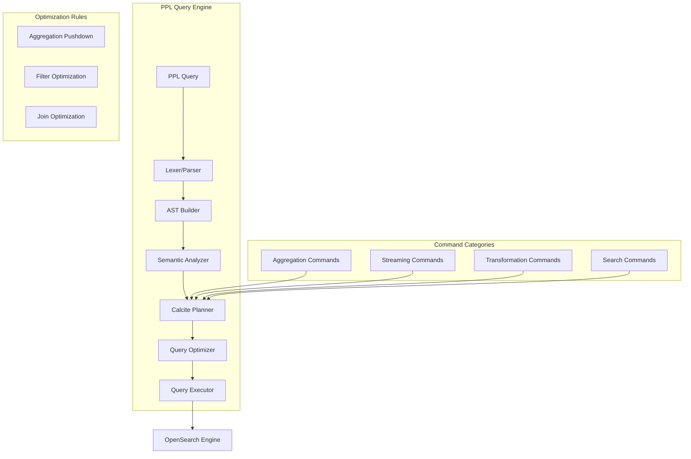
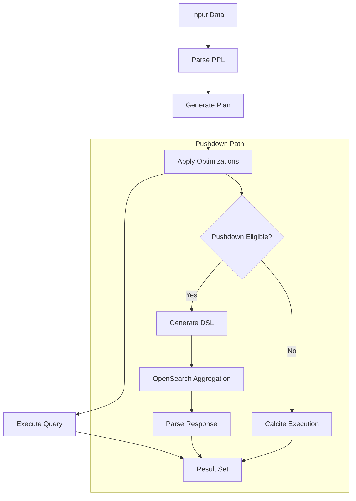

# PPL Commands (Calcite)

## Summary

PPL Commands (Calcite) provides advanced data transformation and analysis capabilities through the Piped Processing Language (PPL) using the Apache Calcite query engine. These commands enable users to perform complex aggregations, streaming statistics, multi-source searches, text replacements, and pipeline operations directly within OpenSearch queries.

## Details

### Architecture



### Data Flow



### Commands

| Command | Category | Description |
|---------|----------|-------------|
| `chart` | Aggregation | Returns aggregation results in visualization-ready format |
| `streamstats` | Streaming | Computes running statistics over streaming data |
| `multisearch` | Search | Combines results from multiple search subsearches |
| `replace` | Transformation | Replaces text patterns in specified fields |
| `appendpipe` | Pipeline | Appends subpipeline results to search results |
| `top` | Aggregation | Returns top N values with optional null handling |
| `rare` | Aggregation | Returns least common values with optional null handling |
| `dedup` | Deduplication | Removes duplicate documents with pushdown optimization |
| `eventstats` | Streaming | Computes statistics and appends to events |

### Configuration

| Setting | Description | Default |
|---------|-------------|---------|
| `plugins.ppl.syntax.legacy.preferred` | Controls default behavior for null handling | `true` |
| `bucket_nullable` | Include null buckets in group-by aggregations | Depends on legacy setting |
| `usenull` | Output null values in top/rare results | Depends on legacy setting |

### Command Syntax

#### chart
```
chart [limit=<int>] [useother=<bool>] [otherstr=<string>] [usenull=<bool>] [nullstr=<string>]
      <agg-function> [OVER <row-split>] [BY <column-split>]
```

#### streamstats
```
streamstats [current=<bool>] [window=<int>] [global=<bool>]
            [reset_before="(<eval-expression>)"] [reset_after="(<eval-expression>)"]
            [bucket_nullable=<bool>]
            <stats-agg-term> [BY <field-list>]
```

#### multisearch
```
multisearch [search <subsearch>] [search <subsearch>] ...
```

#### replace
```
replace '<pattern>' WITH '<replacement>' IN <field-list>
```

#### appendpipe
```
appendpipe [<subpipeline>]
```

### Usage Examples

#### Visualization with chart
```sql
-- Status distribution by host
source=logs | chart count OVER status BY host

-- Top 5 categories with "Other" bucket
source=sales | chart limit=5 useother=true sum(amount) BY category
```

#### Running Statistics with streamstats
```sql
-- Moving average over 10 events
source=metrics | streamstats window=10 avg(cpu_usage) as moving_avg

-- Cumulative sum with reset on error
source=events | streamstats reset_before="(level='error')" sum(count) as cumulative
```

#### Multi-source Analysis with multisearch
```sql
-- Compare success vs failure rates
source=logs | multisearch
  [search source=logs | where status='success' | eval result='success']
  [search source=logs | where status!='success' | eval result='failure']
| stats count by result
```

#### Text Transformation with replace
```sql
-- Normalize error messages
source=logs | replace 'ERROR' WITH 'error' IN message, level

-- Wildcard replacement
source=data | replace 'temp*' WITH 'temporary' IN description
```

#### Pipeline Augmentation with appendpipe
```sql
-- Add summary row to results
source=sales | appendpipe [stats sum(amount) as total | eval category='TOTAL']
```

## Limitations

- `chart` command does not support dynamic pivoting; pivoting must be done in the front-end
- `chart` currently supports only single aggregation function
- `streamstats` with `global=true + window + group` uses correlated joins which may impact performance
- `dedup` pushdown does not support script expressions
- `replace` pattern matching is case-sensitive

## Related PRs

| Version | PR | Description |
|---------|-----|-------------|
| v3.4.0 | [#4579](https://github.com/opensearch-project/sql/pull/4579) | Support `chart` command in PPL |
| v3.4.0 | [#4297](https://github.com/opensearch-project/sql/pull/4297) | Support `streamstats` command with Calcite |
| v3.4.0 | [#4332](https://github.com/opensearch-project/sql/pull/4332) | Support `multisearch` command in Calcite |
| v3.4.0 | [#4451](https://github.com/opensearch-project/sql/pull/4451) | Support `replace` command in Calcite |
| v3.4.0 | [#4602](https://github.com/opensearch-project/sql/pull/4602) | Support `appendpipe` command in PPL |
| v3.4.0 | [#4831](https://github.com/opensearch-project/sql/pull/4831) | Add `bucket_nullable` for `streamstats` |
| v3.4.0 | [#4817](https://github.com/opensearch-project/sql/pull/4817) | Add `bucket_nullable` for `eventstats` |
| v3.4.0 | [#4843](https://github.com/opensearch-project/sql/pull/4843) | Remove redundant push-down-filters |
| v3.4.0 | [#4844](https://github.com/opensearch-project/sql/pull/4844) | Convert `dedup` pushdown to composite + top_hits |
| v3.4.0 | [#4698](https://github.com/opensearch-project/sql/pull/4698) | Support wildcard for replace command |
| v3.4.0 | [#4696](https://github.com/opensearch-project/sql/pull/4696) | Support `usenull` option in `top` and `rare` |
| v3.4.0 | [#4707](https://github.com/opensearch-project/sql/pull/4707) | Pushdown `top`/`rare` to nested aggregation |

## References

- [Issue #399](https://github.com/opensearch-project/sql/issues/399): chart command feature request
- [Issue #4207](https://github.com/opensearch-project/sql/issues/4207): streamstats command feature request
- [Issue #4348](https://github.com/opensearch-project/sql/issues/4348): multisearch command feature request
- [Issue #3975](https://github.com/opensearch-project/sql/issues/3975): replace command feature request
- [Issue #4684](https://github.com/opensearch-project/sql/issues/4684): usenull option for top/rare
- [Issue #4671](https://github.com/opensearch-project/sql/issues/4671): top/rare pushdown optimization
- [Issue #4797](https://github.com/opensearch-project/sql/issues/4797): dedup pushdown optimization
- [Issue #4801](https://github.com/opensearch-project/sql/issues/4801): bucket_nullable for eventstats
- [Issue #4802](https://github.com/opensearch-project/sql/issues/4802): bucket_nullable for streamstats
- [PPL Documentation](https://docs.opensearch.org/3.0/search-plugins/sql/ppl/index/): Official PPL documentation
- [PPL Commands Reference](https://docs.opensearch.org/3.0/search-plugins/sql/ppl/functions/): PPL commands reference

## Change History

- **v3.4.0** (2026-01-11): Added `chart`, `streamstats`, `multisearch`, `replace`, `appendpipe` commands; added `bucket_nullable` for eventstats/streamstats; added `usenull` for top/rare; pushdown optimizations for top/rare/dedup
