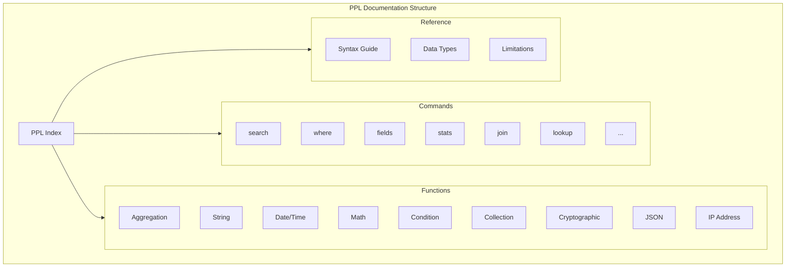

---
tags:
  - indexing
  - observability
  - search
  - sql
---

# PPL Documentation

## Summary

PPL (Piped Processing Language) documentation provides comprehensive reference materials for OpenSearch's query language designed for log analysis and observability workflows. The documentation covers command syntax, function references, and engine limitations to help users effectively query and analyze data stored in OpenSearch.

## Details

### Architecture



### Components

| Component | Description |
|-----------|-------------|
| PPL Index | Main entry point listing all commands and functions |
| Commands Reference | Detailed documentation for each PPL command |
| Functions Reference | Documentation for built-in functions by category |
| Limitations | Engine-specific limitations and fallback behavior |
| Syntax Guide | PPL query structure and formatting rules |

### Function Categories

| Category | Description | Example Functions |
|----------|-------------|-------------------|
| Aggregation | Statistical aggregations | `count`, `sum`, `avg`, `min`, `max`, `percentile` |
| String | Text manipulation | `concat`, `length`, `lower`, `upper`, `trim`, `substring` |
| Date/Time | Temporal operations | `now`, `date_add`, `datediff`, `timestamp` |
| Math | Mathematical operations | `abs`, `ceil`, `floor`, `round`, `sqrt`, `pow` |
| Condition | Conditional logic | `if`, `ifnull`, `nullif`, `coalesce`, `case` |
| Collection | Array/multi-value operations | `array_length`, `array_contains` |
| Cryptographic | Hash and encryption | `md5`, `sha1`, `sha2` |
| JSON | JSON parsing and manipulation | `json_extract`, `json_valid`, `json_keys` |
| IP Address | IP address operations | `cidrmatch`, `geoip` |
| Relevance | Full-text search | `match`, `match_phrase`, `query_string` |

### Engine Limitations

The SQL/PPL plugin uses multiple query engines with different capabilities:

| Engine | Status | Description |
|--------|--------|-------------|
| V1 | Legacy | Original SQL processing engine |
| V2 | Active | Modern SQL/PPL engine with most features |
| V3 (Calcite) | Experimental | Apache Calcite-based engine for advanced PPL |

#### V3 Calcite Engine Unsupported Features

Features that fall back to V2 engine:
- All SQL queries
- `dedup` with `consecutive=true`
- Search commands (AD, ML, Kmeans)
- Commands with `fetch_size` parameter
- Search functions (match, match_phrase, etc.)

### Usage Example

```ppl
# Basic query with filtering and aggregation
source=logs 
| where status_code >= 400 
| stats count() by host 
| sort - count()

# Using collection functions
source=events 
| eval tag_count = array_length(tags)
| where tag_count > 3

# Using JSON functions
source=api_logs 
| eval response_status = json_extract(response_body, '$.status')
| where response_status = 'error'

# Using cryptographic functions
source=users 
| eval email_hash = md5(email)
| fields user_id, email_hash
```

## Limitations

- Documentation accuracy depends on keeping pace with feature development
- Some experimental features may have incomplete documentation
- Cross-version documentation differences require version-specific references

## Change History

- **v3.4.0** (2026-01-11): Standardized PPL command documentation structure; added where command examples; fixed typos; enhanced function documentation for isnull/isnotnull and json_valid; added IP datatype documentation
- **v3.2.0** (2026-01-11): Added Collection, Cryptographic, and JSON function categories to index; updated V3 engine limitations to reflect newly supported features

## Related Features
- [Query Workbench](../dashboards-query-workbench/query-workbench.md)
- [Observability (Dashboards)](../dashboards-observability/ci-tests.md)

## References

### Documentation
- [PPL Documentation](https://docs.opensearch.org/3.0/search-plugins/sql/ppl/index/): Official PPL reference
- [PPL Functions](https://docs.opensearch.org/3.0/search-plugins/sql/functions/): Function reference
- [SQL/PPL Limitations](https://docs.opensearch.org/3.0/search-plugins/sql/limitation/): Engine limitations
- [SQL Plugin Repository](https://github.com/opensearch-project/sql): Source code and in-repo documentation

### Pull Requests
| Version | PR | Description | Related Issue |
|---------|-----|-------------|---------------|
| v3.4.0 | [#4562](https://github.com/opensearch-project/sql/pull/4562) | Update PPL Command Documentation - Major standardization |   |
| v3.4.0 | [#4803](https://github.com/opensearch-project/sql/pull/4803) | Doc update for `json_valid` function |   |
| v3.4.0 | [#4724](https://github.com/opensearch-project/sql/pull/4724) | Enhance tests and doc for eval isnull/isnotnull functions |   |
| v3.4.0 | [#4686](https://github.com/opensearch-project/sql/pull/4686) | Update search.rst documentation for IP datatypes |   |
| v3.4.0 | [#4457](https://github.com/opensearch-project/sql/pull/4457) | Add more examples to the `where` command doc |   |
| v3.4.0 | [#4447](https://github.com/opensearch-project/sql/pull/4447) | Fix typo: evenstats → eventstats |   |
| v3.2.0 | [#3868](https://github.com/opensearch-project/sql/pull/3868) | Update ppl documentation index for new functions |   |
| v3.2.0 | [#3801](https://github.com/opensearch-project/sql/pull/3801) | Update the limitation docs |   |
