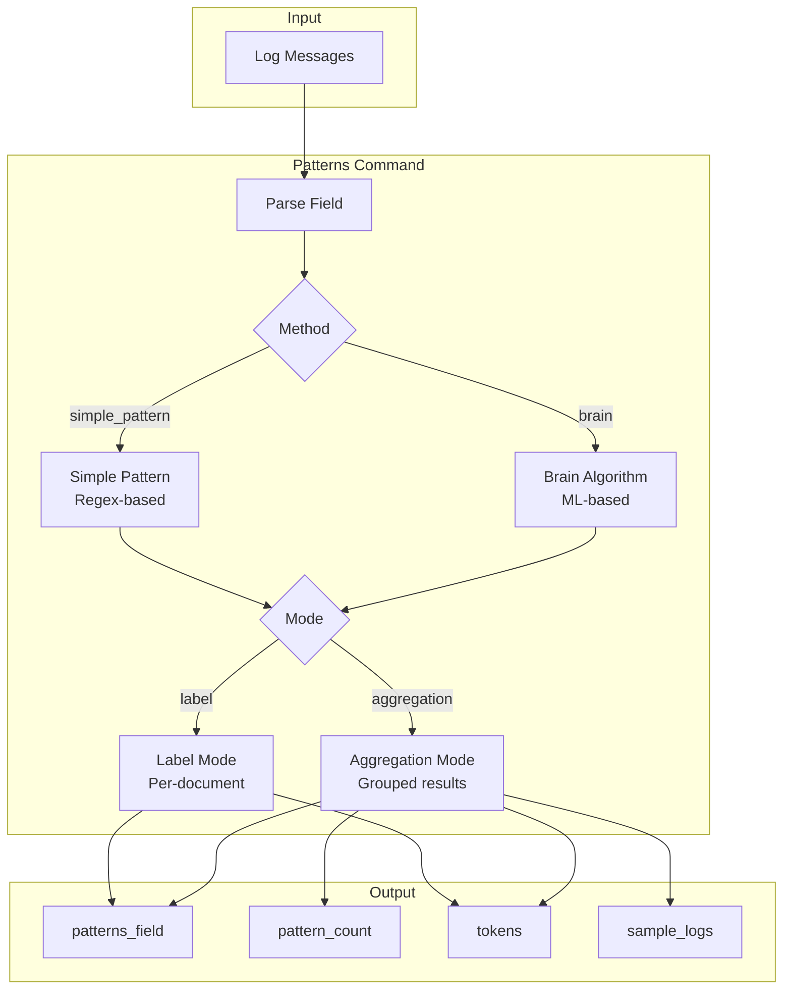
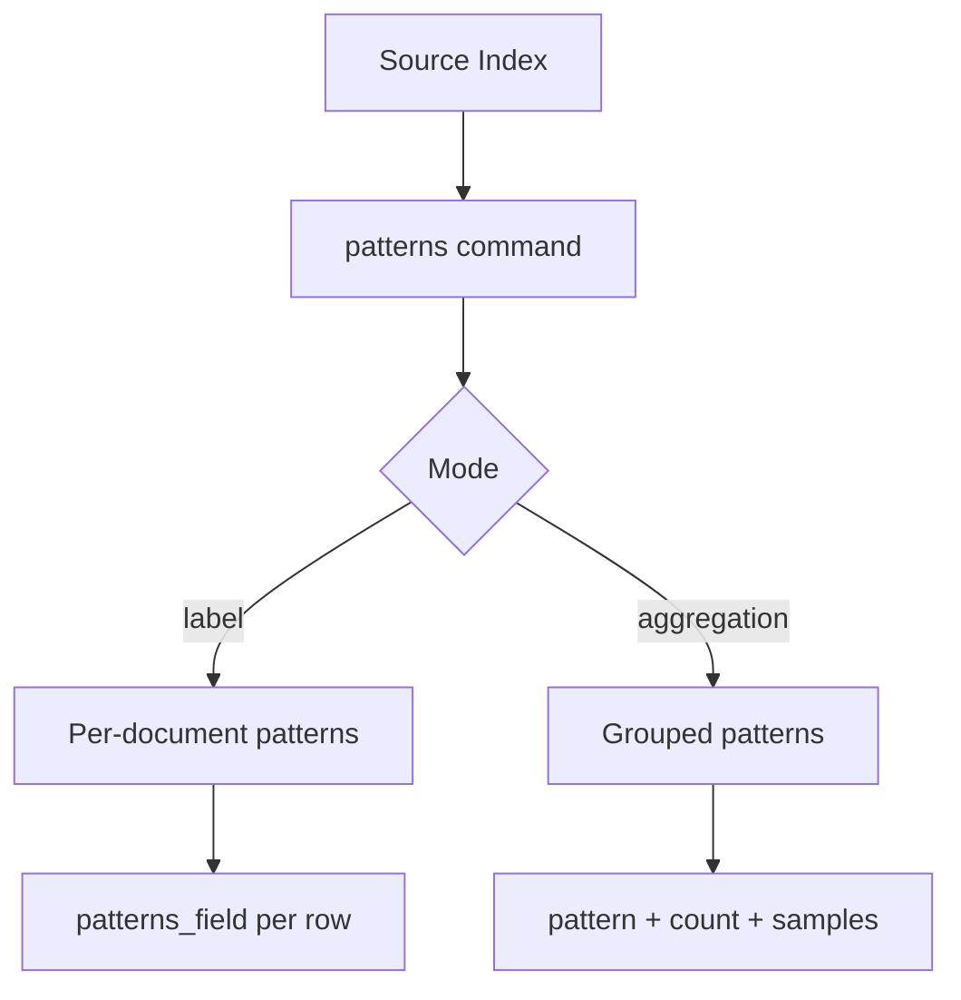

---
tags:
  - indexing
  - ml
  - sql
---

# PPL Patterns Command

## Summary

The PPL `patterns` command extracts and identifies recurring structural patterns from log messages. It supports two algorithms (simple_pattern and brain) and two modes (label and aggregation), enabling users to analyze log data for pattern discovery, anomaly detection, and log categorization.

## Details

### Architecture



### Data Flow



### Components

| Component | Description |
|-----------|-------------|
| `BrainLogParser` | ML-based log pattern extraction using the Brain algorithm |
| `PatternUtils` | Utility functions for pattern parsing and variable extraction |
| `LogPatternAggFunction` | Aggregation function for pattern grouping |
| `PatternParserFunctionImpl` | UDF implementation for pattern parsing |

### Configuration

| Setting | Description | Default |
|---------|-------------|---------|
| `plugins.ppl.pattern.method` | Default pattern extraction method | `simple_pattern` |
| `plugins.ppl.pattern.mode` | Default output mode | `label` |
| `plugins.ppl.pattern.max.sample.count` | Max sample logs per pattern in aggregation | `10` |
| `plugins.ppl.pattern.buffer.limit` | Buffer limit for Brain algorithm | `100000` |
| `plugins.ppl.pattern.show.numbered.token` | Show numbered tokens in output | `false` |

### Syntax

```
patterns <field> [by byClause...] [method=simple_pattern|brain] [mode=label|aggregation] 
         [max_sample_count=N] [buffer_limit=N] [show_numbered_token=true|false] 
         [new_field=<alias>] [pattern=<regex>] [variable_count_threshold=N] 
         [frequency_threshold_percentage=N]
```

### Usage Examples

**Label mode with simple pattern**:
```sql
source=logs | patterns message | fields message, patterns_field
```

**Aggregation mode with Brain algorithm**:
```sql
source=logs | patterns message method=brain mode=aggregation | fields patterns_field, pattern_count, sample_logs
```

**With numbered tokens**:
```sql
source=logs | patterns message mode=aggregation show_numbered_token=true | fields patterns_field, tokens
```

**With custom regex pattern**:
```sql
source=logs | patterns message pattern='[0-9]+' new_field='no_numbers' | fields message, no_numbers
```

**With group by clause**:
```sql
source=logs | patterns message by level mode=aggregation | fields level, patterns_field, pattern_count
```

### Output Fields

| Field | Mode | Description |
|-------|------|-------------|
| `patterns_field` | Both | The extracted pattern with variables replaced by placeholders |
| `tokens` | Both (when show_numbered_token=true) | Map of token names to extracted values |
| `pattern_count` | Aggregation | Number of logs matching the pattern |
| `sample_logs` | Aggregation | Sample log messages matching the pattern |

## Limitations

- The `patterns` command is not rewritten to OpenSearch DSL; it executes on the coordination node
- Brain algorithm requires sufficient memory for large datasets (controlled by `buffer_limit`)
- V2 engine does not support `show_numbered_token` option

## Change History

- **v3.3.0** (2026-01-14): Added `sample_logs` output field, `show_numbered_token` option, fixed continuous wildcards bug
- **v3.1.0**: Added aggregation mode, Brain algorithm support
- **v3.0.0**: Initial patterns command implementation

## Related Features
- [Query Workbench](../dashboards-query-workbench/query-workbench.md)
- [Observability (Dashboards)](../dashboards-observability/ci-tests.md)

## References

### Documentation
- [PPL Commands Documentation](https://docs.opensearch.org/3.0/search-plugins/sql/ppl/functions/): Official PPL commands reference

### Pull Requests
| Version | PR | Description | Related Issue |
|---------|-----|-------------|---------------|
| v3.3.0 | [#4155](https://github.com/opensearch-project/sql/pull/4155) | Add sample_logs output field | [#4139](https://github.com/opensearch-project/sql/issues/4139) |
| v3.3.0 | [#4402](https://github.com/opensearch-project/sql/pull/4402) | Add show_numbered_token option, fix continuous wildcards bug | [#4364](https://github.com/opensearch-project/sql/issues/4364) |

### Issues (Design / RFC)
- [Issue #4139](https://github.com/opensearch-project/sql/issues/4139): Feature request for sample_logs field
- [Issue #4364](https://github.com/opensearch-project/sql/issues/4364): Feature request for optional numbered tokens
