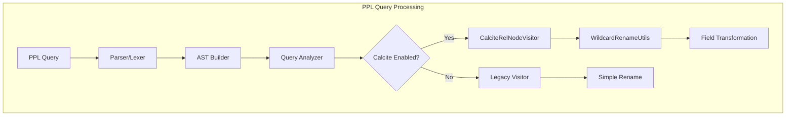
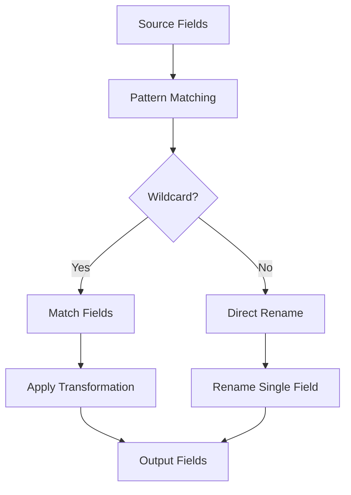

---
tags:
  - search
  - sql
---

# PPL Rename Command

## Summary

The PPL `rename` command renames one or more fields in search results. Starting from v3.3.0, it supports wildcard patterns using `*` to batch rename multiple fields at once, enabling efficient field name transformations across datasets with similarly-named fields.

## Details

### Architecture



### Data Flow



### Components

| Component | Description |
|-----------|-------------|
| `WildcardRenameUtils` | Utility class for wildcard pattern matching and transformation |
| `CalciteRelNodeVisitor.visitRename()` | Handles rename command processing with wildcard support |
| `AstExpressionBuilder.visitRenameFieldExpression()` | Parses rename field expressions including wildcards |
| `OpenSearchPPLParser.renameFieldExpression` | Grammar rule for rename field expressions |

### Configuration

| Setting | Description | Default |
|---------|-------------|---------|
| `plugins.calcite.enabled` | Enable Calcite query engine (required for wildcards) | `false` |

### Syntax

```
rename <source-field> AS <target-field>[, <source-field> AS <target-field>]...
```

- `source-field`: Field name to rename. Supports wildcard patterns (`*`) since v3.3.0.
- `target-field`: New field name. Must have same number of wildcards as source.

### Wildcard Patterns

| Pattern | Description | Example |
|---------|-------------|---------|
| `*name` | Match fields ending with "name" | `firstname`, `lastname` |
| `old_*` | Match fields starting with "old_" | `old_id`, `old_value` |
| `*_*` | Match fields with underscore | `user_name`, `first_name` |
| `*` | Match all fields | All fields |

### Field Rename Behavior (v3.3.0+)

| Scenario | Behavior |
|----------|----------|
| Non-existent → Non-existent | No change to result set |
| Non-existent → Existing | Target field is removed |
| Existing → Existing | Target field removed, source renamed to target |

### Usage Examples

**Basic rename:**
```ppl
source=accounts | rename account_number as an | fields an
```

**Multiple field rename:**
```ppl
source=accounts | rename account_number as an, employer as emp | fields an, emp
```

**Wildcard rename (v3.3.0+):**
```ppl
source=accounts | rename *name as *_name | fields first_name, last_name
```

**Add prefix to all fields (v3.3.0+):**
```ppl
source=accounts | fields name, age | rename * as old_* | fields old_name, old_age
```

**Remove prefix (v3.3.0+):**
```ppl
source=data | rename old_* as * | fields name, value
```

**Multiple wildcards (v3.3.0+):**
```ppl
source=accounts | rename m*n*h as M*N*H | fields MoNtH
```

**Chained renames (v3.3.0+):**
```ppl
source=accounts | rename *ame as *_ame, *_ame as *_AME | fields n_AME
```

**Space-delimited syntax (v3.3.0+):**
```ppl
source=accounts | rename name as user_name age as user_age country as location
```

## Limitations

- The `rename` command is not rewritten to OpenSearch DSL; it executes only on the coordination node
- Wildcard patterns require `plugins.calcite.enabled=true`
- Source and target patterns must have the same number of wildcards
- Literal asterisk (`*`) characters in field names cannot be matched
- Consecutive wildcards (e.g., `**`) in non-full patterns are not supported

## Change History

- **v3.3.0** (2026): Added wildcard pattern support for batch field renaming, space-delimited syntax, and updated field rename behavior for non-existent/existing field scenarios
- **v1.0.0**: Initial implementation with basic single and multiple field rename support

## References

### Documentation
- [PPL Commands Documentation](https://docs.opensearch.org/3.0/search-plugins/sql/ppl/functions/): Official PPL commands reference

### Pull Requests
| Version | PR | Description | Related Issue |
|---------|-----|-------------|---------------|
| v3.3.0 | [#4019](https://github.com/opensearch-project/sql/pull/4019) | Add wildcard support for rename command |   |

### Issues (Design / RFC)
- [Issue #4008](https://github.com/opensearch-project/sql/issues/4008): Feature request for wildcard rename support
