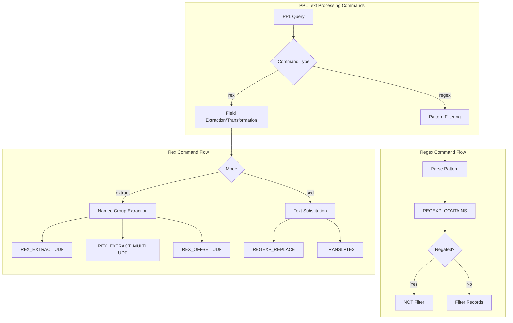
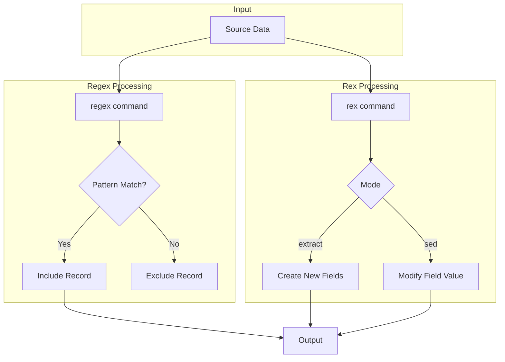

---
tags:
  - search
  - sql
---

# PPL Rex and Regex Commands

## Summary

The `regex` and `rex` commands provide comprehensive regex-based text processing capabilities in PPL (Piped Processing Language). The `regex` command filters records based on pattern matching, while the `rex` command extracts fields using named capture groups and performs text transformations. Both commands use Java's regex engine and are available in the Calcite query engine.

## Details

### Architecture



### Data Flow



### Components

| Component | Description |
|-----------|-------------|
| `Regex` | AST node for regex filter command |
| `Rex` | AST node for rex extraction/transformation command |
| `RegexCommonUtils` | Shared utilities for pattern compilation and caching |
| `RexExtractFunction` | UDF for extracting single match from named capture group |
| `RexExtractMultiFunction` | UDF for extracting multiple matches as array |
| `RexOffsetFunction` | UDF for calculating match position offsets |

### Configuration

| Setting | Description | Default |
|---------|-------------|---------|
| `plugins.ppl.rex.max_match.limit` | Maximum value for `max_match` parameter to prevent memory exhaustion | 10 |

### Regex Command

The `regex` command filters records based on regex pattern matching against field values.

#### Syntax

```
regex <field>=<pattern>
regex <field>!=<pattern>
```

#### Parameters

- `field`: Field name to match against (required)
- `pattern`: Java regex pattern string (required)
- `=`: Positive matching (include matches)
- `!=`: Negative matching (exclude matches)

#### Examples

```sql
-- Basic pattern matching
source=accounts | regex lastname="^[A-Z][a-z]+$" | fields lastname

-- Negative matching
source=accounts | regex lastname!=".*son$" | fields lastname

-- Email domain filtering
source=accounts | regex email="@gmail\.com$" | fields email

-- Complex patterns with character classes
source=accounts | regex address="\d{3,4}\s+[A-Z][a-z]+\s+(Street|Lane)" | fields address

-- Case-insensitive matching (using inline flag)
source=accounts | regex state="(?i)ca" | fields state
```

### Rex Command

The `rex` command extracts fields using named capture groups or performs text transformations.

#### Syntax

```
rex field=<field> "<pattern>" [max_match=<int>] [offset_field=<string>]
rex field=<field> mode=sed "<sed-expression>"
```

#### Parameters

- `field`: Source field to process (required)
- `pattern`: Regex with named capture groups `(?<name>pattern)` (required for extract mode)
- `max_match`: Maximum matches to extract (default: 1, 0=unlimited capped to limit)
- `offset_field`: Field name to store match positions
- `mode`: `extract` (default) or `sed`

#### Extract Mode Examples

```sql
-- Basic field extraction
source=accounts | rex field=email "(?<username>[^@]+)@(?<domain>[^.]+)" 
| fields email, username, domain

-- Multiple named groups
source=accounts | rex field=email "(?<user>[a-zA-Z0-9._%+-]+)@(?<domain>[a-zA-Z0-9.-]+)\.(?<tld>[a-zA-Z]{2,})" 
| fields email, user, domain, tld

-- Multi-value extraction (returns array)
source=accounts | rex field=address "(?<words>[A-Za-z]+)" max_match=3 
| fields address, words

-- Position tracking
source=accounts | rex field=email "(?<username>[^@]+)@(?<domain>[^.]+)" offset_field=matchpos 
| fields email, username, domain, matchpos

-- Chaining multiple rex commands
source=accounts | rex field=firstname "(?<firstinitial>^.)" 
| rex field=lastname "(?<lastinitial>^.)" 
| fields firstname, lastname, firstinitial, lastinitial
```

#### Sed Mode Examples

```sql
-- Basic substitution
source=accounts | rex field=email mode=sed "s/@.*/@company.com/" | fields email

-- Global replacement
source=logs | rex field=message mode=sed "s/ERROR/WARNING/g" | fields message

-- Nth occurrence replacement
source=data | rex field=text mode=sed "s/word/replacement/2" | fields text

-- Case-insensitive replacement
source=data | rex field=text mode=sed "s/error/ERROR/gi" | fields text

-- Character transliteration
source=data | rex field=title mode=sed "y/ /_/" | fields title

-- Backreferences in replacement
source=data | rex field=phone mode=sed "s/(\d{3})(\d{3})(\d{4})/\1-\2-\3/" | fields phone
```

### Comparison with Related Commands

| Feature | regex | rex | parse |
|---------|-------|-----|-------|
| Pattern Type | Java Regex | Java Regex | Java Regex |
| Named Groups Required | No | Yes (extract mode) | Yes |
| Filtering by Match | Yes | No | Yes |
| Multiple Matches | No | Yes | No |
| Text Substitution | No | Yes (sed mode) | No |
| Offset Tracking | No | Yes | No |

## Limitations

- **Calcite Engine Only**: Both commands require `plugins.calcite.enabled=true`
- **Named Group Naming**: Group names cannot contain underscores (Java regex limitation)
- **String Fields Only**: `regex` command only works with string field types
- **Max Match Limit**: `max_match` values exceeding the configured limit throw an error
- **Sed Mode Restrictions**: `offset_field` cannot be used with `mode=sed`

## Change History

- **v3.3.0** (2025-09): Initial implementation of `regex` and `rex` commands with extract mode, sed mode, and offset_field support

## Related Features
- [Query Workbench](../dashboards-query-workbench/query-workbench.md)
- [Observability (Dashboards)](../dashboards-observability/ci-tests.md)

## References

### Documentation
- [Java Pattern Documentation](https://docs.oracle.com/javase/8/docs/api/java/util/regex/Pattern.html): Java regex syntax reference

### Pull Requests
| Version | PR | Description | Related Issue |
|---------|-----|-------------|---------------|
| v3.3.0 | [#4083](https://github.com/opensearch-project/sql/pull/4083) | Implementation of `regex` command in PPL | [#4111](https://github.com/opensearch-project/sql/issues/4111) |
| v3.3.0 | [#4109](https://github.com/opensearch-project/sql/pull/4109) | Core implementation of `rex` command (extract mode) | [#4111](https://github.com/opensearch-project/sql/issues/4111) |
| v3.3.0 | [#4241](https://github.com/opensearch-project/sql/pull/4241) | Implementation of `sed` mode and `offset_field` in rex command | [#4108](https://github.com/opensearch-project/sql/issues/4108) |

### Issues (Design / RFC)
- [Issue #4082](https://github.com/opensearch-project/sql/issues/4082): RFC for regex command
- [Issue #4108](https://github.com/opensearch-project/sql/issues/4108): RFC for rex command
