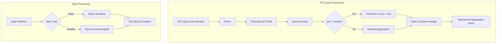
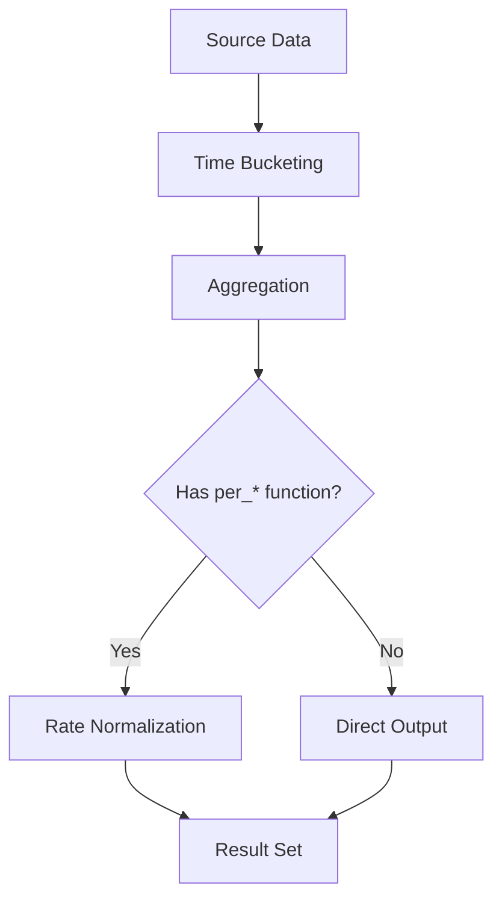

# PPL Timechart Command

## Summary

The PPL `timechart` command creates time-series visualizations by aggregating data into time buckets. It supports various span intervals, rate-based aggregation functions (`per_second`, `per_minute`, `per_hour`, `per_day`), custom timestamp fields, and grouping by categorical fields. The command is essential for performance monitoring, log analysis, and trend visualization in OpenSearch.

## Details

### Architecture



### Data Flow



### Components

| Component | Description |
|-----------|-------------|
| `Timechart` AST | Represents the timechart command in the abstract syntax tree |
| `Chart` Command Handler | Unified handler for both `chart` and `timechart` commands |
| `SpanUnit` | Enum for time span units (millisecond, second, minute, hour, day, week, month, quarter, year) |
| `IntervalUnit` | Enum for interval calculations including millisecond support |
| `PlanUtils` | Utility for span unit to interval unit conversion |

### Configuration

| Setting | Description | Default |
|---------|-------------|---------|
| `timefield` | Specifies the timestamp field to use for time bucketing | `@timestamp` |
| `span` | Time interval for bucketing (e.g., `1m`, `5m`, `1h`, `500ms`) | Required |

### Syntax

```
timechart [timefield=<field>] span=<interval> <aggregation>... [by <field>]
```

#### Parameters

| Parameter | Required | Description |
|-----------|----------|-------------|
| `timefield` | No | Custom timestamp field name (default: `@timestamp`) |
| `span` | Yes | Time bucket interval |
| `aggregation` | Yes | One or more aggregation functions |
| `by` | No | Field to split results by |

#### Supported Span Units

| Unit | Abbreviation | Example |
|------|--------------|---------|
| Millisecond | `ms` | `span=500ms` |
| Second | `s` | `span=30s` |
| Minute | `m` | `span=5m` |
| Hour | `h` | `span=1h` |
| Day | `d` | `span=1d` |
| Week | `w` | `span=1w` |
| Month | `mon` | `span=1mon` |
| Quarter | `q` | `span=1q` |
| Year | `y` | `span=1y` |

### Rate-Based Aggregation Functions

| Function | Description | Calculation |
|----------|-------------|-------------|
| `per_second(field)` | Per-second rate | `sum(field) / span_in_seconds` |
| `per_minute(field)` | Per-minute rate | `sum(field) / span_in_seconds × 60` |
| `per_hour(field)` | Per-hour rate | `sum(field) / span_in_seconds × 3600` |
| `per_day(field)` | Per-day rate | `sum(field) / span_in_seconds × 86400` |

### Usage Examples

#### Basic time-series aggregation

```
source=web_logs
| timechart span=1h count() as requests
```

#### Rate calculation with per_second

```
source=network_logs
| timechart span=5m per_second(bytes) as bytes_per_second
```

#### Multiple aggregations

```
source=metrics
| timechart span=1m avg(cpu_usage), max(memory_usage), per_second(requests)
```

#### Custom timestamp field

```
source=custom_events
| timechart timefield=event_timestamp span=1h count() by event_type
```

#### Millisecond precision for high-frequency data

```
source=trading_data
| timechart span=100ms per_second(transactions)
```

#### Grouping by category

```
source=application_logs
| timechart span=15m count() by log_level
```

## Limitations

- `per_*` functions work exclusively with the `timechart` command
- Variable-length spans (month/quarter/year) use dynamic calculation which may have slight performance overhead
- The `timechart` command requires a timestamp field in the source data

## Related PRs

| Version | PR | Description |
|---------|-----|-------------|
| v3.4.0 | [#4464](https://github.com/opensearch-project/sql/pull/4464) | Add `per_second` function support |
| v3.4.0 | [#4531](https://github.com/opensearch-project/sql/pull/4531) | Add `per_minute`, `per_hour`, `per_day` functions |
| v3.4.0 | [#4672](https://github.com/opensearch-project/sql/pull/4672) | Support millisecond span |
| v3.4.0 | [#4755](https://github.com/opensearch-project/sql/pull/4755) | Merge `timechart` and `chart` implementations |
| v3.4.0 | [#4784](https://github.com/opensearch-project/sql/pull/4784) | Add `timefield` option |

## References

- [Issue #4350](https://github.com/opensearch-project/sql/issues/4350): PPL `per_*` aggregation function support
- [Issue #4550](https://github.com/opensearch-project/sql/issues/4550): Millisecond span bug fix
- [Issue #4576](https://github.com/opensearch-project/sql/issues/4576): Custom timestamp field feature request
- [Issue #4581](https://github.com/opensearch-project/sql/issues/4581): Timechart bug fixes
- [Issue #4582](https://github.com/opensearch-project/sql/issues/4582): Timechart bug fixes
- [Issue #4632](https://github.com/opensearch-project/sql/issues/4632): Timechart bug fixes
- [PPL Commands Documentation](https://docs.opensearch.org/3.0/search-plugins/sql/ppl/functions/)

## Change History

- **v3.4.0** (2026-01): Added `per_second`, `per_minute`, `per_hour`, `per_day` functions; millisecond span support; `timefield` option; merged `timechart` and `chart` implementations
