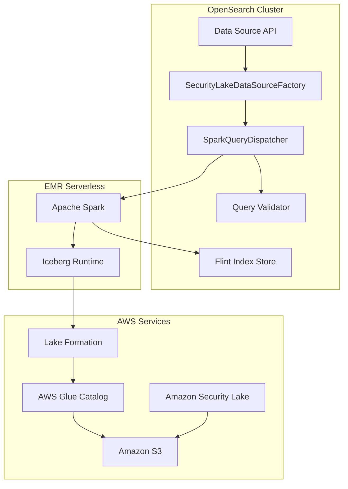
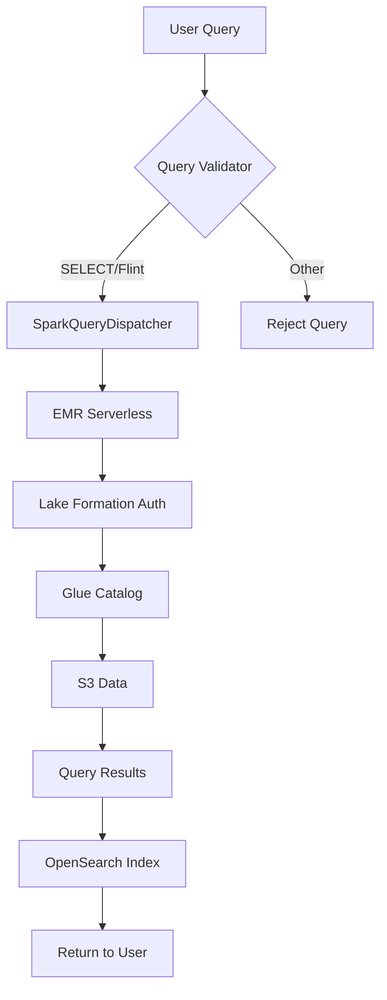

# Security Lake Data Source

## Summary

The Security Lake Data Source feature enables OpenSearch to query Amazon Security Lake tables directly using SQL and PPL. Amazon Security Lake centralizes security data from AWS environments, SaaS providers, and on-premises sources into a purpose-built data lake stored in S3. This integration allows security analysts to query normalized security data in OCSF (Open Cybersecurity Schema Framework) format directly from OpenSearch.

Key benefits:
- Direct querying of Security Lake tables without data movement
- Automatic Iceberg and Lake Formation integration for secure access
- Query validation to prevent privilege escalation
- Support for Flint index acceleration on Security Lake data

## Details

### Architecture



### Data Flow



### Components

| Component | Description |
|-----------|-------------|
| `SecurityLakeDataSourceFactory` | Creates Security Lake data sources with automatic Iceberg/LF configuration |
| `SparkSqlSecurityLakeValidatorVisitor` | ANTLR-based query validator that restricts queries to SELECT and Flint commands |
| `S3GlueDataSourceSparkParameterComposer` | Configures Spark parameters for Iceberg and Lake Formation |
| `DataSourceType.SECURITY_LAKE` | Data source type identifier |

### Configuration

| Setting | Description | Default |
|---------|-------------|---------|
| `glue.auth.type` | Authentication type (must be `iam_role`) | Required |
| `glue.auth.role_arn` | IAM role ARN for accessing Security Lake | Required |
| `glue.indexstore.opensearch.uri` | OpenSearch URI for index storage | Required |
| `glue.indexstore.opensearch.auth` | Authentication for OpenSearch (`noauth`, `basicauth`, `awssigv4`) | Required |
| `glue.indexstore.opensearch.region` | AWS region for OpenSearch (required for awssigv4) | - |
| `glue.lakeformation.session_tag` | Session tag for Lake Formation role assumption | Required |
| `glue.iceberg.enabled` | Enable Iceberg support (auto-set to `true`) | `true` |
| `glue.lakeformation.enabled` | Enable Lake Formation (auto-set to `true`) | `true` |

### Usage Example

#### Create Data Source

```json
POST /_plugins/_query/_datasources
{
  "name": "my_security_lake",
  "connector": "security_lake",
  "properties": {
    "glue.auth.type": "iam_role",
    "glue.auth.role_arn": "arn:aws:iam::123456789012:role/SecurityLakeQueryRole",
    "glue.indexstore.opensearch.uri": "https://search-domain.us-west-2.es.amazonaws.com:443",
    "glue.indexstore.opensearch.auth": "awssigv4",
    "glue.indexstore.opensearch.auth.region": "us-west-2",
    "glue.lakeformation.session_tag": "opensearch-security-analytics"
  },
  "resultIndex": "security_lake_results"
}
```

#### Query VPC Flow Logs

```sql
SELECT 
  src_endpoint.ip AS source_ip,
  dst_endpoint.ip AS dest_ip,
  traffic.packets,
  time
FROM my_security_lake.amazon_security_lake_glue_db_us_west_2.amazon_security_lake_table_us_west_2_vpc_flow_2_0
WHERE time > '2024-01-01'
LIMIT 100
```

#### Create Covering Index

```sql
CREATE INDEX srcip_time 
ON my_security_lake.amazon_security_lake_glue_db_us_west_2.amazon_security_lake_table_us_west_2_vpc_flow_2_0 
(src_endpoint.ip, time) 
WITH (auto_refresh=true)
```

## Limitations

- Only SELECT queries and Flint index operations are allowed
- DDL operations (CREATE TABLE, DROP TABLE) are blocked
- DML operations (INSERT, UPDATE, DELETE) are blocked
- Covering index acceleration is disabled when Lake Formation is enabled
- Requires EMR Serverless as the Spark execution engine
- Session tag is required for Lake Formation authorization

## Related PRs

| Version | PR | Description |
|---------|-----|-------------|
| v2.17.0 | [#2858](https://github.com/opensearch-project/sql/pull/2858) | Add flags for Iceberg and Lake Formation and Security Lake as a data source type |
| v2.17.0 | [#2959](https://github.com/opensearch-project/sql/pull/2959) | Adds validation to allow only flint queries and sql SELECT queries to security lake type datasource |

## References

- [Issue #2907](https://github.com/opensearch-project/sql/issues/2907): Original feature request
- [Amazon Security Lake Documentation](https://docs.aws.amazon.com/security-lake/latest/userguide/what-is-security-lake.html)
- [OpenSearch S3 Data Source Documentation](https://docs.opensearch.org/2.17/dashboards/management/S3-data-source/)
- [Security Lake Connector Documentation](https://github.com/opensearch-project/sql/blob/main/docs/user/ppl/admin/connectors/security_lake_connector.rst)

## Change History

- **v2.17.0** (2024-09-17): Initial implementation with SECURITY_LAKE data source type and query validation
