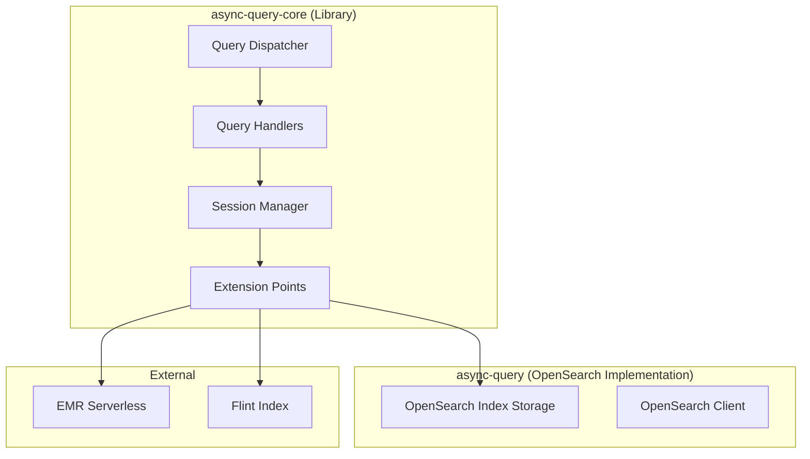

---
tags:
  - sql
---
# SQL Async Query Core

## Summary

The async-query-core library implements the core logic for asynchronous query execution in OpenSearch SQL plugin. It provides a modular architecture with extension points that allow plugging in different implementations for data storage, session management, and Spark integration. The `async-query` module provides OpenSearch-specific implementations using OpenSearch indices.

## Details

### Architecture



### Query Types

| Query Type | Description |
|------------|-------------|
| BatchQuery | Execute single query in Spark |
| InteractiveQuery | Establish session and execute queries in single Spark session |
| IndexDMLQuery | Handles DROP/ALTER/VACUUM operations for Flint indices |
| RefreshQuery | One-time query request to refresh (update) Flint index |
| StreamingQuery | Continuously update Flint index in single Spark session |

### Extension Points

The library provides extension points for custom implementations:

**Data Store Interfaces:**
| Interface | Purpose |
|-----------|---------|
| `AsyncQueryJobMetadataStorageService` | Job metadata storage |
| `SessionStorageService` | Session state storage |
| `StatementStorageService` | Statement storage |
| `FlintIndexMetadataService` | Flint index metadata |
| `FlintIndexStateModelService` | Flint index state model |
| `IndexDMLResultStorageService` | DML result storage |

**Other Interfaces:**
| Interface | Purpose |
|-----------|---------|
| `LeaseManager` | Lease management |
| `JobExecutionResponseReader` | Job response reading |
| `QueryIdProvider` | Query ID generation |
| `SessionIdProvider` | Session ID generation |
| `SessionConfigSupplier` | Session configuration |
| `EMRServerlessClientFactory` | EMR Serverless client creation |
| `SparkExecutionEngineConfigSupplier` | Spark configuration |
| `DataSourceSparkParameterComposer` | Data source parameter composition |
| `GeneralSparkParameterComposer` | General parameter composition |

### Grammar Files

The package uses ANTLR grammar files from `opensearch-spark` and `Spark` repositories. To update grammar files:

```bash
./gradlew async-query-core:downloadG4Files
```

## Limitations

- Requires EMR Serverless for Spark execution
- OpenSearch indices are used for state storage in the default implementation

## Change History

- **v2.16.0** (2024-08-06): Introduced SparkParameterComposerCollection to abstract datasource-type-specific logic from async-query-core
- **v2.16.0** (2024-08-06): Initial implementation - extracted async query core logic into separate library module with extension points

## References

### Documentation
- [async-query-core README](https://github.com/opensearch-project/sql/blob/main/async-query-core/README.md)

### Pull Requests
| Version | PR | Description |
|---------|-----|-------------|
| v2.16.0 | [#2751](https://github.com/opensearch-project/sql/pull/2751) | Scaffold async-query-core and async-query module |
| v2.16.0 | [#2750](https://github.com/opensearch-project/sql/pull/2750) | Move classes from spark to async-query-core and async-query |
| v2.16.0 | [#2746](https://github.com/opensearch-project/sql/pull/2746) | Change DataSourceType from enum to class |
| v2.16.0 | [#2768](https://github.com/opensearch-project/sql/pull/2768) | Abstract metrics to reduce dependency to legacy |
| v2.16.0 | [#2771](https://github.com/opensearch-project/sql/pull/2771) | Abstract FlintIndex client |
| v2.16.0 | [#2792](https://github.com/opensearch-project/sql/pull/2792) | Eliminate dependency from async-query-core to legacy |
| v2.16.0 | [#2785](https://github.com/opensearch-project/sql/pull/2785) | Implement integration test for async-query-core |
| v2.16.0 | [#2774](https://github.com/opensearch-project/sql/pull/2774) | Introduce SparkParameterComposerCollection |
| v2.16.0 | [#2824](https://github.com/opensearch-project/sql/pull/2824) | Backport SparkParameterComposerCollection to 2.x |
