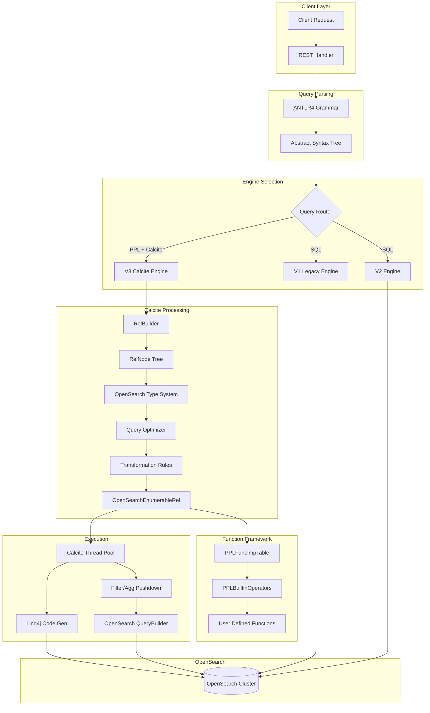
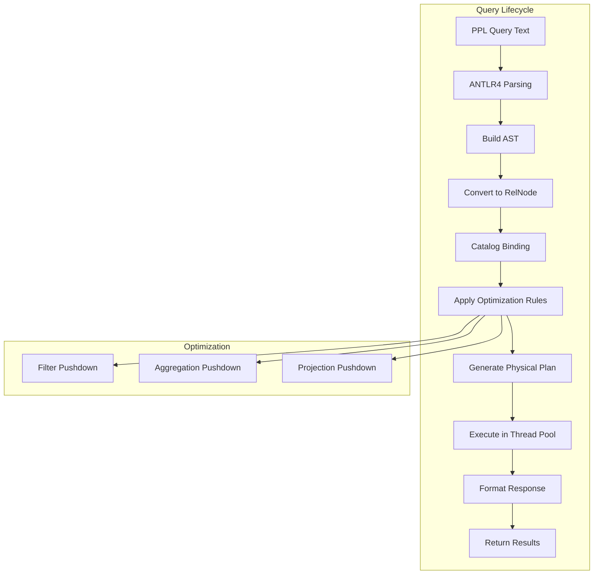

---
tags:
  - indexing
  - observability
  - performance
  - search
  - sql
---

# Calcite Query Engine

## Summary

The Calcite Query Engine is an Apache Calcite-based query processing framework for OpenSearch's SQL/PPL plugin. It provides advanced query optimization, cross-index data correlation capabilities (joins, lookups, subsearches), and an extensible UDF framework. The engine transforms PPL from a simple query language into a powerful analytical tool for log analysis and observability workflows.

## Details

### Architecture



### Data Flow



### Components

| Component | Description |
|-----------|-------------|
| `CalcitePPLParser` | Converts PPL AST to Calcite RelNode tree using RelBuilder |
| `OpenSearchTypeSystem` | Custom Calcite type system for OpenSearch data types |
| `OpenSearchTypeFactory` | Factory for creating OpenSearch-specific type instances |
| `PPLFuncImpTable` | Registry for logical-level function implementations |
| `PPLBuiltinOperators` | Physical-level UDF implementations mapped to Calcite |
| `CalciteEnumerableIndexScan` | OpenSearch index scan operator with pushdown support |
| `OpenSearchEnumerableRel` | Base class for OpenSearch-specific Calcite operators |
| `CalciteQueryPlanner` | Orchestrates query planning and optimization |
| `PushDownContext` | Tracks pushdown state for filters and aggregations |

### Configuration

| Setting | Description | Default |
|---------|-------------|---------|
| `plugins.calcite.enabled` | Enable Calcite engine for PPL queries | `true` (v3.3.0+, was `false`) |
| `plugins.calcite.fallback.allowed` | Allow fallback to v2 engine on failure | `false` (v3.2.0+) |
| `plugins.sql.enabled` | Enable SQL support | `true` |
| `plugins.ppl.enabled` | Enable PPL support | `true` |
| `plugins.query.memory_limit` | Query memory limit | `85%` |
| `plugins.query.size_limit` | Maximum query result size | `200` |

### PPL Commands

| Command | Description | Syntax | Since |
|---------|-------------|--------|-------|
| `join` | Correlate data from multiple indexes | `source=a \| join [LEFT\|RIGHT\|INNER\|OUTER\|CROSS\|SEMI\|ANTI] ON condition b` | v3.0.0 |
| `lookup` | Enrich data with reference table | `source=a \| lookup b match_field [AS alias], [output_field, ...]` | v3.0.0 |
| `subsearch` | Dynamic filtering with subqueries | `where [NOT] exists/in [subquery]` | v3.0.0 |
| `dedup` | Remove duplicate records | `source=a \| dedup field1, field2` | v3.0.0 |
| `parse` | Extract fields using regex | `source=a \| parse field 'pattern'` | v3.0.0 |
| `eventstats` | Window functions over partitions | `source=a \| eventstats avg(field) by group` | v3.1.0 |
| `flatten` | Flatten nested struct fields | `source=a \| flatten nested_field` | v3.1.0 |
| `expand` | Expand array fields into rows | `source=a \| expand array_field` | v3.1.0 |
| `trendline` | Calculate trend lines | `source=a \| trendline sma(2, field)` | v3.1.0 |
| `appendcol` | Append columns from subquery | `source=a \| appendcol [subquery]` | v3.1.0 |
| `grok` | Parse text using Grok patterns | `source=a \| grok field '%{PATTERN}'` | v3.1.0 |
| `top` | Find most common values | `source=a \| top N field [by group]` | v3.1.0 |
| `rare` | Find least common values | `source=a \| rare field [by group]` | v3.1.0 |
| `fillnull` | Replace null values | `source=a \| fillnull value=default field` | v3.1.0 |
| `describe` | Show index metadata | `describe index_name` | v3.1.0 |
| `patterns` | Pattern detection (BRAIN method) | `source=a \| patterns field` | v3.1.0 |
| `timechart` | Time-series aggregation with binning | `source=a \| timechart span=1m avg(field) [by group]` | v3.3.0 |

### Supported Functions

| Category | Functions |
|----------|-----------|
| Math | `abs`, `ceil`, `floor`, `round`, `sqrt`, `pow`, `exp`, `ln`, `log`, `log10`, `log2`, `atan`, `atan2`, `sin`, `cos`, `tan` |
| String | `concat`, `length`, `lower`, `upper`, `trim`, `ltrim`, `rtrim`, `substring`, `replace`, `reverse`, `position`, `left`, `right`, `mvjoin`, `regex_match` |
| Condition | `if`, `ifnull`, `nullif`, `coalesce`, `case`, `isnull`, `isempty`, `isblank`, `ispresent` |
| Geo | `geoip`, `cidrmatch` |
| Date/Time | `now`, `curdate`, `curtime`, `date`, `time`, `timestamp`, `date_add`, `date_sub`, `datediff`, `timediff`, `time_to_sec` |
| Type | `typeof`, `cast` |
| Aggregation | `count`, `sum`, `avg`, `min`, `max`, `take` |

### Supported Data Types

| Type | OpenSearch Mapping | Description |
|------|-------------------|-------------|
| `DATE` | `date` | Date without time |
| `TIME` | `date` | Time without date |
| `TIMESTAMP` | `date` | Full date and time |
| `IP` | `ip` | IPv4/IPv6 addresses |
| `GEO_POINT` | `geo_point` | Geographic coordinates |
| `BINARY` | `binary` | Binary data |
| `ALIAS` | `alias` | Field aliases |
| `NESTED` | `nested` | Nested objects |

### Usage Example

```bash
# Enable Calcite engine
PUT _cluster/settings
{
  "transient": {
    "plugins.calcite.enabled": true
  }
}

# Lookup: Enrich authentication logs with user details
POST /_plugins/_ppl
{
  "query": "source=auth_logs | lookup user_info user_id | where status='failed' | fields timestamp, user_id, department, status"
}

# Join: Correlate logs within time window
POST /_plugins/_ppl
{
  "query": "source=auth_logs | join left=l right=r ON l.user_id = r.user_id AND TIME_TO_SEC(TIMEDIFF(r.timestamp, l.timestamp)) <= 60 app_logs | fields timestamp, user_id, action, status"
}

# Subsearch EXISTS: Find suspicious activity
POST /_plugins/_ppl
{
  "query": "source=auth_logs | where status='failed' AND exists [source=app_logs | where user_id=auth_logs.user_id AND action='login']"
}

# Subsearch IN: Filter by department
POST /_plugins/_ppl
{
  "query": "source=logs | where user_id in [source=users | where department='Security' | fields user_id]"
}

# Explain query plan
POST /_plugins/_ppl
{
  "query": "explain source=auth_logs | lookup user_info user_id | where status='failed'"
}

# Response shows logical and physical plans:
# LogicalProject -> LogicalFilter -> LogicalJoin -> CalciteLogicalIndexScan
# EnumerableCalc -> EnumerableMergeJoin -> CalciteEnumerableIndexScan (with pushdown)
```

## Limitations

- Only PPL queries optimized by Calcite (SQL support planned)
- JOIN queries auto-terminate after 60 seconds
- `dedup` with `consecutive=true` not supported
- Pagination/cursor not supported
- Aggregation over expressions has limited support
- Subquery in FROM clause has limited support
- `eventstats` supports basic aggregate functions; advanced window functions (ROW_NUMBER, RANK, etc.) planned for future releases
- `flatten` works only with struct/object fields, not arrays
- `timechart` does not support pivot formatting or multiple aggregation functions

## Change History

- **v3.3.0** (2026-01-11): Calcite enabled by default (`plugins.calcite.enabled=true`); implicit fallback to V2 for unsupported commands; new functions (`mvjoin`, `regex_match`); `timechart` command for time-series aggregation; enhanced cost computing mechanism; project pushdown optimization for non-identity projections
- **v3.2.0** (2026-01-11): Major pushdown expansion - sort, aggregation with scripts, partial filter, span, relevance queries, Sarg values; secure RelJson serialization for filter scripts; performance optimization skipping codegen for simple queries (~30% improvement); v2 fallback disabled by default; new UDFs (compare_ip, IP casting); function argument coercion
- **v3.1.0** (2026-01-10): Expanded command support - eventstats (window functions), flatten, expand, trendline, appendcol, grok, top/rare, fillnull, describe, patterns; new functions (coalesce, isempty, isblank, ispresent, geoip, cidrmatch); performance optimizations (LIMIT pushdown, row count estimation, ResourceMonitor)
- **v3.0.0** (2025-05-06): Initial implementation - Apache Calcite integration, join/lookup/subsearch commands, UDF framework, custom type system, thread pool execution, enhanced explain output

## Related Features
- [Query Workbench](../dashboards-query-workbench/dashboards-query-workbench-query-workbench.md)
- [Observability (Dashboards)](../dashboards-observability/dashboards-observability-search-relevance-ci-tests.md)

## References

### Documentation
- [SQL Settings Documentation](https://docs.opensearch.org/3.0/search-plugins/sql/settings/): Configuration reference
- [SQL Limitations](https://docs.opensearch.org/3.0/search-plugins/sql/limitation/): Engine limitations
- [PPL Commands](https://docs.opensearch.org/3.0/search-plugins/sql/ppl/functions/): PPL command reference
- [Apache Calcite](https://calcite.apache.org/): Query optimization framework
- [SQL Plugin Repository](https://github.com/opensearch-project/sql): Source code

### Blog Posts
- [Enhanced Log Analysis Blog](https://opensearch.org/blog/enhanced-log-analysis-with-opensearch-ppl-introducing-lookup-join-and-subsearch/): Feature announcement

### Pull Requests
| Version | PR | Description | Related Issue |
|---------|-----|-------------|---------------|
| v3.3.0 | [#4372](https://github.com/opensearch-project/sql/pull/4372) | Enable Calcite by default and implicit fallback for unsupported commands | [#4314](https://github.com/opensearch-project/sql/issues/4314) |
| v3.3.0 | [#4353](https://github.com/opensearch-project/sql/pull/4353) | Enhance cost computing mechanism and push down context | [#4312](https://github.com/opensearch-project/sql/issues/4312) |
| v3.3.0 | [#4279](https://github.com/opensearch-project/sql/pull/4279) | Push down project operator with non-identity projections into scan | [#4230](https://github.com/opensearch-project/sql/issues/4230) |
| v3.3.0 | [#4217](https://github.com/opensearch-project/sql/pull/4217) | `mvjoin` support in PPL Calcite | [#4146](https://github.com/opensearch-project/sql/issues/4146) |
| v3.3.0 | [#4092](https://github.com/opensearch-project/sql/pull/4092) | Add `regex_match` function for PPL with Calcite engine support |   |
| v3.3.0 | [#3993](https://github.com/opensearch-project/sql/pull/3993) | Support `timechart` command with Calcite | [#3965](https://github.com/opensearch-project/sql/issues/3965) |
| v3.2.0 | [#3620](https://github.com/opensearch-project/sql/pull/3620) | Support Sort pushdown | [#3380](https://github.com/opensearch-project/sql/issues/3380) |
| v3.2.0 | [#3916](https://github.com/opensearch-project/sql/pull/3916) | Support aggregation push down with scripts | [#3386](https://github.com/opensearch-project/sql/issues/3386) |
| v3.2.0 | [#3850](https://github.com/opensearch-project/sql/pull/3850) | Support partial filter push down | [#3470](https://github.com/opensearch-project/sql/issues/3470) |
| v3.2.0 | [#3834](https://github.com/opensearch-project/sql/pull/3834) | Support relevance query functions pushdown | [#3462](https://github.com/opensearch-project/sql/issues/3462) |
| v3.2.0 | [#3859](https://github.com/opensearch-project/sql/pull/3859) | Filter script pushdown with RelJson serialization | [#3379](https://github.com/opensearch-project/sql/issues/3379) |
| v3.2.0 | [#3853](https://github.com/opensearch-project/sql/pull/3853) | Skip codegen for Scan only plan (~30% improvement) | [#3852](https://github.com/opensearch-project/sql/issues/3852) |
| v3.2.0 | [#3952](https://github.com/opensearch-project/sql/pull/3952) | Disable v2 fallback by default | [#3942](https://github.com/opensearch-project/sql/issues/3942) |
| v3.2.0 | [#3823](https://github.com/opensearch-project/sql/pull/3823) | Support span push down | [#3384](https://github.com/opensearch-project/sql/issues/3384) |
| v3.2.0 | [#3840](https://github.com/opensearch-project/sql/pull/3840) | Support filter push down for Sarg value | [#3839](https://github.com/opensearch-project/sql/issues/3839) |
| v3.2.0 | [#3864](https://github.com/opensearch-project/sql/pull/3864) | Support pushdown physical sort for SortMergeJoin | [#3863](https://github.com/opensearch-project/sql/issues/3863) |
| v3.2.0 | [#3880](https://github.com/opensearch-project/sql/pull/3880) | Push down QUERY_SIZE_LIMIT | [#3879](https://github.com/opensearch-project/sql/issues/3879) |
| v3.2.0 | [#3914](https://github.com/opensearch-project/sql/pull/3914) | Support function argument coercion |   |
| v3.2.0 | [#3919](https://github.com/opensearch-project/sql/pull/3919) | Support casting to IP with Calcite | [#3918](https://github.com/opensearch-project/sql/issues/3918) |
| v3.2.0 | [#3821](https://github.com/opensearch-project/sql/pull/3821) | Add compare_ip operator UDFs | [#3776](https://github.com/opensearch-project/sql/issues/3776) |
| v3.1.0 | [#3738](https://github.com/opensearch-project/sql/pull/3738) | Support ResourceMonitor with Calcite | [#3454](https://github.com/opensearch-project/sql/issues/3454) |
| v3.1.0 | [#3747](https://github.com/opensearch-project/sql/pull/3747) | Support `flatten` command with Calcite | [#3712](https://github.com/opensearch-project/sql/issues/3712) |
| v3.1.0 | [#3745](https://github.com/opensearch-project/sql/pull/3745) | Support `expand` command with Calcite | [#3711](https://github.com/opensearch-project/sql/issues/3711) |
| v3.1.0 | [#3741](https://github.com/opensearch-project/sql/pull/3741) | Support trendline command in Calcite | [#3466](https://github.com/opensearch-project/sql/issues/3466) |
| v3.1.0 | [#3729](https://github.com/opensearch-project/sql/pull/3729) | Support `appendcol` command with Calcite | [#3172](https://github.com/opensearch-project/sql/issues/3172) |
| v3.1.0 | [#3678](https://github.com/opensearch-project/sql/pull/3678) | Support Grok command in Calcite engine | [#3677](https://github.com/opensearch-project/sql/issues/3677) |
| v3.1.0 | [#3673](https://github.com/opensearch-project/sql/pull/3673) | Support decimal literal with Calcite | [#3614](https://github.com/opensearch-project/sql/issues/3614) |
| v3.1.0 | [#3647](https://github.com/opensearch-project/sql/pull/3647) | Support `top`, `rare` commands with Calcite | [#3464](https://github.com/opensearch-project/sql/issues/3464) |
| v3.1.0 | [#3634](https://github.com/opensearch-project/sql/pull/3634) | Support `fillnull` command with Calcite | [#3461](https://github.com/opensearch-project/sql/issues/3461) |
| v3.1.0 | [#3628](https://github.com/opensearch-project/sql/pull/3628) | Support function `coalesce` with Calcite | [#3610](https://github.com/opensearch-project/sql/issues/3610) |
| v3.1.0 | [#3627](https://github.com/opensearch-project/sql/pull/3627) | Support functions `isempty`, `isblank`, `ispresent` | [#3609](https://github.com/opensearch-project/sql/issues/3609) |
| v3.1.0 | [#3626](https://github.com/opensearch-project/sql/pull/3626) | Implement Parameter Validation for PPL functions | [#3608](https://github.com/opensearch-project/sql/issues/3608) |
| v3.1.0 | [#3624](https://github.com/opensearch-project/sql/pull/3624) | Support `describe` command with Calcite | [#3460](https://github.com/opensearch-project/sql/issues/3460) |
| v3.1.0 | [#3615](https://github.com/opensearch-project/sql/pull/3615) | Support Limit pushdown | [#3381](https://github.com/opensearch-project/sql/issues/3381) |
| v3.1.0 | [#3612](https://github.com/opensearch-project/sql/pull/3612) | Add UT for PredicateAnalyzer and AggregateAnalyzer | [#3340](https://github.com/opensearch-project/sql/issues/3340) |
| v3.1.0 | [#3605](https://github.com/opensearch-project/sql/pull/3605) | Add row count estimation for CalciteIndexScan | [#3557](https://github.com/opensearch-project/sql/issues/3557) |
| v3.1.0 | [#3604](https://github.com/opensearch-project/sql/pull/3604) | Implement `geoip` udf with Calcite | [#3506](https://github.com/opensearch-project/sql/issues/3506) |
| v3.1.0 | [#3603](https://github.com/opensearch-project/sql/pull/3603) | Implement `cidrmatch` udf with Calcite | [#3505](https://github.com/opensearch-project/sql/issues/3505) |
| v3.1.0 | [#3585](https://github.com/opensearch-project/sql/pull/3585) | Support `eventstats` command with Calcite | [#3563](https://github.com/opensearch-project/sql/issues/3563) |
| v3.1.0 | [#3570](https://github.com/opensearch-project/sql/pull/3570) | Calcite patterns command brain pattern method | [#3569](https://github.com/opensearch-project/sql/issues/3569) |
| v3.0.0 | [#3249](https://github.com/opensearch-project/sql/pull/3249) | Framework of Calcite Engine | [#3250](https://github.com/opensearch-project/sql/issues/3250) |
| v3.0.0 | [#3364](https://github.com/opensearch-project/sql/pull/3364) | PPL join command | [#3356](https://github.com/opensearch-project/sql/issues/3356) |
| v3.0.0 | [#3419](https://github.com/opensearch-project/sql/pull/3419) | Lookup command | [#3358](https://github.com/opensearch-project/sql/issues/3358) |
| v3.0.0 | [#3371](https://github.com/opensearch-project/sql/pull/3371) | IN subquery | [#3359](https://github.com/opensearch-project/sql/issues/3359) |
| v3.0.0 | [#3388](https://github.com/opensearch-project/sql/pull/3388) | EXISTS subquery | [#3360](https://github.com/opensearch-project/sql/issues/3360) |
| v3.0.0 | [#3374](https://github.com/opensearch-project/sql/pull/3374) | UDF interface |   |
| v3.0.0 | [#3468](https://github.com/opensearch-project/sql/pull/3468) | Enable Calcite by default | [#3451](https://github.com/opensearch-project/sql/issues/3451) |
| v3.0.0 | [#3521](https://github.com/opensearch-project/sql/pull/3521) | Enhanced explain output | [#3519](https://github.com/opensearch-project/sql/issues/3519) |
