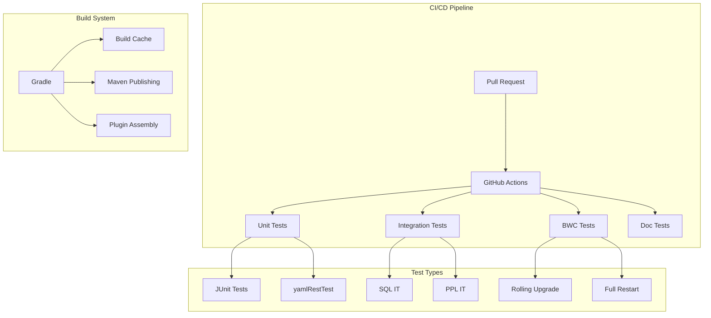
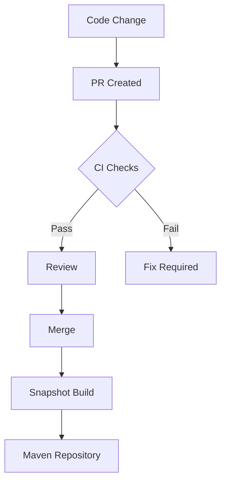

---
tags:
  - indexing
  - performance
  - search
  - sql
---

# SQL CI/Tests

## Summary

The SQL plugin CI/CD infrastructure provides automated testing, build validation, and release workflows for the OpenSearch SQL and PPL query engines. It includes unit tests, integration tests, backward compatibility tests, and continuous deployment pipelines that ensure code quality and compatibility across OpenSearch versions.

## Details

### Architecture



### Data Flow



### Components

| Component | Description |
|-----------|-------------|
| Unit Tests | Fast tests for individual components |
| Integration Tests | End-to-end tests with OpenSearch cluster |
| BWC Rolling Upgrade | Tests upgrade from previous version one node at a time |
| BWC Full Restart | Tests upgrade with full cluster restart |
| yamlRestTest | YAML-based REST API tests |
| Doc Tests | Documentation validation tests |

### Configuration

| Setting | Description | Default |
|---------|-------------|---------|
| `plugins.ppl.query.timeout` | PPL query execution timeout | 300s |
| Build Cache | Gradle build cache for dependencies | Enabled |
| JDK Version | Java Development Kit version | 25 |
| Gradle Version | Build tool version | 9.2.0 |

### GitHub Actions Workflows

| Workflow | Trigger | Purpose |
|----------|---------|---------|
| `sql-test-and-build-workflow.yml` | PR, Push | Main CI workflow |
| `bwc-rolling-upgrade.yml` | PR, Push | Rolling upgrade BWC tests |
| `bwc-full-restart.yml` | PR, Push | Full restart BWC tests |
| `publish-snapshot.yml` | Push to main | Publish snapshots to Maven |
| `delete_backport_branch.yml` | PR merge | Clean up backport branches |

### Usage Example

```yaml
# Running tests locally
./gradlew test                    # Unit tests
./gradlew integTest               # Integration tests
./gradlew yamlRestTest            # YAML REST tests
./gradlew bwcTestSuite            # BWC tests

# With specific options
./gradlew integTest -PignorePrometheus=true
./gradlew docTest -PignorePrometheus=true
```

### Build Configuration

```groovy
// Gradle plugins (v3.4.0)
plugins {
    id 'me.champeau.jmh' version '0.7.3'
    id 'com.diffplug.spotless' version '8.1.0'
    id 'info.solidsoft.pitest' version '1.19.0-rc.2'
}

// Google Java Format
googleJavaFormat {
    version = '1.32.0'
}
```

## Limitations

- BWC tests require significant disk space (~10GB per workflow)
- Query timeout only applies to Calcite-based queries
- Some tests may be flaky due to timing dependencies
- Build cache may need manual clearing for dependency resolution issues

## Change History

- **v3.4.0** (2026-01-11): Major CI/CD improvements including Gradle 9.2.0, JDK 25, BWC test splitting, query timeouts, and maven snapshots publishing

## Related Features
- [Query Workbench](../dashboards-query-workbench/query-workbench.md)
- [Observability (Dashboards)](../dashboards-observability/ci-tests.md)

## References

### Documentation
- [opensearch-build #5789](https://github.com/opensearch-project/opensearch-build/pull/5789): S3 publishing support

### Pull Requests
| Version | PR | Description | Related Issue |
|---------|-----|-------------|---------------|
| v3.4.0 | [#4824](https://github.com/opensearch-project/sql/pull/4824) | Bump Gradle to 9.2.0 and JDK to 25 | [#4722](https://github.com/opensearch-project/sql/issues/4722) |
| v3.4.0 | [#4857](https://github.com/opensearch-project/sql/pull/4857) | Support timeouts for Calcite queries | [#4842](https://github.com/opensearch-project/sql/issues/4842) |
| v3.4.0 | [#4838](https://github.com/opensearch-project/sql/pull/4838) | Execute yamlRestTest in integration job |   |
| v3.4.0 | [#4716](https://github.com/opensearch-project/sql/pull/4716) | Split BWC tests to prevent disk exhaustion |   |
| v3.4.0 | [#4646](https://github.com/opensearch-project/sql/pull/4646) | Add build cache for jitpack dependencies |   |
| v3.4.0 | [#4598](https://github.com/opensearch-project/sql/pull/4598) | Onboard async query core to maven snapshots | [#5360](https://github.com/opensearch-project/opensearch-build/issues/5360) |
| v3.4.0 | [#4588](https://github.com/opensearch-project/sql/pull/4588) | Onboard maven snapshots publishing to S3 | [#5360](https://github.com/opensearch-project/opensearch-build/issues/5360) |
| v3.4.0 | [#4484](https://github.com/opensearch-project/sql/pull/4484) | Publish internal modules for downstream reuse |   |

### Issues (Design / RFC)
- [Issue #4722](https://github.com/opensearch-project/sql/issues/4722): Gradle upgrade tracking
- [Issue #4842](https://github.com/opensearch-project/sql/issues/4842): Query timeout issue
- [opensearch-build #5360](https://github.com/opensearch-project/opensearch-build/issues/5360): Maven snapshots onboarding
