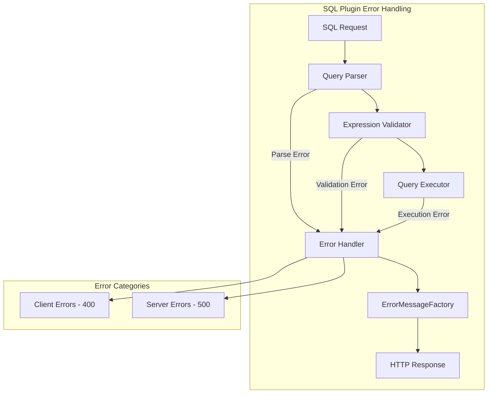

# SQL Error Handling

## Summary

The OpenSearch SQL plugin provides error handling mechanisms to return meaningful error messages and appropriate HTTP status codes when queries fail. This includes handling malformed cursors, invalid query syntax, and edge cases in query parsing.

## Details

### Architecture



### Components

| Component | Description |
|-----------|-------------|
| `CursorResultExecutor` | Handles pagination cursor parsing and validation |
| `OpenSearchActionFactory` | Validates SQL expression types before execution |
| `TermFieldRewriter` | Validates table aliases and index mappings |
| `ErrorMessageFactory` | Creates standardized error response messages |

### Error Types

| Error Type | HTTP Status | Description |
|------------|-------------|-------------|
| `SqlParseException` | 400 | Invalid SQL syntax |
| `IllegalArgumentException` | 400 | Malformed cursor or invalid arguments |
| `IndexNotFoundException` | 404 | Referenced index does not exist |
| `OpenSearchException` | 4xx/5xx | OpenSearch cluster errors |

### Error Response Format

```json
{
  "error": {
    "type": "ExceptionType",
    "reason": "Human-readable error message"
  },
  "status": 400
}
```

### Usage Example

Valid cursor pagination:
```bash
# Initial query with pagination
POST /_plugins/_sql
{
  "query": "SELECT * FROM my_index",
  "fetch_size": 10
}

# Response includes cursor
{
  "cursor": "d:eyJhIjp7fSwiYyI6...",
  "datarows": [...],
  ...
}

# Continue with cursor
POST /_plugins/_sql
{
  "cursor": "d:eyJhIjp7fSwiYyI6..."
}
```

Malformed cursor error:
```bash
POST /_plugins/_sql
{
  "cursor": "invalid_cursor_string"
}

# Response
{
  "error": {
    "type": "IllegalArgumentException",
    "reason": "Malformed cursor: unable to extract cursor information"
  },
  "status": 400
}
```

## Limitations

- Error messages are in English only
- Some complex query failures may produce generic error messages
- Wildcard indices are not permitted in SQL subqueries

## Related PRs

| Version | PR | Description |
|---------|-----|-------------|
| v2.18.0 | [#3066](https://github.com/opensearch-project/sql/pull/3066) | Improve error handling for malformed query cursors |
| v2.18.0 | [#3080](https://github.com/opensearch-project/sql/pull/3080) | Improve error handling for some more edge cases |

## References

- [SQL and PPL API Documentation](https://docs.opensearch.org/latest/search-plugins/sql/sql-ppl-api/)
- [SQL Plugin Documentation](https://docs.opensearch.org/latest/search-plugins/sql/index/)

## Change History

- **v2.18.0** (2024-11-05): Improved error handling for malformed cursors and edge cases in query parsing
