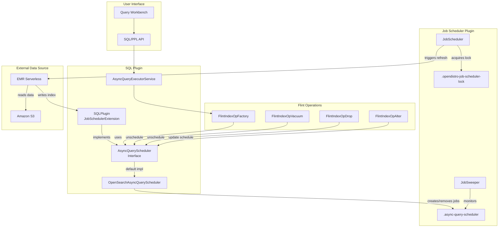
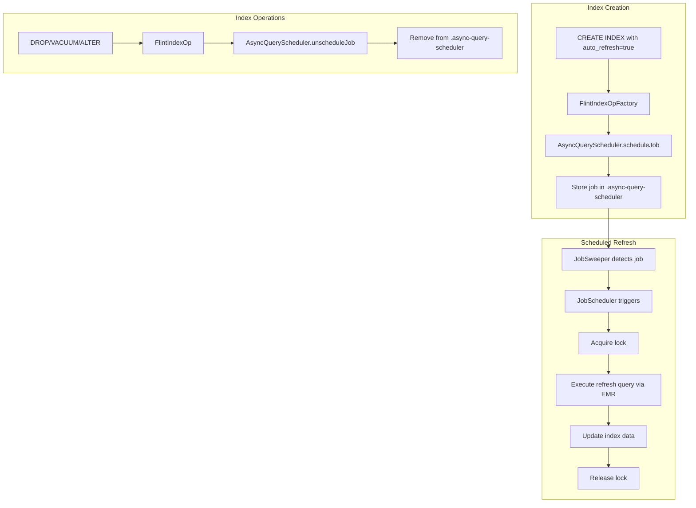

---
tags:
  - domain/search
  - component/server
  - indexing
  - observability
  - search
  - sql
---
# Flint Query Scheduler

## Summary

The Flint Query Scheduler is an external scheduling mechanism for managing automatic index refreshes in OpenSearch's async query feature. It integrates with the OpenSearch Job Scheduler plugin to provide cost-effective, observable, and controllable refresh operations for Flint indexes (skipping indexes, covering indexes, and materialized views) used with external data sources like Amazon S3.

Key benefits:
- **Cost reduction**: Eliminates the need for continuously running driver nodes for auto-refresh
- **Improved observability**: Provides visibility into index states and refresh timing
- **Better control**: Allows flexible scheduling of refresh intervals
- **Simplified management**: Enables updates to index settings in a single query

## Details

### Architecture



### Data Flow



### Components

| Component | Description |
|-----------|-------------|
| `AsyncQueryScheduler` | Interface defining scheduler operations (schedule, unschedule, update) |
| `OpenSearchAsyncQueryScheduler` | Default implementation using OpenSearch Job Scheduler |
| `AsyncQuerySchedulerRequest` | Data model for scheduler job requests |
| `OpenSearchRefreshIndexJob` | ScheduledJobRunner implementation for refresh operations |
| `OpenSearchRefreshIndexJobRequest` | Job request model implementing ScheduledJobParameter |
| `FlintIndexOpFactory` | Factory for Flint index operations with scheduler integration |

### Configuration

| Setting | Description | Default |
|---------|-------------|---------|
| `plugins.query.executionengine.async_query.enabled` | Enable async query execution | `true` |
| `plugins.query.executionengine.async_query.external_scheduler.interval` | External scheduler check interval | `5 minutes` |
| `auto_refresh` | Enable automatic refresh for index | `false` |
| `refresh_interval` | Time between refresh operations | - |
| `scheduler_mode` | Scheduling mode (`internal` or `external`) | `external` |
| `checkpoint_location` | Path for refresh job checkpoints (required for external) | - |

### System Indexes

| Index | Description |
|-------|-------------|
| `.async-query-scheduler` | Stores scheduled job metadata and configuration |
| `.opendistro-job-scheduler-lock` | Coordinates job execution to prevent overlapping refreshes |

### Usage Example

```sql
-- Create skipping index with external scheduler
CREATE SKIPPING INDEX my_skipping_index ON myglue.default.logs
(
    year PARTITION,
    month PARTITION,
    day PARTITION
)
WITH (
    auto_refresh = true,
    refresh_interval = '15 minutes',
    checkpoint_location = 's3://my-bucket/checkpoints/'
);

-- Create materialized view with external scheduler
CREATE MATERIALIZED VIEW myglue.default.hourly_stats AS
SELECT hour, COUNT(*) as count
FROM myglue.default.logs
GROUP BY hour
WITH (
    auto_refresh = true,
    refresh_interval = '1 hour'
);

-- Switch scheduler mode
ALTER MATERIALIZED VIEW myglue.default.hourly_stats
WITH (scheduler_mode = 'internal');

-- Update refresh interval
ALTER INDEX my_skipping_index
WITH (refresh_interval = '30 minutes');

-- Disable auto-refresh
ALTER MATERIALIZED VIEW myglue.default.hourly_stats
WITH (auto_refresh = false);

-- Monitor index status
SHOW FLINT INDEXES IN spark_catalog.default;

-- Inspect scheduler metadata
GET /.async-query-scheduler/_search
```

## Limitations

- External scheduler is designed for batch refresh operations, not low-latency streaming use cases
- Only one refresh operation can be active for any given index or materialized view at a time
- Requires EMR Serverless or compatible Spark environment for query execution
- Feature flag must be enabled for the scheduler to function
- `checkpoint_location` is required when using external scheduler mode

## Change History

- **v2.18.0** (2024-10-23): Bugfix - Remove scheduler index from SystemIndexDescriptor to prevent conflicts with Job Scheduler plugin
- **v2.17.0** (2024-09-17): Initial implementation with Job Scheduler integration, scheduler service, and feature flag support


## References

### Documentation
- [Documentation](https://docs.opensearch.org/2.18/dashboards/management/scheduled-query-acceleration/): Scheduled Query Acceleration
- [Flint Index Reference](https://github.com/opensearch-project/opensearch-spark/blob/main/docs/index.md): OpenSearch Spark documentation

### Pull Requests
| Version | PR | Description | Related Issue |
|---------|-----|-------------|---------------|
| v2.18.0 | [#3097](https://github.com/opensearch-project/sql/pull/3097) | Remove scheduler index from SystemIndexDescriptor |   |
| v2.17.0 | [#2834](https://github.com/opensearch-project/sql/pull/2834) | Flint query scheduler part 1 - integrate job scheduler plugin | [#416](https://github.com/opensearch-project/opensearch-spark/issues/416) |
| v2.17.0 | [#2961](https://github.com/opensearch-project/sql/pull/2961) | Flint query scheduler part 2 - scheduler service and Flint integration | [#2833](https://github.com/opensearch-project/sql/issues/2833) |
| v2.17.0 | [#2973](https://github.com/opensearch-project/sql/pull/2973) | Add feature flag for async query scheduler | [#622](https://github.com/opensearch-project/opensearch-spark/issues/622) |

### Issues (Design / RFC)
- [Issue #2832](https://github.com/opensearch-project/sql/issues/2832): Integrate job scheduler plugin
- [Issue #2833](https://github.com/opensearch-project/sql/issues/2833): Introduce scheduling service
- [RFC #416](https://github.com/opensearch-project/opensearch-spark/issues/416): Direct Query External Query Scheduler
